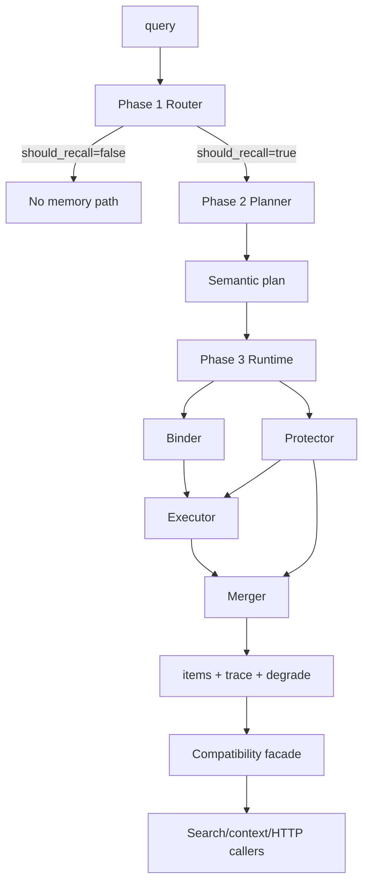
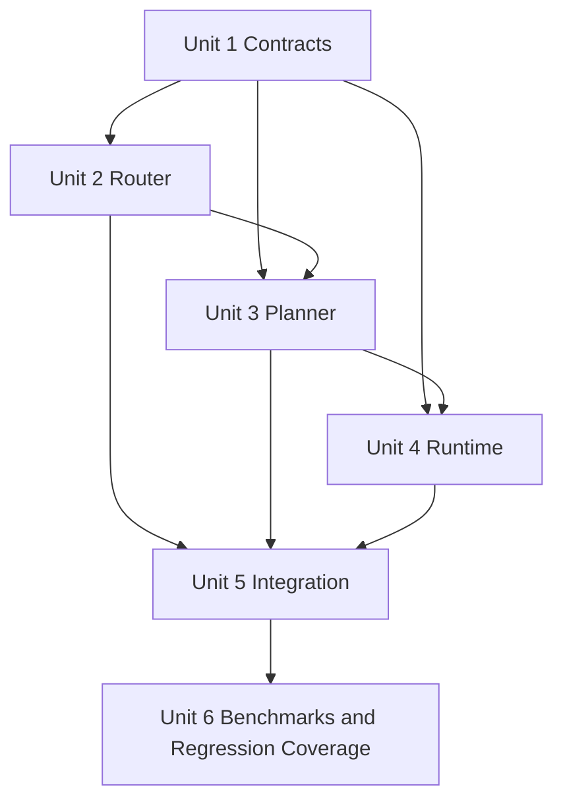
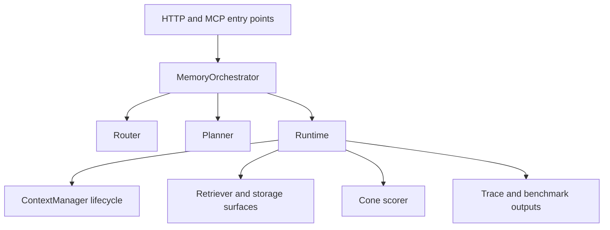

# refactor: Rebuild memory recall into router/planner/runtime phases

## Overview

Refactor the current memory recall hot path so that semantic routing, semantic planning, and runtime execution become three explicit phases with separate contracts, tests, and benchmark attribution. The implementation must preserve current public request identity inputs such as `session_id`, keep tenant/user/project isolation intact, and ship through compatibility adapters instead of a flag-day replacement.

## Problem Frame

The current stack spreads one recall decision across multiple layers:

- `src/opencortex/retrieve/intent_router.py` already decides retrieval behavior such as `top_k`, `detail_level`, and `need_rerank`
- `src/opencortex/cognition/recall_planner.py` is nominally a planner but mostly repackages router output into `RecallPlan`
- `src/opencortex/context/manager.py` still owns timeout, fallback, and partial planning policy
- `src/opencortex/orchestrator.py` exposes `plan_recall()` as a combined route+plan facade

That overlap makes latency hard to bound, benchmark failures hard to attribute, and future optimization hard to reason about. The three origin documents define a cleaner target split:

- Phase 1 `Router`: pure `query -> should_recall/task_class/confidence`
- Phase 2 `Planner`: `task_class/confidence -> semantic executable plan`
- Phase 3 `Runtime`: bind, execute, merge, and protect the plan under real execution boundaries

This plan covers how to migrate the current codebase to that split without breaking search/context APIs during the transition.

## Requirements Trace

- R1. Router becomes a query-only semantic classifier that emits only `should_recall`, `task_class`, and `confidence` (see origin: `docs/brainstorms/2026-04-12-memory-router-phase1-requirements.md`).
- R2. `should_recall=false` is absolute: no hidden vector lookup, cone expansion, or fallback memory recall path.
- R3. Planner consumes only router semantics and emits a semantic plan with `strategy`, `rewrite`, `breadth_budget`, `depth`, `cone_budget`, `rerank`, plus explainability and provenance (see origin: `docs/brainstorms/2026-04-12-memory-planner-phase2-requirements.md`).
- R4. Runtime accepts explicit execution inputs, including `session_id`, `tenant_id`, `user_id`, and `project_id`, and owns binding, execution, merging, degrade, and traceability (see origin: `docs/brainstorms/2026-04-12-memory-runtime-phase3-requirements.md`).
- R5. Cone behavior stays semantic in planner (`cone_budget`) and becomes structured in runtime (`core_cone`, `extended_cone`) via deterministic mapping.
- R6. Benchmarks and production telemetry must be able to attribute failures and latency separately to router, planner, and runtime.
- R7. Existing public flows such as `MemoryOrchestrator.search()`, context prepare, and HTTP responses must remain functional while contracts migrate.
- R8. Request-level identity and visibility boundaries remain strict and non-degradable throughout the refactor.

## Scope Boundaries

- No new remote-LLM dependency is introduced on the production recall hot path.
- No storage backend redesign, Qdrant migration, or retriever algorithm replacement is planned here.
- No non-memory routing redesign is included.
- No classifier training pipeline or benchmark-label generation pipeline is included in this first implementation plan.
- No public client knobs are added for router/planner/runtime internals; compatibility work is limited to preserving existing behavior while old surfaces are retired.

## Context & Research

### Relevant Code and Patterns

- `src/opencortex/retrieve/intent_router.py`: current mixed router with keyword rules, optional LLM classification, and direct retrieval parameter output.
- `src/opencortex/cognition/recall_planner.py`: current thin `RecallPlan` builder; good seam for Phase 2 replacement.
- `src/opencortex/context/manager.py`: current owner of 10s planning timeout and fallback behavior; primary place where runtime policy is leaking upward.
- `src/opencortex/orchestrator.py`: current integration facade exposing `plan_recall()` and wiring context/search entry points.
- `src/opencortex/retrieve/cone_scorer.py`: existing cone expansion/scoring logic that Phase 3 should bind more explicitly instead of treating as one boolean.
- `src/opencortex/http/request_context.py`: current source of tenant/user/project ambient context; relevant because runtime core must become replayable with explicit inputs.
- `src/opencortex/http/server.py` and `src/opencortex/http/models.py`: current HTTP contract surfaces exposing `search_intent`, `recall_plan`, and `/api/v1/intent/should_recall`.
- `src/opencortex/retrieve/types.py`: current shared data model location for `SearchIntent`, `RecallPlan`, and `FindResult` serialization.
- `tests/test_intent_router_session.py`: pattern for isolated router behavior tests.
- `tests/test_recall_planner.py`: existing contract/serialization coverage for `SearchIntent`, `RecallPlan`, `plan_recall()`, and search response compatibility.
- `tests/test_context_manager.py`: existing prepare/commit/end coverage and current timeout/fallback expectations.
- `tests/test_cone_scorer.py` and `tests/test_cone_e2e.py`: current cone behavior safety net.
- `tests/benchmark/runner.py` and `tests/test_benchmark_runner.py`: existing benchmark execution surface that should consume richer attribution data.

### Institutional Learnings

- No relevant files were found under `docs/solutions/`.

### External References

- None. Local code and the three origin documents are sufficient for this refactor plan.

## Key Technical Decisions

- Introduce explicit phase contracts before changing behavior: the migration should start with new data contracts and adapters, not with a flag-day rewrite of internals.
- Keep compatibility envelopes during rollout: `SearchIntent`, `RecallPlan`, and current `FindResult`/HTTP serialization remain supported until all call sites consume the new phase artifacts.
- Route and plan stay local and deterministic: Phase 1 and Phase 2 must become cheap, testable components so the only bounded slow path left is Phase 3 execution.
- Move timeout/degrade ownership downward, not upward: the current `ContextManager` timeout around `plan_recall()` should be replaced by runtime protection around actual execution work.
- Preserve business overrides only at orchestration edges: existing `recall_mode` and `detail_level` remain orchestration concerns during migration, but they must not flow back into router semantics.
- Treat benchmark attribution as a first-class output: phase outputs must carry enough structured provenance to explain bad results without re-running the pipeline.

## Open Questions

### Resolved During Planning

- How to stage the migration without breaking current APIs: introduce phase contracts and adapters first, then rewire integration points behind existing facades.
- Whether to keep `RecallPlan`: yes, temporarily, as a compatibility envelope for current search/context/HTTP/test surfaces while the new planner/runtime contracts land.
- Where timeout/degrade should move: into Phase 3 runtime protection, with `ContextManager` reduced to orchestration and cache ownership.
- How to handle existing `detail_level`/`recall_mode`: preserve them at the entry-point facade during migration, but stop feeding them into router semantics.
- Whether this should be a deep plan: yes; the work spans public contracts, cross-layer control flow, runtime safety, and benchmark observability.

### Deferred to Implementation

- Exact local classifier family and feature extraction strategy for Phase 1, as long as it satisfies the query-only and no-remote-LLM requirements.
- Exact numeric calibration for `confidence`, `breadth_budget`, `cone_budget`, and degrade thresholds.
- Exact field-level schemas for `evidence`, `decision_trace`, `trace`, and `degrade`, beyond the minimum shape needed to unblock implementation.
- Exact primary versus secondary source taxonomy inside runtime binder, as long as the binder contract remains semantically downstream from planner.

## High-Level Technical Design

> *This illustrates the intended approach and is directional guidance for review, not implementation specification. The implementing agent should treat it as context, not code to reproduce.*

## Implementation Units

- [x] **Unit 1: Introduce phase contracts and compatibility envelopes**

**Goal:** Create explicit data contracts for router decisions, planner plans, and runtime results while keeping current `SearchIntent`/`RecallPlan`-based callers functioning during the migration.

**Requirements:** R1, R3, R4, R6, R7

**Dependencies:** None

**Files:**
- Modify: `src/opencortex/retrieve/types.py`
- Modify: `src/opencortex/orchestrator.py`
- Modify: `src/opencortex/http/server.py`
- Test: `tests/test_recall_planner.py`
- Test: `tests/test_request_context.py`

**Approach:**
- Add explicit phase-oriented types for Phase 1, Phase 2, and Phase 3 artifacts in the shared retrieval type layer.
- Add adapter helpers that can project new artifacts onto legacy `SearchIntent`, `RecallPlan`, and serialized HTTP/search payloads.
- Keep provenance fields immutable once emitted so downstream layers cannot silently mutate router/planner semantics.
- Treat compatibility as an explicit boundary instead of letting old and new objects partially overlap ad hoc.

**Patterns to follow:**
- `src/opencortex/retrieve/types.py` dataclass + `to_dict()` patterns
- `tests/test_recall_planner.py` serialization assertions for compatibility envelopes

**Test scenarios:**
- Happy path: new router/planner/runtime artifacts serialize into stable machine-readable dicts.
- Happy path: compatibility projection still emits current `search_intent` and `recall_plan` payload fields expected by `FindResult.to_dict()`.
- Edge case: router decision with `should_recall=false` projects to legacy compatibility objects without inventing task confidence or hidden recall surfaces.
- Edge case: planner provenance fields remain unchanged after runtime projection.
- Error path: missing optional explainability fields degrade to empty structured containers, not `None`-driven crashes in serializers.
- Integration: existing HTTP response construction continues to emit legacy payloads while the new phase artifacts are attached internally.

**Verification:**
- Existing serialization and request-context tests still pass with the new contract layer in place.
- New contract types can be instantiated and inspected without involving retrievers, storage, or HTTP contextvars.

- [x] **Unit 2: Replace mixed intent routing with Phase 1 router semantics**

**Goal:** Convert `IntentRouter` from a retrieval-parameter generator into a pure Phase 1 semantic router with query-only input and two-stage cascade output.

**Requirements:** R1, R2, R6, R7, R8

**Dependencies:** Unit 1

**Files:**
- Modify: `src/opencortex/retrieve/intent_router.py`
- Modify: `src/opencortex/orchestrator.py`
- Modify: `src/opencortex/http/server.py`
- Test: `tests/test_intent_router_session.py`
- Test: `tests/test_recall_optimization.py`
- Test: `tests/test_recall_planner.py`

**Approach:**
- Remove direct router ownership of `top_k`, `detail_level`, `need_rerank`, and cone-related behavior.
- Implement a strict two-stage flow: stage 1 decides `should_recall`; stage 2 assigns a single `task_class` and confidence only when stage 1 is true.
- Preserve a very small guardrail rule set for obvious no-recall traffic, but keep semantic classification local and lightweight rather than rule-dominant.
- Rework `/api/v1/intent/should_recall` to return Phase 1 semantics instead of legacy intent categories.
- Keep a temporary compatibility adapter for any old call site still expecting legacy `SearchIntent` fields.

**Execution note:** Add characterization coverage for the current no-session and keyword-only fast paths before changing router behavior.

**Patterns to follow:**
- `tests/test_intent_router_session.py` for router isolation
- `tests/test_recall_optimization.py` for lightweight lexical guardrail expectations

**Test scenarios:**
- Happy path: fact-style query returns `should_recall=true`, `task_class=fact`, and non-null confidence.
- Happy path: temporal/profile/aggregate/summarize examples map to the expected single task class.
- Edge case: greeting/thanks/no-op query returns `should_recall=false`, `task_class=null`, and `confidence=null`.
- Edge case: ambiguous but recallable query still yields exactly one primary task class.
- Error path: classifier failure falls back to a safe local default without invoking a remote LLM or emitting retrieval parameters.
- Integration: orchestrator routing facade converts the Phase 1 decision into legacy compatibility objects only where still required.

**Verification:**
- Router tests assert pure `query -> decision` behavior with no dependency on session context for semantics.
- No router path emits direct retrieval controls such as `top_k`, `detail_level`, or `rerank`.

- [x] **Unit 3: Rebuild `RecallPlanner` as Phase 2 semantic planner**

**Goal:** Replace the current thin planner with a deterministic semantic planner that consumes router output and emits explainable retrieval strategy decisions.

**Requirements:** R3, R5, R6, R7

**Dependencies:** Unit 1, Unit 2

**Files:**
- Modify: `src/opencortex/cognition/recall_planner.py`
- Modify: `src/opencortex/orchestrator.py`
- Modify: `src/opencortex/retrieve/types.py`
- Test: `tests/test_recall_planner.py`

**Approach:**
- Redefine planner input around `task_class` and `confidence` only, with orchestration overrides applied outside planner semantics.
- Implement the agreed primary strategy mapping:
  `fact -> exact`, `temporal -> time_aware`, `profile -> profile_aware`, `aggregate -> broad`, `summarize -> synthesis`.
- Make `confidence` tune breadth, cone, rewrite, depth, and rerank rather than switching the primary strategy.
- Emit machine-readable `evidence`, `decision_trace`, and `summary` so benchmarks and regressions can inspect planning output directly.
- Keep a compatibility adapter that can derive legacy `RecallPlan` fields while runtime migration is still in progress.

**Patterns to follow:**
- `tests/test_recall_planner.py` deterministic plan assertions
- Existing `DetailLevel`/`RecallPlan` compatibility patterns in `src/opencortex/retrieve/types.py`

**Test scenarios:**
- Happy path: each router `task_class` maps to its default primary strategy.
- Happy path: lower confidence widens budgets or enables rerank without changing the primary strategy.
- Edge case: planner never runs when router says `should_recall=false`; the no-recall branch is handled before planner invocation.
- Edge case: detail-level compatibility projection preserves current `l0/l1/l2` expectations while the new planner emits semantic fields.
- Error path: malformed or out-of-range confidence inputs are clamped and traced rather than crashing planner output generation.
- Integration: orchestrator facade can expose both the new semantic plan and a legacy `RecallPlan` view during migration.

**Verification:**
- Planner tests prove deterministic outputs for the same router inputs.
- Planner output contains explainability and provenance fields without binding execution sources or request scope.

- [x] **Unit 4: Introduce Phase 3 runtime with Binder, Executor, Merger, and Protector**

**Goal:** Move binding, execution, cone posture, degrade, and observability into an explicit runtime layer that consumes the planner plan plus explicit execution context.

**Requirements:** R4, R5, R6, R8

**Dependencies:** Unit 1, Unit 3

**Files:**
- Create: `src/opencortex/context/memory_runtime.py`
- Modify: `src/opencortex/context/manager.py`
- Modify: `src/opencortex/orchestrator.py`
- Modify: `src/opencortex/retrieve/cone_scorer.py`
- Modify: `src/opencortex/http/request_context.py`
- Test: `tests/test_memory_runtime.py`
- Test: `tests/test_context_manager.py`
- Test: `tests/test_cone_scorer.py`
- Test: `tests/test_cone_e2e.py`

**Approach:**
- Introduce a runtime module that accepts `retrieve_plan`, `session_id`, `tenant_id`, `user_id`, and `project_id` explicitly.
- Split runtime internals into binder/executor/merger/protector responsibilities rather than keeping them implicit in `ContextManager`.
- Move the current timeout/fallback/degrade policy out of `ContextManager._prepare()` and into `Protector`, where it can operate on actual execution work and emit structured `trace`/`degrade`.
- Map planner `cone_budget` to runtime `core_cone`/`extended_cone` postures using the agreed deterministic contract, then adapt `ConeScorer` so optional expansion is degradable before core association is narrowed.
- Keep execution-boundary constraints non-negotiable: runtime can shrink work, but it cannot relax tenant/user/project/session visibility or mutate router/planner provenance.

**Technical design:** *(directional guidance, not implementation specification)* Runtime should initially wrap existing retriever/search calls rather than rewrite them all at once. The first runtime should bind existing surfaces and policies more explicitly before attempting deeper retrieval-engine refactors.

**Patterns to follow:**
- `src/opencortex/context/manager.py` current prepare flow for orchestration boundaries
- `tests/test_recall_planner.py` and `tests/test_context_manager.py` for contract-style deterministic assertions around orchestrated flows
- `tests/test_context_manager.py` idempotency and fallback assertions
- `tests/test_cone_scorer.py` and `tests/test_cone_e2e.py` for cone safety nets

**Test scenarios:**
- Happy path: runtime binds a planner plan plus explicit execution context into concrete sources/scope and returns `items`, `trace`, and `degrade`.
- Happy path: runtime preserves planner provenance and primary strategy while translating cone budget into runtime posture.
- Edge case: `project_id`/tenant/user visibility filters remain enforced during cone expansion and multi-source merge.
- Edge case: degrade disables `extended_cone` before shrinking breadth or touching `core_cone`.
- Error path: timeout or execution failure emits structured `degrade` metadata and a bounded fallback result without reclassifying the query.
- Integration: `ContextManager.prepare()` can call the runtime with explicit context and replay the same behavior in tests without ambient request context.

**Verification:**
- Dedicated runtime tests cover binder/executor/merger/protector behavior without requiring full HTTP setup.
- Context-manager tests prove timeout/degrade ownership has moved into runtime behavior instead of wrapping `plan_recall()`.
- Cone tests still pass while runtime can differentiate `core_cone` and `extended_cone`.

- [x] **Unit 5: Rewire orchestration and public entry points onto the three-phase pipeline**

**Goal:** Make `MemoryOrchestrator`, context prepare, search, and HTTP entry points call the new phase pipeline while keeping current public behavior stable during migration.

**Requirements:** R2, R4, R7, R8

**Dependencies:** Unit 2, Unit 3, Unit 4

**Files:**
- Modify: `src/opencortex/orchestrator.py`
- Modify: `src/opencortex/context/manager.py`
- Modify: `src/opencortex/http/server.py`
- Modify: `src/opencortex/http/models.py`
- Modify: `src/opencortex/context/__init__.py`
- Test: `tests/test_recall_planner.py`
- Test: `tests/test_context_manager.py`
- Test: `tests/test_request_context.py`

**Approach:**
- Replace the current monolithic `plan_recall()` responsibility with explicit orchestration across route, plan, and runtime phases; keep a legacy facade only as long as tests/clients still depend on it.
- Narrow `ContextManager` to orchestration, prepare caching, and session lifecycle; runtime protection should become a delegated dependency instead of inline policy.
- Update search and HTTP response assembly to surface new phase attribution internally while preserving current external payloads until a deliberate contract cleanup is scheduled.
- Ensure `recall_mode=never` still short-circuits memory entirely, and `recall_mode=always` remains an entry-point override rather than a router semantic.
- Rework `/api/v1/intent/should_recall` and any debug surfaces so they describe Phase 1 semantics consistently.

**Execution note:** Use characterization-first assertions around existing HTTP/search payloads before changing orchestration code; this surface is shared by tests and benchmarks.

**Patterns to follow:**
- `src/opencortex/http/server.py` response shaping patterns
- `tests/test_recall_planner.py` and `tests/test_context_manager.py` current compatibility assertions

**Test scenarios:**
- Happy path: `search()` still returns memories/resources/skills plus compatibility `search_intent`/`recall_plan` fields while internally using the new pipeline.
- Happy path: context prepare still returns stable instructions, memory, and knowledge payloads for callers.
- Edge case: `recall_mode=never` bypasses router/planner/runtime memory execution cleanly.
- Edge case: `recall_mode=always` still forces entry into planner/runtime without mutating router semantics stored for attribution.
- Error path: runtime degradation is reflected in structured trace metadata without breaking existing response shapes.
- Integration: HTTP `/api/v1/intent/should_recall` and context prepare both observe the same Phase 1 router semantics.

**Verification:**
- Existing public-facing tests still pass after orchestration is rewired.
- There is exactly one production path from query to runtime execution, with compatibility facades only at the outer boundary.

- [x] **Unit 6: Upgrade benchmark and regression coverage for phase attribution**

**Goal:** Make the benchmark harness and regression suite consume phase-separated signals so future accuracy or latency regressions can be attributed to router, planner, or runtime.

**Requirements:** R5, R6, R7

**Dependencies:** Unit 5

**Files:**
- Modify: `tests/benchmark/runner.py`
- Modify: `tests/benchmark/ablation.py`
- Modify: `tests/test_benchmark_runner.py`
- Modify: `tests/test_recall_accuracy.py`
- Modify: `tests/test_recall_regression.py`

**Approach:**
- Extend benchmark execution to capture phase outputs and timing rather than only end-to-end recall behavior.
- Add assertions that benchmark traces include router decision, planner strategy, runtime execution facts, and degrade actions when relevant.
- Preserve existing score computations so architectural refactor and metric definition do not drift together.
- Use benchmark attribution data to validate that `should_recall=false` queries truly skip runtime and that runtime degrade does not masquerade as planner/router behavior.

**Patterns to follow:**
- `tests/benchmark/runner.py` current benchmark orchestration
- `tests/test_benchmark_runner.py` benchmark contract tests
- `tests/test_recall_accuracy.py` and `tests/test_recall_regression.py` regression-style expectations

**Test scenarios:**
- Happy path: benchmark result includes router/planner/runtime attribution for a recallable query.
- Happy path: no-recall benchmark case records router-only attribution and zero runtime execution.
- Edge case: runtime degrade event is present and machine-parseable when latency protection activates.
- Edge case: benchmark reporting remains backward-compatible for consumers that only inspect final recall metrics.
- Error path: benchmark runner tolerates missing optional explainability detail while still surfacing phase attribution.
- Integration: regression suite can distinguish router false-negative, planner narrowing, and runtime degradation failures in separate assertions.

**Verification:**
- Benchmark runner emits stable phase attribution without changing the benchmark score formula.
- Regression tests can fail on the correct layer instead of only on final answer quality.

## System-Wide Impact

- **Interaction graph:** `http/models -> http/server -> orchestrator -> router/planner/runtime -> context manager/search -> retriever/cone scorer`.
- **Error propagation:** router/planner stay cheap and deterministic; runtime owns execution failures, degrade, and latency protection; compatibility layers should report but not reinterpret semantic decisions.
- **State lifecycle risks:** prepare-cache entries and benchmark traces must not mix old/new contract versions silently; compatibility projection should happen after phase artifacts are finalized.
- **API surface parity:** `FindResult.to_dict()`, HTTP search responses, and `/api/v1/intent/should_recall` are the main public surfaces that must remain coherent during migration.
- **Integration coverage:** context prepare, orchestrator search, cone expansion, and benchmark runner must all be exercised because each crosses layer boundaries.
- **Unchanged invariants:** `session_id` stays explicit, tenant/user/project boundaries stay strict, and no client gets direct control over runtime internals such as cone budget or rerank.

## Risks & Dependencies

| Risk | Mitigation |
|------|------------|
| Compatibility objects leak old semantics back into new phases | Keep adapters one-way: new phase artifacts project to legacy envelopes, not the reverse |
| Runtime refactor accidentally duplicates timeout/degrade in both `ContextManager` and runtime | Move policy ownership explicitly and delete or neutralize the old wrapper once runtime is integrated |
| Cone split changes recall quality in ways hidden by end-to-end tests | Keep cone unit/e2e tests and add benchmark attribution around `core_cone` vs `extended_cone` usage |
| HTTP/search payload drift breaks existing consumers | Preserve existing external fields until a later cleanup plan, and keep serialization regression tests active |
| Benchmarks become noisy during partial migration | Preserve score formulas and add phase-level attribution instead of changing metrics and architecture together |

## Documentation / Operational Notes

- When implementation begins, update internal architecture docs only after the compatibility path is working; otherwise docs will describe a pipeline that the codebase does not yet run.
- Benchmark baselines should be regenerated only after Unit 6 lands; regenerating earlier would conflate incomplete migration behavior with the target architecture.
- If rollback pressure appears during implementation, prefer reverting the orchestrator/runtime wiring while keeping inert contract types in place; avoid half-reverting semantic contract definitions.

## Sources & References

- **Origin document:** `docs/brainstorms/2026-04-12-memory-router-phase1-requirements.md`
- **Origin document:** `docs/brainstorms/2026-04-12-memory-planner-phase2-requirements.md`
- **Origin document:** `docs/brainstorms/2026-04-12-memory-runtime-phase3-requirements.md`
- Related code: `src/opencortex/retrieve/intent_router.py`
- Related code: `src/opencortex/cognition/recall_planner.py`
- Related code: `src/opencortex/context/manager.py`
- Related code: `src/opencortex/orchestrator.py`
- Related code: `src/opencortex/retrieve/cone_scorer.py`
- Related tests: `tests/test_intent_router_session.py`
- Related tests: `tests/test_recall_planner.py`
- Related tests: `tests/test_context_manager.py`
- Related tests: `tests/benchmark/runner.py`
