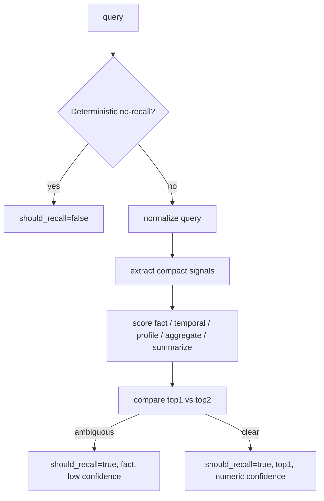

# refactor: Rebuild phase1 router as an NLP-lite scoring classifier

## Overview

Replace the current Phase 1 router's bare substring matching with a single-pass, high-performance NLP-lite scoring classifier. The new router remains query-only and continues to emit only `should_recall`, `task_class`, and `confidence`, but it must stop over-classifying long or polite queries into `profile`, `aggregate`, or `summarize`.

## Problem Frame

The current router in `src/opencortex/intent/router.py` is fast, but its decision logic is too primitive for production recall quality:

- it uses raw substring checks such as `kw in query_lower`
- it resolves conflicts with a hard-coded precedence chain
- it treats words like `like`, `review`, and `all` as direct intent evidence even when they are only incidental phrasing
- it therefore misroutes complex queries into planner-deeper paths that are semantically wrong

The origin requirements now sharpen the target:

- router stays Phase 1 only and remains pure `query -> decision`
- `should_recall=false` becomes extremely narrow
- task classification becomes conservative
- ambiguity falls back to `should_recall=true + task_class=fact + low confidence`
- the first production version is training-free, Chinese/English first, and must stay within a tight hot-path latency budget

This plan covers only the router rewrite and its direct test and benchmark surfaces. Planner and runtime behavior are intentionally out of scope except where router outputs are already consumed.

## Requirements Trace

- R1. Router remains a dedicated semantic decision layer with query-only input (see origin: `docs/brainstorms/2026-04-12-memory-router-phase1-requirements.md`).
- R2. Router output remains exactly `should_recall`, `task_class`, and `confidence`.
- R3. `should_recall=false` remains absolute and is limited to deterministic non-memory traffic.
- R4. Router becomes a single-stage NLP-lite scoring pass rather than a bare keyword matcher or staged cascade.
- R5. Router prefers conservative classification and falls back to `fact` on ambiguity.
- R6. `confidence` remains numeric and reflects both selected-class support and top-two separation.
- R7. Chinese, English, and mixed Chinese/English queries receive first-class support.
- R8. Existing API and orchestration surfaces continue to consume the same Phase 1 contract.
- R9. Router latency must remain hot-path safe, with router-only measurement added so retrieval cost does not hide regressions.

## Scope Boundaries

- This plan does not redesign planner strategy, runtime degrade, or retrieval behavior.
- This plan does not add model training, ONNX inference, spaCy, Rasa, or any other heavyweight NLP/runtime dependency.
- This plan does not broaden router output beyond the existing three fields.
- This plan does not attempt high-quality semantic classification for all languages in the first iteration; non-Chinese/non-English text must fail safely.
- This plan does not remove `IntentRouter.lexical_boost()` unless implementation proves the current helper cannot coexist cleanly with the new classifier.

## Context & Research

### Relevant Code and Patterns

- `src/opencortex/intent/router.py`: current router implementation; primary rewrite target.
- `src/opencortex/intent/types.py`: `MemoryRouteDecision` contract that must remain stable.
- `src/opencortex/orchestrator.py`: `route_memory()` facade; should continue to expose the same Phase 1 contract.
- `src/opencortex/http/server.py`: `/api/v1/intent/should_recall` returns the router decision directly.
- `tests/test_intent_router_session.py`: minimal router contract tests; good place to keep pure query-only behavior assertions.
- `tests/test_intent_cache.py`: existing TTL/LRU cache coverage; must remain valid after the rewrite.
- `tests/test_recall_optimization.py`: current lexical boost and regex utility coverage; likely place for router-adjacent hot-path tests.
- `tests/test_http_server.py`: HTTP contract assertions for `/api/v1/intent/should_recall`.
- `tests/test_multi_query_concurrent.py`: small router expectation tests; useful for conservative fact fallback coverage.

### Institutional Learnings

- No relevant files were found under `docs/solutions/`.

### External References

- Not used. The user explicitly chose a training-free high-performance router, and local code plus the origin requirements are sufficient to define the implementation approach.

## Key Technical Decisions

- Keep the public contract fixed: rewrite internals, not the Phase 1 API shape.
- Keep the implementation single-pass: one narrow no-recall gate, one feature/scoring pass, one resolver.
- Keep the rewrite local and lightweight: use precompiled patterns and structural cues, not a framework-scale NLP stack.
- Bias toward under-classification, not over-classification: ambiguous queries become `fact`, not speculative `profile` or `aggregate`.
- Support all languages safely via fallback, not by claiming equal semantic quality across all languages.
- Preserve caching behavior and query-only determinism so the router remains cheap and easy to benchmark independently.
- Add benchmark-derived characterization cases for the exact failure patterns observed in PersonaMem and LongMemEval.

## Open Questions

### Resolved During Planning

- Should router stay a separate plan from planner/runtime: yes; this plan is router-only.
- Should the new router be multi-stage: no; use one narrow gate plus one scoring pass.
- Should ambiguity suppress recall: no; ambiguous queries remain recallable and fall back to `fact`.
- Should `confidence` remain numeric: yes.
- Should the first version require model training: no.
- Should the first version target all languages equally: no; prioritize Chinese, English, and mixed Chinese/English, with safe fallback elsewhere.

### Deferred to Implementation

- Exact score weights and confidence formula constants.
- Whether the pattern tables remain inline in `src/opencortex/intent/router.py` or move into a small adjacent helper module for readability.
- Exact microbenchmark fixture shape for router-only latency measurement.
- Exact final benchmark-derived query corpus size for characterization coverage.

## High-Level Technical Design

> *This illustrates the intended approach and is directional guidance for review, not implementation specification. The implementing agent should treat it as context, not code to reproduce.*

## Implementation Units

- [x] **Unit 1: Characterize the current router surface and benchmark-derived failures**

**Goal:** Freeze the expected external contract and capture the known misclassification patterns before rewriting internals.

**Requirements:** R1, R2, R8, R9

**Dependencies:** None

**Files:**
- Modify: `tests/test_intent_router_session.py`
- Modify: `tests/test_intent_cache.py`
- Modify: `tests/test_http_server.py`
- Modify: `tests/test_multi_query_concurrent.py`
- Modify: `tests/test_recall_optimization.py`
- Test: `tests/test_intent_router_session.py`
- Test: `tests/test_intent_cache.py`
- Test: `tests/test_http_server.py`
- Test: `tests/test_multi_query_concurrent.py`
- Test: `tests/test_recall_optimization.py`

**Approach:**
- Preserve and strengthen the existing contract assertions: query-only semantics, cache stability, HTTP payload shape, and no-recall nullability.
- Add characterization examples from the benchmark audit for the exact current failure modes:
  - polite `I'd like to ...` phrasing should not trigger `profile`
  - `reviewing implementation/file` should not trigger `summarize`
  - incidental `all/across/compare` wording should not automatically trigger `aggregate`
- Keep assertions conservative: lock down intended semantics rather than overfitting to specific internal scores.
- Add at least one mixed Chinese/English case and one unsupported-language-safe-fallback case to keep the language boundary explicit.

**Execution note:** Start with failing characterization coverage for the known benchmark-derived false positives before changing router logic.

**Patterns to follow:**
- `tests/test_intent_router_session.py` pure router contract style
- `tests/test_http_server.py` Phase 1 API contract assertions
- `tests/test_intent_cache.py` cache behavior expectations

**Test scenarios:**
- Happy path: temporal question such as `What did we discuss yesterday?` returns recallable temporal output with non-null confidence.
- Happy path: basic factual question returns `fact`.
- Edge case: `hello` or `谢谢` returns `should_recall=false` with null `task_class` and `confidence`.
- Edge case: repeated identical query returns the same cached decision.
- Edge case: `I'd like to streamline communication with our team...` remains recallable but does not classify as `profile` unless stable-preference evidence exists.
- Edge case: `I have been reviewing our current implementation...` remains recallable but does not classify as `summarize`.
- Edge case: mixed Chinese/English query with explicit time intent classifies as `temporal`.
- Edge case: unsupported-language query with no clear signal returns `should_recall=true` and conservative `fact`.
- Integration: `/api/v1/intent/should_recall` still returns exactly `should_recall`, `task_class`, and `confidence`.

**Verification:**
- The router surface is covered by behavior-first tests that fail under the current bare substring logic.
- No new test requires session context or planner/runtime participation to validate router semantics.

- [x] **Unit 2: Rebuild `IntentRouter` as a single-pass NLP-lite scoring classifier**

**Goal:** Replace raw substring precedence with a compact scoring-based classifier while preserving the existing router API and cache behavior.

**Requirements:** R1, R2, R3, R4, R5, R6, R7

**Dependencies:** Unit 1

**Files:**
- Modify: `src/opencortex/intent/router.py`
- Test: `tests/test_intent_router_session.py`
- Test: `tests/test_intent_cache.py`
- Test: `tests/test_multi_query_concurrent.py`

**Approach:**
- Keep `IntentRouter.route_decision(query)` as the stable entry point.
- Replace `kw in query_lower` direct classification with:
  - a deterministic narrow no-recall gate
  - query normalization
  - a compact set of precompiled pattern and structural signals
  - per-class score accumulation
  - top1/top2 resolution with conservative fallback to `fact`
- Keep signal inventory intentionally small and high-value. The first implementation should focus on the known error classes rather than trying to encode all language nuance.
- Preserve the current TTL/LRU query cache and avoid any new request-context or planner coupling.
- Keep helper structure simple. Favor a few private functions over introducing a framework-like mini-pipeline.

**Patterns to follow:**
- Existing `IntentRouter` cache ownership and query-only API
- `MemoryRouteDecision.to_dict()` stability in `src/opencortex/intent/types.py`

**Test scenarios:**
- Happy path: explicit temporal, profile, aggregate, summarize, and fact examples each resolve to the intended task class.
- Edge case: ambiguous query with weak competing signals resolves to `fact` rather than a deeper task class.
- Edge case: no-recall short phrases are recognized narrowly and do not grow into a broad rule list.
- Edge case: long technical prompt containing file paths or CamelCase remains `fact` unless another task signal is clearly stronger.
- Edge case: polite phrasing containing `like` does not imply `profile`.
- Edge case: `compare` or `all` only contributes to `aggregate` when the surrounding structure is actually comparative or aggregative.
- Error path: malformed, empty, or whitespace-only input does not crash scoring and resolves deterministically.

**Verification:**
- `IntentRouter` still exposes the same public API and cache behavior.
- Raw keyword precedence is removed from the classification path.
- The resulting implementation is visibly simpler to reason about than the current bare substring matcher.

- [x] **Unit 3: Introduce numeric confidence resolution and router-only latency measurement**

**Goal:** Make `confidence` planner-usable and add router-only latency evidence so the hot-path budget is enforceable.

**Requirements:** R6, R8, R9

**Dependencies:** Unit 2

**Files:**
- Modify: `src/opencortex/intent/router.py`
- Modify: `tests/test_recall_optimization.py`
- Modify: `tests/test_http_server.py`
- Test: `tests/test_recall_optimization.py`
- Test: `tests/test_http_server.py`

**Approach:**
- Define `confidence` from a simple, deterministic combination of:
  - selected-class support
  - separation between top1 and top2
- Keep confidence computation local to the router so planners continue to consume only one numeric field.
- Add a lightweight router-only timing harness in test coverage. The harness should measure router execution directly, not mixed retrieval time.
- Keep the latency check robust rather than brittle. Use a router-only percentile-oriented assertion or reporting path that can detect regressions without depending on storage or retrieval infrastructure.

**Patterns to follow:**
- Existing router-adjacent performance tests in `tests/test_recall_optimization.py`
- Existing Phase 1 HTTP contract test in `tests/test_http_server.py`

**Test scenarios:**
- Happy path: clear intent examples produce higher confidence than ambiguous ones.
- Edge case: ambiguous query still returns a non-null low confidence while falling back to `fact`.
- Edge case: no-recall output keeps `confidence=null`.
- Edge case: confidence ordering is stable across repeated invocations for the same query.
- Integration: HTTP route still returns a numeric confidence for recallable queries and `null` for no-recall queries.
- Integration: router-only timing harness captures percentile-oriented latency output without involving retrieval.

**Verification:**
- Confidence is numeric, deterministic, and consistent with conservative fallback behavior.
- Router latency can be measured independently from planner and retrieval cost.

- [x] **Unit 4: Wire benchmark and regression validation around benchmark-derived query classes**

**Goal:** Validate that the rewrite improves the specific quality failures already seen in benchmark audits and remains safe for the broader recall path.

**Requirements:** R5, R7, R8, R9

**Dependencies:** Unit 1, Unit 2, Unit 3

**Files:**
- Modify: `tests/test_recall_planner.py`
- Modify: `tests/test_context_manager.py`
- Modify: `tests/test_benchmark_runner.py`
- Modify: `docs/benchmark/2026-04-12-PersonaMem.md`
- Test: `tests/test_recall_planner.py`
- Test: `tests/test_context_manager.py`
- Test: `tests/test_benchmark_runner.py`

**Approach:**
- Keep this unit focused on router-attribution safety, not planner redesign.
- Add or extend regression assertions so benchmark traces and context prepare responses continue to expose the Phase 1 router decision after the internal rewrite.
- Update benchmark documentation with a router-focused readout so future audits can separate:
  - false no-recall
  - wrong `task_class`
  - downstream planner/runtime issues
- Validate specifically against the currently observed benchmark-derived classes:
  - PersonaMem long polite prompts
  - PersonaMem technical prompts with `review`, `all`, or `like`
  - LongMemEval multi-session count/compare queries

**Patterns to follow:**
- Existing memory pipeline trace assertions in `tests/test_context_manager.py`
- Existing benchmark contract style in `tests/test_benchmark_runner.py`

**Test scenarios:**
- Happy path: context prepare and search flows continue to carry the router decision into memory pipeline trace structures.
- Edge case: queries that are now conservatively downgraded to `fact` still remain recallable.
- Edge case: planner-facing code accepts lower-confidence `fact` outputs without contract changes.
- Integration: benchmark-oriented regression can distinguish wrong `task_class` from `should_recall=false`.
- Integration: documented benchmark examples align with the new router semantics rather than the removed substring-precedence logic.

**Verification:**
- Router quality improvements are visible in regression fixtures tied to known benchmark failure patterns.
- Router attribution remains observable without changing planner/runtime contracts.

## System-Wide Impact

- **Interaction graph:** `http/server -> orchestrator.route_memory -> intent/router -> planner/runtime consumers`.
- **Error propagation:** router remains deterministic and local; failures should degrade to conservative decisions, not propagate exceptions into planner/runtime.
- **State lifecycle risks:** cache stability matters; the rewrite must not accidentally key decisions on hidden context or mutable per-request state.
- **API surface parity:** `/api/v1/intent/should_recall`, `ContextManager` memory pipeline route trace, and planner inputs all depend on the same router contract.
- **Integration coverage:** contract tests must prove the router rewrite stays isolated from retrieval behavior while still surfacing the same decision fields to downstream layers.
- **Unchanged invariants:** router remains query-only, recall false remains absolute, and planner/runtime remain the only owners of retrieval strategy and execution policy.

## Risks & Dependencies

| Risk | Mitigation |
|------|------------|
| Rule inventory grows back into an unbounded keyword list | Keep the first implementation focused on a small set of benchmark-proven failure patterns and structural signals. |
| Confidence becomes noisy or planner-hostile | Define confidence from simple deterministic score components and validate relative ordering in tests. |
| Router latency regresses while accuracy improves | Add router-only latency measurement in test coverage so regressions are visible without full benchmark runs. |
| Bilingual support becomes uneven and silently breaks unsupported languages | Make Chinese/English and mixed Chinese/English explicit targets, and add safe-fallback tests for unsupported-language queries. |
| Internal refactor leaks new abstractions into the hot path | Favor a compact private-helper structure inside `src/opencortex/intent/router.py` unless a small helper module is clearly justified. |

## Documentation / Operational Notes

- Update router-related benchmark notes only where they explain router-attribution changes or revised benchmark interpretation.
- Do not update planner/runtime documentation as part of this plan unless router contract wording must be synchronized.

## Sources & References

- **Origin document:** `docs/brainstorms/2026-04-12-memory-router-phase1-requirements.md`
- Related code: `src/opencortex/intent/router.py`
- Related code: `src/opencortex/intent/types.py`
- Related code: `src/opencortex/orchestrator.py`
- Related tests: `tests/test_intent_router_session.py`
- Related tests: `tests/test_intent_cache.py`
- Related tests: `tests/test_recall_optimization.py`
- Related tests: `tests/test_http_server.py`
