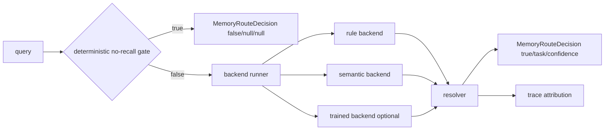

# refactor: Evolve phase1 router into a hybrid backend with resolver arbitration

## Overview

Evolve the Phase 1 memory router from its current implicit `rule_only + optional semantic promotion` shape into an explicit hybrid architecture:

- deterministic no-recall gate first
- one or more classifier backends second
- a dedicated resolver third
- unchanged public output last

The near-term target is to make `semantic_hybrid` the default online mode safely. The medium-term target is to let a future optional `trained_classifier` join the same hot path without redesigning planner or runtime contracts.

## Problem Frame

The current router already improved over the old keyword matcher, but it is still structurally incomplete for the next iteration:

- `src/opencortex/intent/router.py` mixes rule scoring, semantic promotion, backend lifecycle, and conflict resolution in one module-level flow.
- The current merge rule is implicit and narrow: semantic only wins when rules fall back to `fact`.
- The active mode surface only distinguishes `rule_only` and `semantic_hybrid`, while the origin requirements already define a future dual-classifier state.
- Fallback on semantic failure mutates router state inline, but there is no explicit internal contract for backend availability, arbitration, or trace attribution.
- Benchmark attribution currently exposes `route_mode`, but not enough machine-readable detail to separate rule-gate behavior, classifier behavior, and resolver behavior (see origin: `docs/brainstorms/2026-04-13-memory-router-hybrid-evolution-requirements.md`).

This plan therefore focuses on one thing: make the router internally explicit enough that it can be fast, benchmark-attributable, and future-ready without changing the external Phase 1 contract.

## Requirements Trace

### Router Contract

- R1. Preserve the public Phase 1 output as only `should_recall`, `task_class`, and `confidence`.
- R2. Keep routing query-only at the semantic layer. Do not add planner/runtime/client inputs.
- R3. Keep `should_recall=false` as a narrow deterministic guard.
- R4. Emit exactly one primary recallable `task_class` from `fact`, `temporal`, `profile`, `aggregate`, `summarize`.

### Near-Term Online Mode

- R5. Make `semantic_hybrid` the intended default online mode.
- R6. Preserve the hot-path shape: no-recall gate first, semantic classification second.
- R7. Improve benchmark-shaped false negatives without restoring broad lexical over-classification.
- R8. Keep the hot path local-only. No remote LLM routing.
- R9. Keep deployment valid without a trained classifier artifact.
- R10. Degrade automatically to a safe routing mode when semantic components fail.

### Future Evolution

- R11. Reserve an explicit optional `trained_classifier` backend.
- R12. Evolve toward dual-classifier mode, not semantic replacement.
- R13. Support running `semantic_hybrid` and `trained_classifier` together on recallable queries.
- R14. Missing trained artifacts must not require manual operator intervention.
- R15. Present/past trained artifacts must not change request shape or client behavior.

### Resolver Semantics

- R16. Give final task arbitration to a dedicated resolver whenever multiple backends are active.
- R17. Make the resolver correction-oriented: a strong non-`fact` signal should beat a weak `fact` collapse.
- R18. Never convert classifier disagreement into `should_recall=false`.
- R19. When backends agree on the same non-`fact` task, return that task with the stronger confidence.
- R20. When backends disagree on different non-`fact` tasks, use explicit deterministic arbitration rules.
- R21. Keep arbitration deterministic and benchmark-replayable.

### Deployment and Rollout

- R22. Keep router mode control server-side.
- R23. Keep rollout operationally transparent: no API change, no request change, no manual artifact babysitting.
- R24. Support automatic degradation across effective states `rule_only`, `semantic_hybrid`, and `dual_classifier`.
- R25. Expose effective router mode in trace and benchmark attribution.

### Performance

- R26. Keep `semantic_hybrid` within `p95 <= 20ms` on target hardware.
- R27. Design future dual-classifier mode to also fit `p95 <= 20ms`.
- R28. Prefer local runtime/model choices that preserve latency budget, not just offline accuracy.

### Evaluation

- R29. Judge success on both router classification quality and end-to-end benchmark improvement.
- R30. Reject router changes that only look semantically better without benchmark improvement.
- R31. Make benchmark attribution distinguish rule gate, classifier backend, and resolver behavior.
- R32. Prioritize benchmark-shaped coverage for implicit profile, temporal, and aggregate queries.

## Scope Boundaries

- This plan does not define the offline data collection, labeling, or training pipeline for `trained_classifier`.
- This plan does not choose the final ML framework or artifact format for the future trained backend beyond a lightweight loader contract.
- This plan does not redesign planner policy, retrieval source binding, or runtime execution semantics outside route attribution.
- This plan does not change the Phase 1 public API or the client request schema.
- This plan does not introduce remote inference, heavyweight NLP services, or per-request network I/O into the router.

## Context & Research

### Relevant Code and Existing Patterns

- `src/opencortex/intent/router.py`: current router implementation; primary refactor target.
- `src/opencortex/intent/types.py`: `MemoryRouteDecision` contract that must remain stable.
- `src/opencortex/orchestrator.py`: owns the router instance and exposes `memory_router_mode()`.
- `src/opencortex/config.py`: current router feature flags and semantic model configuration.
- `src/opencortex/context/manager.py`: emits `memory_pipeline.runtime.trace.route_mode`.
- `src/opencortex/http/server.py`: startup path; validates that routing upgrades remain transparent to clients.
- `tests/test_intent_router_session.py`: pure router behavior and semantic prototype coverage.
- `tests/test_recall_planner.py`: orchestrator-to-router ownership and mode exposure.
- `tests/test_context_manager.py`: runtime trace envelope assertions.
- `tests/test_http_server.py`: HTTP contract stability.
- `tests/test_benchmark_runner.py`: benchmark attribution extraction.
- `tests/benchmark/runner.py`: benchmark report generation and attribution plumbing.

### Current Code Observations

- The current router already has two internal scoring sources, but they are not modeled as explicit backends.
- Semantic classification is prototype-centroid based and uses `fastembed` through `LocalEmbedder`, which is compatible with a local-only latency budget.
- Mode detection is currently an implementation side effect: if semantic classifier init fails, router mode mutates back to `rule_only`.
- The resolver is currently `_merge_route_decisions()`, which is too limited for future non-`fact` vs non-`fact` arbitration.
- Benchmark and runtime trace currently expose only final route mode, not why a route was chosen.

### Institutional Learnings

- `docs/solutions/best-practices/memory-intent-hot-path-refactor-2026-04-12.md`: keep the hot path explicitly split into router/planner/runtime and avoid leaking planner/runtime concerns back into router design.

### External Research

- Not used. The codebase already has the relevant hot-path structure, local embedding path, and benchmark attribution surfaces. This is a repo-specific refactor and rollout plan rather than a framework-selection exercise.

## Key Technical Decisions

- Keep the public router contract fixed and evolve internals only.
- Introduce an explicit internal pipeline inside `IntentRouter`: `no_recall_gate -> backend_runner -> resolver -> MemoryRouteDecision`.
- Model backend results explicitly even if only one backend is active, so resolver and trace semantics stay uniform.
- Keep `semantic_hybrid` as the online default target, but make the effective mode auto-degrade based on backend readiness.
- Reserve `trained_classifier` as an optional backend contract now, with artifact absence treated as a normal runtime state rather than an error.
- Make resolver arbitration correction-oriented and deterministic, with rule-based tie-breaks rather than backend ordering.
- Keep trace enrichment bounded and machine-readable; expose enough to attribute benchmark regressions without bloating user-facing payloads.
- Carry a characterization-first execution posture: benchmark-shaped regression fixtures should land before or alongside the internal refactor.

## Open Questions

### Resolved During Planning

- Should the router stay query-only: yes.
- Should the external Phase 1 payload change: no.
- Should the future trained backend replace semantic hybrid: no; it joins it.
- Should disagreement ever suppress recall: no.
- Should rollout require operators to toggle request-level flags based on artifact state: no.

### Deferred to Implementation

- Exact internal type location for backend/resolver diagnostics: keep local to router unless a second consumer appears.
- Exact artifact discovery path for `trained_classifier`: config-backed path with safe absence semantics, final naming to be chosen in implementation.
- Exact confidence normalization formula across heterogeneous backends: implementation should choose the smallest deterministic formula that keeps resolver comparisons stable.
- Exact router-only performance harness thresholds in CI: the plan fixes the budget target, while implementation will choose the least flaky assertion style.

## High-Level Technical Design

> This diagram is directional guidance for reviewers, not implementation specification.

### Internal Contracts

- `MemoryRouteDecision` remains the only Phase 1 public output.
- Router-private backend outputs should carry at least:
  - backend name
  - availability state
  - per-task scores or promoted task
  - backend confidence
  - lightweight decision reason
- Resolver output should carry:
  - final `task_class`
  - final `confidence`
  - winning backend or arbitration rule
  - whether correction occurred

### Effective Mode Semantics

- `rule_only`: only deterministic guard + rule backend available.
- `semantic_hybrid`: deterministic guard + rule backend + semantic backend available.
- `dual_classifier`: deterministic guard + rule backend + semantic backend + trained backend available.

Configured mode and effective mode should be separated:

- configured mode expresses desired server capability
- effective mode expresses what the process can actually run after startup and runtime fallback

### Resolver Policy

The resolver should implement explicit ordered rules:

1. If only one recallable backend result is available, use it.
2. If all active classifier backends agree on the same task, use that task and the strongest confidence.
3. If one backend emits high-confidence non-`fact` and the competing backend falls back to `fact`, prefer the non-`fact` result.
4. If two non-`fact` tasks disagree, resolve via explicit priority rules based on confidence gap and class-pair arbitration, not backend order.
5. If no non-`fact` outcome clears arbitration, fall back to recallable `fact` with bounded low confidence.

The implementation should keep this rule table small and inspectable. No probabilistic or opaque learned resolver is in scope.

## Implementation Units

- [x] **Unit 1: Lock down benchmark-shaped router behavior and attribution expectations**

**Goal:** Characterize the intended hybrid-router semantics before restructuring internals.

**Requirements:** R1, R3, R4, R7, R21, R25, R29, R31, R32

**Dependencies:** None

**Files:**
- Modify: `tests/test_intent_router_session.py`
- Modify: `tests/test_recall_planner.py`
- Modify: `tests/test_context_manager.py`
- Modify: `tests/test_http_server.py`
- Modify: `tests/test_benchmark_runner.py`
- Modify: `tests/benchmark/runner.py`
- Test: `tests/test_intent_router_session.py`
- Test: `tests/test_recall_planner.py`
- Test: `tests/test_context_manager.py`
- Test: `tests/test_http_server.py`
- Test: `tests/test_benchmark_runner.py`

**Approach:**
- Add router behavior tests for benchmark-shaped implicit profile, temporal, and aggregate queries that previously collapsed into `fact`.
- Add mode and fallback assertions that distinguish configured mode from effective mode.
- Extend benchmark attribution expectations so tests assert the presence of router-specific diagnostic fields without changing search metrics.
- Keep assertions behavior-first. Tests should not lock implementation to a specific helper layout.

**Execution note:** Start here. The refactor should be constrained by characterization coverage rather than ad hoc manual checking.

**Patterns to follow:**
- `tests/test_intent_router_session.py` for pure Phase 1 behavior
- `tests/test_context_manager.py` for `memory_pipeline` trace shape
- `tests/test_benchmark_runner.py` for attribution extraction

**Test scenarios:**
- Happy path: an implicit temporal query such as `What was my last name before I changed it?` routes to `temporal`.
- Happy path: an implicit preference query such as `What kind of place would be good for a special evening out?` routes to `profile`.
- Happy path: an implicit aggregate query such as `How many times did I mention wanting to try water sports in 2023?` routes to `aggregate`.
- Edge case: `hello!` remains `should_recall=false` and clears task metadata.
- Edge case: missing semantic backend leaves effective mode at `rule_only` while preserving a recallable rule decision.
- Integration: benchmark attribution exposes effective route mode plus bounded router diagnostics for replay and analysis.

- [x] **Unit 2: Refactor `IntentRouter` around explicit backend and resolver stages**

**Goal:** Replace the current implicit merge logic with a clear internal classifier pipeline that still emits the same Phase 1 contract.

**Requirements:** R1, R2, R4, R6, R16, R17, R18, R19, R20, R21

**Dependencies:** Unit 1

**Files:**
- Modify: `src/opencortex/intent/router.py`
- Test: `tests/test_intent_router_session.py`

**Approach:**
- Keep `IntentRouter.route_decision(query)` as the only public entry point.
- Split internal responsibilities into:
  - deterministic no-recall gate
  - backend execution
  - resolver arbitration
  - final decision serialization
- Turn current rule scoring and semantic promotion into backend-shaped results rather than ad hoc local variables.
- Replace `_merge_route_decisions()` with an explicit resolver function/table that handles:
  - agreement
  - non-`fact` correction over `fact`
  - non-`fact` vs non-`fact` disagreement
  - recallable conservative fallback
- Keep the implementation local and compact. Avoid creating a general-purpose routing framework.

**Patterns to follow:**
- `src/opencortex/intent/types.py` contract stability for `MemoryRouteDecision`
- `docs/solutions/best-practices/memory-intent-hot-path-refactor-2026-04-12.md` phase-boundary guidance

**Test scenarios:**
- Happy path: rule and semantic both agree on `profile`, final route stays `profile` with the stronger confidence.
- Edge case: rule says `fact`, semantic says strong `temporal`, resolver chooses `temporal`.
- Edge case: semantic unavailable produces the same final route as rule-only mode without crashing.
- Edge case: two non-`fact` backend outputs with different classes resolve by explicit rule rather than implicit backend order.
- Edge case: disagreement never produces `should_recall=false`.

- [x] **Unit 3: Add explicit backend lifecycle, mode selection, and safe degradation**

**Goal:** Make backend readiness and degradation operationally explicit so `semantic_hybrid` can be the default and `trained_classifier` can be added later without request-shape changes.

**Requirements:** R5, R8, R9, R10, R11, R12, R13, R14, R15, R22, R23, R24, R27, R28

**Dependencies:** Unit 2

**Files:**
- Modify: `src/opencortex/config.py`
- Modify: `src/opencortex/intent/router.py`
- Modify: `src/opencortex/orchestrator.py`
- Test: `tests/test_recall_planner.py`
- Test: `tests/test_intent_router_session.py`

**Approach:**
- Add explicit configured router mode semantics that can express desired operation cleanly, for example `rule_only`, `semantic_hybrid`, and `dual_classifier`.
- Separate configured mode from effective mode and compute effective mode from backend availability at init time and runtime.
- Keep semantic backend initialization local and cached, but stop treating absence/failure as an exceptional deployment path.
- Add a lightweight optional trained-backend loader contract that can report `unavailable` when no artifact is present.
- Ensure `MemoryOrchestrator.memory_router_mode()` reports the effective mode used for real routing.

**Patterns to follow:**
- Existing config-driven router initialization in `src/opencortex/orchestrator.py`
- Current semantic classifier lazy initialization path in `src/opencortex/intent/router.py`

**Test scenarios:**
- Happy path: configured `semantic_hybrid` with semantic backend available reports effective mode `semantic_hybrid`.
- Happy path: configured dual mode with trained artifact available reports effective mode `dual_classifier`.
- Edge case: configured dual mode without trained artifact degrades automatically to `semantic_hybrid`.
- Edge case: semantic backend init failure degrades automatically to `rule_only`.
- Edge case: runtime exception in one backend removes only that backend from the effective mode ladder and preserves final routing availability.

- [x] **Unit 4: Enrich route trace and benchmark attribution without changing public API**

**Goal:** Surface enough router diagnostics to attribute benchmark regressions to gate, backend, or resolver behavior.

**Requirements:** R22, R23, R24, R25, R29, R30, R31

**Dependencies:** Unit 3

**Files:**
- Modify: `src/opencortex/context/manager.py`
- Modify: `tests/benchmark/runner.py`
- Modify: `tests/test_context_manager.py`
- Modify: `tests/test_benchmark_runner.py`
- Test: `tests/test_context_manager.py`
- Test: `tests/test_benchmark_runner.py`

**Approach:**
- Keep the external route response contract unchanged.
- Extend `memory_pipeline.runtime.trace` with compact router attribution, for example:
  - effective route mode
  - gate outcome
  - active backends
  - resolver rule
  - whether correction occurred
- Keep trace fields machine-readable and bounded. Do not dump full embeddings, large score arrays, or verbose prose.
- Update benchmark extraction helpers so reports can separate final route outcome from router-internal attribution.

**Patterns to follow:**
- Existing `memory_pipeline` envelope in `src/opencortex/context/manager.py`
- Existing attribution extraction in `tests/benchmark/runner.py`

**Test scenarios:**
- Happy path: a corrected non-`fact` route exposes the winning resolver rule and effective mode.
- Edge case: rule-only degradation still emits valid trace attribution without missing keys.
- Integration: benchmark runner can read the new trace fields while leaving metric calculation unchanged.
- Integration: HTTP search payload remains backward compatible for consumers that only read final route/planner/runtime envelopes.

- [x] **Unit 5: Add router-only performance and benchmark-quality gates for hybrid evolution**

**Goal:** Prevent accuracy work from silently violating the router hot-path latency budget or improving router labels without benchmark payoff.

**Requirements:** R26, R27, R28, R29, R30, R31, R32

**Dependencies:** Unit 4

**Files:**
- Modify: `tests/test_recall_optimization.py`
- Modify: `tests/test_intent_router_session.py`
- Modify: `tests/test_benchmark_runner.py`
- Test: `tests/test_recall_optimization.py`
- Test: `tests/test_intent_router_session.py`
- Test: `tests/test_benchmark_runner.py`

**Approach:**
- Add a router-only latency harness that measures Phase 1 routing cost directly rather than full retrieval cost.
- Build a small benchmark-derived router regression set that stresses the failure modes called out in the origin requirements.
- Gate changes on dual evidence:
  - router classification wins on the regression set
  - benchmark attribution stays rich enough to explain end-to-end changes
- Keep the regression set intentionally small and high-signal so it remains maintainable.

**Patterns to follow:**
- Existing router timing coverage in `tests/test_recall_optimization.py`
- Existing semantic prototype coverage in `tests/test_intent_router_session.py`

**Test scenarios:**
- Happy path: `semantic_hybrid` stays under the chosen router-only performance envelope on repeated mixed-query runs.
- Edge case: benchmark-shaped implicit queries improve over a rule-only baseline fixture.
- Edge case: enabling a second classifier backend does not silently remove attribution fields needed by benchmark reports.
- Regression: a router change that improves semantic labels but drops benchmark-shaped cases should fail the characterization suite.

## Sequencing

1. Unit 1 establishes characterization coverage and trace expectations.
2. Unit 2 makes the router internals explicit while preserving the external contract.
3. Unit 3 adds lifecycle, configured/effective mode semantics, and future trained-backend hooks.
4. Unit 4 extends attribution through runtime and benchmark tooling.
5. Unit 5 hardens the change with latency and benchmark-quality gates.

## Risks and Mitigations

- Risk: adding backend abstractions slows the hot path.
  Mitigation: keep contracts router-private, compact, and allocation-light; verify with router-only latency coverage.

- Risk: resolver rules become too clever and hard to reason about.
  Mitigation: keep arbitration as a short inspectable rule table and test each disagreement class explicitly.

- Risk: trace enrichment bloats payloads or leaks internal noise into user-facing surfaces.
  Mitigation: add bounded machine-readable fields only inside `memory_pipeline.runtime.trace`.

- Risk: dual-classifier preparation grows into premature ML infrastructure.
  Mitigation: keep artifact loading optional and local; explicitly keep offline training pipeline out of scope.

## Definition of Ready for `ce:work`

- The implementing agent can identify a small set of router-private contracts without inventing new public APIs.
- The difference between configured mode and effective mode is explicit.
- Resolver behavior is specified enough to implement deterministically.
- Attribution additions are bounded and mapped to real benchmark tooling.
- Performance and benchmark gates are defined before the refactor begins.
