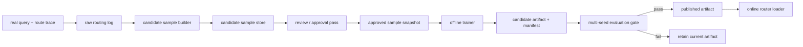

# feat: Add offline auto-training loop for the memory router

## Overview

Add a future-safe offline auto-training loop for the Phase 1 memory router so the system can accumulate training-ready routing samples from real usage, periodically retrain lightweight gate/task classifiers, evaluate candidate artifacts, and promote only approved versions into online serving.

This plan does not change the current production hot path in this phase. It defines how to build the supporting collection, curation, training, evaluation, and promotion pipeline around the existing router boundary.

## Problem Frame

The current router can now train lightweight classifiers offline from benchmark-derived data, but it still lacks a sustainable path to learn from real traffic. That creates a hard ceiling on generalization: the system can improve against curated benchmark slices, but it cannot systematically accumulate the long-tail phrasing that appears in real conversations.

The origin requirements document defines the correct product boundary: real conversations should feed a data loop, not an online self-learning loop. The implementation therefore needs to separate raw behavior logs, candidate training samples, approved training samples, and published classifier artifacts while keeping the online hot path local, fast, and rollback-safe (see origin: `docs/brainstorms/2026-04-13-memory-router-autotraining-requirements.md`).

The user also clarified one additional control boundary that this plan now treats as fixed:

- human confirmation belongs to a backend/admin control surface
- training must be triggered by that backend/admin control surface
- online collection must never auto-start a training run

## Requirements Trace

- R1-R3. Keep this work out of the current request path and avoid planner/runtime semantic coupling.
- R4-R7. Capture router-relevant behavior from real conversations without treating raw conversations as labels.
- R8-R12. Separate raw logs, candidate samples, and approved samples with source metadata and traceability.
- R13-R16. Use periodic offline retraining with lightweight classifiers and explicit artifact outputs.
- R17-R20. Evaluate candidate artifacts with holdout and multi-seed regression gates before promotion.
- R21-R24. Let online serving load only published static artifacts and degrade safely when artifacts are unavailable.
- R25-R28. Preserve auditability, manual review, filtering, and rollback controls.
- R12a, R16a, R25a. Route human confirmation and training triggers through a backend/admin control surface rather than online automation.

## Scope Boundaries

- This plan does not add online or per-request training.
- This plan does not retrain the underlying embedding model.
- This plan does not require a human review UI in the first implementation pass.
- This plan does not redesign router/planner/runtime contracts.
- This plan does not replace the current lightweight router immediately; it adds a closed-loop path that can later feed a trained backend.

## Context & Research

### Relevant Code and Patterns

- `src/opencortex/intent/router.py`: current Phase 1 online boundary and trace semantics.
- `src/opencortex/intent/training.py`: newly added offline training helper for benchmark/manual data.
- `scripts/train_intent_classifier.py`: current artifact-building entry point.
- `src/opencortex/context/manager.py`: already carries route/plan/runtime trace facts and user follow-up context on the hot path.
- `src/opencortex/config.py`: existing home for server-side feature flags and artifact-related configuration.
- `src/opencortex/alpha/trace_store.py`: existing pattern for durable trace persistence with metadata and callback-based ingestion.
- `src/opencortex/orchestrator.py`: existing reward/feedback pattern and likely owner of model/artifact lifecycle hooks.
- `tests/test_intent_training.py`: current offline training coverage anchor.

### Institutional Learnings

- `docs/solutions/best-practices/memory-intent-hot-path-refactor-2026-04-12.md`: keep hot-path concerns split cleanly and avoid bleeding downstream concerns back into router semantics.
- `docs/opencortex-technical-design.md`: already frames memory/trace/feedback as lifecycle inputs and assumes future training-ready traces.
- `docs/feature-design-overview.md`: uses a staged `trace -> labels -> training` lifecycle that matches this plan's required separation.

### External References

- None. The repo already contains the relevant lifecycle, trace, training, and artifact patterns for this work.

## Key Technical Decisions

- Build the loop around immutable stages: raw routing logs, candidate samples, approved samples, candidate artifacts, published artifacts.
- Reuse existing trace/metadata persistence patterns instead of inventing a router-specific online training store from scratch.
- Keep training lightweight and offline by extending the current `src/opencortex/intent/training.py` pipeline rather than introducing a separate ML service.
- Make artifact promotion an explicit step with manifest-based evaluation results rather than silently replacing online weights after training.
- Treat user behavior as weak supervision only; no single runtime event may directly become a final label.

## Open Questions

### Resolved During Planning

- Should this be online self-learning: no. The origin doc explicitly requires periodic offline retraining only.
- Should this retrain the embedding model: no. Only a lightweight gate/task classifier head is in scope.
- Should the online router load unpublished artifacts: no. Only published artifacts may influence serving.
- Should raw conversations be directly converted into labels: no. They first become candidate samples with provenance and review state.

### Deferred to Implementation

- Exact storage substrate for candidate and approved samples: deferred because it depends on whether the team prefers a trace-store-adjacent Qdrant collection, file-backed export, or a dedicated warehouse layer.
- Exact weak-label heuristics: deferred because they should be characterized against real data before freezing rules.
- Exact artifact manifest schema versioning: deferred until the first end-to-end training job writes a stable payload.
- Exact approval workflow form factor: deferred because batch CLI review may be enough before a UI exists.

## High-Level Technical Design

> *This illustrates the intended approach and is directional guidance for review, not implementation specification. The implementing agent should treat it as context, not code to reproduce.*

## Implementation Units

- [ ] **Unit 1: Add a durable router training-sample domain model**

**Goal:** Define the canonical data model for raw routing logs, candidate samples, approved samples, and artifact manifests so later collection and promotion work shares one vocabulary.

**Requirements:** R4-R12, R25-R28

**Dependencies:** None

**Files:**
- Create: `src/opencortex/intent/autotraining_types.py`
- Modify: `src/opencortex/intent/training.py`
- Modify: `src/opencortex/intent/__init__.py`
- Test: `tests/test_intent_autotraining_types.py`

**Approach:**
- Introduce explicit models for:
  - raw routing observation
  - candidate training sample
  - approved training sample
  - candidate artifact manifest
  - published artifact manifest
- Keep provenance first-class: every candidate sample should carry `source_kind`, timestamps, label provenance, and trace references.
- Reuse the current offline trainer as the canonical place where approved samples become trainable arrays, rather than duplicating label structures elsewhere.

**Patterns to follow:**
- `src/opencortex/intent/types.py`
- `src/opencortex/alpha/types.py`
- `src/opencortex/alpha/trace_store.py`

**Test scenarios:**
- Happy path: serializing each autotraining model preserves query, label, provenance, and timestamps.
- Edge case: a raw observation with no final label remains representable as a non-trainable record.
- Edge case: approved and candidate samples with the same query but different provenance remain distinguishable.
- Error path: invalid sample state transitions such as `approved` without approval metadata are rejected.
- Integration: `src/opencortex/intent/training.py` can consume approved-sample models without losing label/source counts.

**Verification:**
- The new model layer can represent every stage from observation through artifact publication without using ad hoc dicts.

- [ ] **Unit 2: Add opt-in raw routing observation capture without changing serving behavior**

**Goal:** Capture training-relevant raw observations from the online memory pipeline with minimal hot-path intrusion and clear opt-in controls.

**Requirements:** R1-R3, R4-R7, R21-R24

**Dependencies:** Unit 1

**Files:**
- Create: `src/opencortex/intent/autotraining_collector.py`
- Modify: `src/opencortex/context/manager.py`
- Modify: `src/opencortex/orchestrator.py`
- Modify: `src/opencortex/config.py`
- Test: `tests/test_intent_autotraining_collector.py`
- Test: `tests/test_context_manager.py`

**Approach:**
- Add a server-side collector that records raw routing observations asynchronously after route/plan/runtime facts are already known.
- Capture enough context to support later weak labeling:
  - query text
  - route output
  - planner/runtime summary
  - retry/rewrites when visible within the same session
  - explicit reward/negative signals when available
- Keep the collector failure-isolated: if observation persistence fails, current request handling must proceed unchanged.
- Gate the feature in config so the collection loop can be enabled independently of artifact loading.
- Do not let collection completion or weak-label generation trigger training; the collector stops at raw observation persistence.

**Execution note:** Characterization-first. This unit touches the current hot path and should preserve existing route/planner/runtime traces before new capture logic is added.

**Patterns to follow:**
- `src/opencortex/context/manager.py` stage-timing and trace propagation
- `src/opencortex/alpha/trace_store.py` persistence callback pattern
- `src/opencortex/orchestrator.py` reward/feedback hooks

**Test scenarios:**
- Happy path: a normal recallable request emits one raw routing observation with route, planner, and runtime summaries.
- Happy path: a `no_recall` request emits a raw observation without planner/runtime-derived training labels.
- Edge case: repeated queries in one session produce distinct observations with stable session/turn references.
- Error path: collector storage failure does not change the response payload or crash request handling.
- Error path: when collection is disabled in config, no observation writer is invoked.
- Integration: reward/citation signals can be attached to previously written observations through stable identifiers rather than duplicate records.

**Verification:**
- Online behavior remains unchanged while opt-in raw observation records become available for offline sample construction.

- [ ] **Unit 3: Build candidate-sample construction and approval snapshots**

**Goal:** Convert raw routing observations into candidate samples, apply weak-label logic safely, and materialize approved sample snapshots for training.

**Requirements:** R7-R12, R25-R28

**Dependencies:** Units 1-2

**Files:**
- Create: `src/opencortex/intent/autotraining_dataset.py`
- Create: `scripts/build_intent_training_candidates.py`
- Create: `scripts/approve_intent_training_candidates.py`
- Modify: `src/opencortex/intent/training.py`
- Test: `tests/test_intent_autotraining_dataset.py`

**Approach:**
- Add an offline candidate-builder that reads raw observations and emits candidate samples with explicit `label_source`.
- Keep weak supervision separate from approval:
  - candidate construction may infer provisional labels
  - approval snapshots are the only inputs that can reach the trainer
- Keep approval outside the trainer itself: a backend/admin control surface owns candidate review state transitions and selects which approved snapshot is trainable.
- Support filtered snapshot building by date range, source type, and approval state so operators can train on a bounded slice rather than the entire warehouse.
- Merge approved real-world samples with benchmark/manual seeds in a reproducible order, preserving manifest counts by source.

**Patterns to follow:**
- `src/opencortex/intent/training.py` dataset summary and artifact manifest style
- `scripts/train_intent_classifier.py` offline CLI shape

**Test scenarios:**
- Happy path: raw observations become candidate samples with `candidate` status and explicit weak-label provenance.
- Happy path: backend-approved snapshots include only approved records plus selected benchmark/manual seeds.
- Edge case: duplicate queries from different sessions remain separate until explicit dedupe policy is applied.
- Edge case: `no_recall` candidates with weak evidence stay unapproved by default.
- Error path: malformed raw observations are skipped with audit visibility instead of crashing snapshot generation.
- Integration: training on an approved snapshot yields the same label counts recorded in the snapshot manifest.

**Verification:**
- There is a reproducible path from raw observations to an approved training snapshot without leaking weak labels directly into the trainer.

- [ ] **Unit 4: Add multi-seed evaluation and artifact promotion gates**

**Goal:** Turn the current one-shot trainer into a controlled artifact pipeline that compares candidate and incumbent classifiers before promotion.

**Requirements:** R13-R20, R25-R28

**Dependencies:** Units 1-3

**Files:**
- Modify: `src/opencortex/intent/training.py`
- Modify: `scripts/train_intent_classifier.py`
- Create: `scripts/eval_intent_classifier.py`
- Create: `src/opencortex/intent/artifact_registry.py`
- Test: `tests/test_intent_training.py`
- Test: `tests/test_intent_artifact_registry.py`

**Approach:**
- Extend the offline trainer to emit:
  - training snapshot reference
  - candidate artifact identifiers
  - holdout metrics
  - multi-seed regression metrics
  - incumbent comparison
- Require the training entry point to accept an explicit backend-approved snapshot identifier instead of implicitly training on all available candidates.
- Define an artifact registry contract with explicit states such as `candidate`, `published`, `rejected`, and `rolled_back`.
- Require promotion gates to check both mean and stability, not just best single run.
- Keep promotion explicit even if automated: the registry should record why an artifact was or was not promoted.

**Patterns to follow:**
- `src/opencortex/intent/training.py` manifest output
- benchmark report manifests in `docs/benchmark/`

**Test scenarios:**
- Happy path: a candidate artifact with metrics above configured thresholds is marked promotable.
- Happy path: a stronger incumbent comparison produces a published artifact manifest with reproducible references.
- Happy path: a backend-triggered training run uses only the explicitly selected approved snapshot.
- Edge case: a candidate with higher peak accuracy but worse variance is rejected.
- Edge case: artifact promotion keeps both current and previous published versions available for rollback.
- Error path: missing evaluation data prevents promotion instead of defaulting to publish.
- Error path: no approved snapshot selected means training does not start.
- Integration: multi-seed evaluation can compare candidate artifacts against the currently published artifact on the same regression suite.

**Verification:**
- Artifact promotion becomes manifest-driven and reproducible rather than an ad hoc training side effect.

- [ ] **Unit 5: Add online published-artifact loading with safe fallback**

**Goal:** Let the router load only published classifier artifacts at startup or refresh time while preserving current fallback behavior when artifacts are absent or invalid.

**Requirements:** R21-R24

**Dependencies:** Unit 4

**Files:**
- Modify: `src/opencortex/intent/router.py`
- Modify: `src/opencortex/config.py`
- Modify: `src/opencortex/context/manager.py`
- Modify: `src/opencortex/orchestrator.py`
- Test: `tests/test_intent_router_session.py`
- Test: `tests/test_recall_planner.py`
- Test: `tests/test_context_manager.py`

**Approach:**
- Add a published-artifact loader path that is server-configured and optional.
- Keep the current lightweight classifier as the baseline fallback when no published artifact is active.
- Surface trace attribution showing whether routing used:
  - lightweight baseline
  - published trained classifier
  - fallback due to artifact failure
- Avoid artifact-dependent request-shape changes; loading must remain transparent to clients.

**Execution note:** Characterization-first. The route trace contract and current fallback semantics should be locked down before introducing published-artifact loading.

**Patterns to follow:**
- `src/opencortex/intent/router.py` backend init and safe fallback pattern
- `src/opencortex/context/manager.py` memory pipeline trace emission
- `src/opencortex/config.py` server-side feature-flag style

**Test scenarios:**
- Happy path: a valid published artifact is loaded and used for routing while public Phase 1 output stays unchanged.
- Happy path: route trace exposes artifact-backed mode distinctly from lightweight fallback.
- Edge case: no published artifact configured keeps the current lightweight path unchanged.
- Error path: corrupt or version-incompatible artifact causes safe fallback without startup failure.
- Integration: orchestrator and context-manager traces continue to expose effective router mode and route attribution after artifact-backed routing is enabled.

**Verification:**
- Online serving can consume published artifacts safely without losing the existing fallback path.

- [ ] **Unit 6: Document operator workflow and review gates**

**Goal:** Make the collection, approval, training, evaluation, publication, and rollback loop operable by the team without reverse-engineering code paths.

**Requirements:** R17-R20, R25-R28

**Dependencies:** Units 1-5

**Files:**
- Modify: `docs/brainstorms/2026-04-13-memory-router-autotraining-requirements.md`
- Create: `docs/solutions/memory-router-autotraining-workflow.md`
- Modify: `README.md`
- Test: `Test expectation: none -- documentation and operator workflow only.`

**Approach:**
- Document the end-to-end lifecycle:
  - collection enablement
  - candidate export
  - backend/admin approval snapshot creation
  - backend-triggered offline training
  - multi-seed evaluation
  - artifact promotion and rollback
- Keep rollout guidance explicit about what remains manual versus automated in the first version.
- Document audit expectations so future operators know where to inspect provenance, manifests, and rejected artifacts.

**Patterns to follow:**
- existing `docs/solutions/` operational write-up style
- benchmark reporting docs in `docs/benchmark/`

**Test scenarios:**
- Test expectation: none -- documentation-only unit with no behavioral change.

**Verification:**
- A new implementer or operator can trace the full auto-training loop from raw observations to published artifact without consulting source code first.

## System-Wide Impact

- **Interaction graph:** `ContextManager` request handling, router trace emission, offline training scripts, config loading, and future artifact registry all participate in the loop.
- **Error propagation:** collection and artifact loading must fail closed to the current lightweight router; offline training failures must never impact online availability.
- **State lifecycle risks:** the system introduces new persistent states (`raw`, `candidate`, `approved`, `candidate artifact`, `published artifact`) that must not collapse into one another.
- **API surface parity:** public router responses remain unchanged, but internal trace payloads and operator-facing scripts gain new surfaces.
- **Integration coverage:** end-to-end tests must prove that route traces can be captured, transformed into approved snapshots, trained into artifacts, and loaded back into the router without contract drift.
- **Unchanged invariants:** `router -> planner -> runtime` ownership and the public `MemoryRouteDecision` contract remain unchanged throughout this plan.

## Risks & Dependencies

| Risk | Mitigation |
|------|------------|
| Weak labels contaminate the training set and degrade classifier quality | Keep candidate and approved samples separate; require explicit approval and manifest provenance before training |
| Hot-path collection adds noticeable latency | Make collection async, failure-isolated, and config-gated; characterize latency before and after |
| Artifact promotion becomes too opaque to trust | Require manifest-based comparison, stored metrics, and explicit artifact states |
| Real traffic skews the classifier away from benchmark coverage | Keep benchmark/manual seeds in every approved snapshot and compare against incumbent artifacts on a fixed regression suite |
| Artifact loading failures create startup fragility | Preserve current lightweight classifier as the default fallback and treat artifact load errors as degradable |

## Documentation / Operational Notes

- The first implementation should ship with collection disabled by default until storage volume, candidate quality, and review flow are validated.
- Approval and promotion may remain CLI-driven in the first version; no UI is required to start.
- Artifact retention should preserve at least the current and previous published versions for rollback.

## Sources & References

- **Origin document:** `docs/brainstorms/2026-04-13-memory-router-autotraining-requirements.md`
- Related code: `src/opencortex/intent/router.py`
- Related code: `src/opencortex/intent/training.py`
- Related code: `src/opencortex/context/manager.py`
- Related code: `src/opencortex/config.py`
- Related code: `src/opencortex/alpha/trace_store.py`
- Related learning: `docs/solutions/best-practices/memory-intent-hot-path-refactor-2026-04-12.md`
