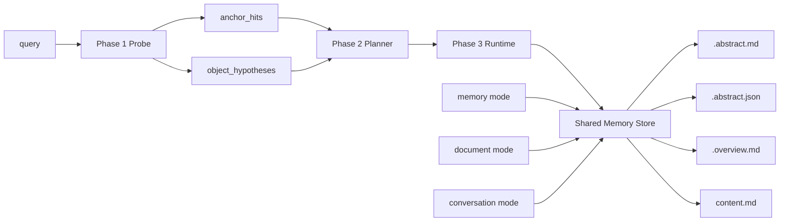

# refactor: align memory retrieval and store around anchor-aware layered objects

## Overview

Rebuild the memory hot path and store contract around one shared shape:

- Phase 1 probe becomes `anchor-aware L0` retrieval over derived anchor projections
- Phase 2 planner consumes `query + probe_result(anchor_hits + object_hypotheses)` and decides whether `L0` can stop or whether to escalate to `L1`, `L2`, cone, rerank, or exceptional rewrite
- Phase 3 runtime remains bounded and execution-only, with cone treated as anchor-first, budgeted expansion rather than a second planner
- All three ingest modes (`memory`, `document`, `conversation`) converge on one durable `MemoryObject + layered files + derived anchors` contract

This plan is intentionally destructive with respect to the remaining text-first and category-first semantics. It does not preserve transcript-concatenation memory as a durable target shape, and it does not preserve category-only mergeability as the main store policy.

## Problem Frame

The repo now has aligned requirements for probe, planner, runtime, and store, but the implementation surface is still split across old and new assumptions:

- `src/opencortex/intent/probe.py` still returns object-first candidates rather than anchor-first evidence
- `src/opencortex/intent/planner.py` still derives posture from legacy class-prior assumptions instead of `anchor_hits + object_hypotheses`
- `src/opencortex/storage/cortex_fs.py` only writes `.abstract.md`, `.overview.md`, and `content.md`, so the canonical `.abstract.json` machine surface does not exist yet
- `src/opencortex/orchestrator.py` still treats `memory` mode as the default loose text writer, and document mode falls back into that same contract
- `src/opencortex/context/manager.py` still merges buffered conversation by concatenating transcript text into an `events` record
- write-time dedup and merge are still driven by `category in MERGEABLE_CATEGORIES` and `_merge_into()` string concatenation instead of object-aware merge policy

That means the planned architecture is not yet realizable end to end. If implementation continues incrementally without a concrete plan, the most likely outcome is partial migration:

- probe emits a new schema while store still writes old records
- planner speaks in anchors while write paths do not persist canonical anchors
- conversation keeps creating merged transcript blobs that do not fit the new retrieval model
- document and memory modes drift into different object semantics

The goal of this refactor is to make `probe -> planner -> runtime` and `memory/document/conversation -> shared store contract` land together.

## Requirements Trace

- R1. Carry forward the Phase 1 bootstrap-probe requirements from `docs/brainstorms/2026-04-13-memory-router-coarse-gating-requirements.md`, especially the shift to `anchor-aware L0 probing`, `anchor_hits + object_hypotheses`, and `.abstract.json`-sourced derived anchor projections.
- R2. Carry forward the Phase 2 planner requirements from `docs/brainstorms/2026-04-13-memory-planner-object-aware-requirements.md`, especially the evidence-driven stop/escalate decision, `L1` as the default arbitration layer, and rewrite as an exceptional recovery tool.
- R3. Carry forward the Phase 3 runtime requirements from `docs/brainstorms/2026-04-13-memory-runtime-bounded-adaptive-requirements.md`, especially bounded runtime-only adaptation, anchor-first cone execution, and provenance-preserving trace/degrade outputs.
- R4. Carry forward the Phase 4 store requirements from `docs/brainstorms/2026-04-13-memory-store-domain-module-requirements.md`, especially primary `MemoryKind`, `.abstract.md + .abstract.json + .overview.md + content.md`, derived anchor projections, and the requirement that all three ingest modes converge on one store contract.
- R5. Remove legacy text-first and category-first behavior from the durable memory path rather than preserving it behind a compatibility layer.

## Scope Boundaries

- In scope:
  - anchor-aware probe contract and planner/runtime consumers
  - layered store surface including `.abstract.json`
  - object-aware merge policy for direct memory writes
  - document mode alignment to the shared object contract
  - conversation mode alignment away from merged transcript blobs toward extracted objects
  - public and internal payload updates where probe/planner/runtime surfaces are serialized

- Out of scope:
  - training a new classifier model
  - remote LLM planning in the hot path
  - full graph-native storage replacement
  - collapsing traces and memory objects into one shared lifecycle
  - benchmark performance claims before implementation and measurement

## Context & Research

### Relevant Code and Patterns

- `src/opencortex/intent/probe.py`: current Phase 1 implementation; object-first and still shaped around legacy candidate hits rather than `anchor_hits + candidate_entries`
- `src/opencortex/intent/planner.py`: current class-prior-driven planner that must be reshaped around `anchor_hits + object_hypotheses`
- `src/opencortex/intent/executor.py`: current bounded runtime shell; good boundary baseline, but not yet cone-aware in the new sense
- `src/opencortex/intent/types.py`: DTO contract surface that must carry the new probe/planner/runtime schemas
- `src/opencortex/memory/domain.py`: current shared domain types and `MemoryKindPolicy` baseline
- `src/opencortex/memory/mappers.py`: current normalization layer to extend into layered object and anchor projection mapping
- `src/opencortex/orchestrator.py`: main ingest and retrieval orchestration; contains `_add_document()`, direct `add()`, dedup, and `_merge_into()`
- `src/opencortex/context/manager.py`: current conversation immediate-write and merge-buffer behavior
- `src/opencortex/storage/cortex_fs.py`: current layered file writer that needs `.abstract.json` support
- `src/opencortex/alpha/trace_store.py`: useful pattern for keeping trace evidence separate from object memory
- `src/opencortex/alpha/knowledge_store.py`: useful pattern for alternate store surfaces that still use CortexFS layers
- `tests/test_memory_probe.py`, `tests/test_intent_planner_phase2.py`, `tests/test_memory_runtime.py`, `tests/test_memory_domain.py`, `tests/test_document_mode.py`, `tests/test_conversation_immediate.py`, `tests/test_conversation_merge.py`, `tests/test_context_manager.py`, `tests/test_http_server.py`: current tests to reuse and extend

### Institutional Learnings

- `docs/solutions/best-practices/memory-intent-hot-path-refactor-2026-04-12.md`: keep the hot path explicit in `probe/planner/runtime` phases and do not let runtime or public payloads revive old semantics

### External References

- None. The requirements are already grounded in local architectural decisions and the repo has enough active code to plan without external research.

## Key Technical Decisions

- One active plan, no compatibility layer: update the existing active plan in place and implement destructively instead of keeping both old and new probe/store contracts alive.
- `MemoryObject` remains the only durable memory unit: anchors are derived retrieval projections, not primary lifecycle records.
- `.abstract.json` is the canonical machine-readable `L0`: vector metadata is only an index-side projection, not the source of truth.
- `.abstract.json` must use one fixed top-level schema across all `MemoryKind` values: kind differences belong in required fields and field semantics, not separate JSON shapes.
- Probe is anchor-first, object-second: Phase 1 recalls anchors, then cheaply aggregates parent object hypotheses.
- `L1` is the default arbitration layer: planner should prefer `L1` before `L2`, and cone should open only when anchors are already stable enough.
- Conversation memory must stop being merged transcript text: trace evidence stays append-only, while durable memory evolves through `immediate -> merged -> optional final` object stages with superseded stages removed from retrieval.
- `document` keeps hierarchy on write, not a special read path: parsing, section structure, and lineage stay document-specific on ingest, but retrieval after persistence must still run through the same probe/planner/runtime pipeline.
- Legacy memory data is intentionally dropped rather than migrated: the refactor may restart durable retrieval data from the new contract.
- `memory` mode becomes the canonical object writer: document and conversation must converge to the same persistence contract instead of preserving their own semantics.
- Carry a characterization-first execution posture: the refactor is hot-path and destructive, so contract tests should lock each unit before behavior changes fan out.

## Naming Decisions

The following naming decisions are fixed for this refactor and should be applied consistently across code, tests, and documentation. Do not preserve the old names behind aliases or compatibility shims.

| Old | New |
|-----|-----|
| `runtime` | `executor` |
| `MemoryObjectView` | `MemoryEntry` |
| `DerivedAnchorProjection` | `AnchorEntry` |
| `MemoryProbeCandidate` | `SearchCandidate` |
| `MemoryProbeEvidence` | `SearchEvidence` |
| `MemoryProbeResult` | `SearchResult` |
| `object_hypotheses` | `candidate_entries` |
| `MemoryRetrievePlan` | `RetrievalPlan` |
| `MemoryRuntimeTrace` | `ExecutionTrace` |
| `MemoryRuntimeResult` | `ExecutionResult` |

The following names are intentionally kept unchanged for now:

- `probe`
- `planner`
- `MemoryKind`
- `StructuredSlots`
- `QueryAnchor`
- `QueryAnchorKind`
- `anchor_hits`
- `MemoryQueryPlan`
- `MemorySearchProfile`
- `rewrite_mode`
- `retrieval_depth`
- `target_memory_kinds`
- `MemoryRuntimeDegrade`

## Open Questions

### Resolved During Planning

- Should Phase 1 be anchor-aware rather than object-summary-only: yes
- Should `.abstract.json` become part of the durable file contract: yes
- Should anchor projections be durable-derived rather than standalone records: yes
- Should planner consume `anchor_hits + object_hypotheses`: yes
- Should `L1` remain the default escalation target: yes
- Should conversation mode keep transcript concatenation as the durable memory shape: no
- Should merge behavior become kind-sensitive: yes
- Should document hierarchy survive: yes, but as hierarchy layered on top of the shared object contract

### Deferred to Implementation

- Exact object extraction heuristics that determine primary `MemoryKind`
- Exact object-aware merge keys for `profile`, `preference`, `constraint`, `relation`, and `summary`
- Exact store API shape for bounded anchor neighborhood fetches
- Exact cone scoring formula and rerank provenance weighting

## High-Level Technical Design

> This illustrates the intended approach and is directional guidance for review, not implementation specification. The implementing agent should treat it as context, not code to reproduce.



Directional store sketch:

```text
MemoryObject
  primary_kind: MemoryKind
  slots: StructuredSlots
  files:
    .abstract.md    -> object-readable L0 summary
    .abstract.json  -> machine-readable L0 summary + anchors + cheap slots
    .overview.md    -> L1 normalized object view
    content.md      -> L2 full evidence payload

DerivedAnchorProjection
  anchor_id
  parent_object_id
  anchor_type
  anchor_l0
  memory_kind
  cheap metadata

ProbeResult
  anchor_hits[]
  object_hypotheses[]
  top_score
  score_gap
  hit_count
```

## Implementation Units

- [x] **Unit 1: Stabilize shared contracts for layered objects and anchor-aware probe**

**Goal:** Replace the remaining old DTO and shared-domain assumptions with one contract that explicitly models layered objects, derived anchors, and `anchor_hits + object_hypotheses`.

**Requirements:** R1, R2, R4, R5

**Dependencies:** None

**Files:**
- Modify: `src/opencortex/intent/types.py`
- Modify: `src/opencortex/memory/domain.py`
- Modify: `src/opencortex/memory/mappers.py`
- Modify: `src/opencortex/intent/__init__.py`
- Test: `tests/test_memory_domain.py`
- Test: `tests/test_memory_probe.py`
- Test: `tests/test_intent_planner_phase2.py`

**Approach:**
- Extend the shared domain and DTO surfaces so the new concepts are explicit before changing execution logic.
- Model layered object surfaces and derived anchor projections in types first, so `memory`, `document`, `conversation`, probe, planner, and runtime can all converge on the same vocabulary.
- Lock one fixed `.abstract.json` top-level schema in Unit 1, and express kind differences only through required fields, field population rules, and validation.
- Keep the contract Pydantic-first and phase-native; do not leave stale fields that preserve old route/classifier semantics.

**Execution note:** Add characterization coverage for the current DTO serialization before removing legacy fields.

**Patterns to follow:**
- `src/opencortex/memory/domain.py`
- `src/opencortex/intent/types.py`
- `docs/solutions/best-practices/memory-intent-hot-path-refactor-2026-04-12.md`

**Test scenarios:**
- Happy path: serializing and deserializing a layered `MemoryEntry` preserves primary `MemoryKind`, slots, and layered file references.
- Happy path: `SearchResult` supports `anchor_hits + candidate_entries` without compatibility-only route fields.
- Happy path: all first-version `MemoryKind` values serialize under one shared `.abstract.json` top-level schema.
- Edge case: mixed anchor types under one parent object still serialize to one primary `MemoryKind`.
- Error path: invalid `.abstract.json`-derived anchor projection payloads are rejected by the schema instead of silently degrading into loose dicts.

**Verification:**
- Shared types encode the accepted architecture directly and no feature-bearing consumer needs legacy route/classifier DTOs to proceed.

- [x] **Unit 2: Extend CortexFS and store write primitives to persist `.abstract.json` and layered object files**

**Goal:** Make the filesystem and write primitives capable of writing and reading the canonical machine-readable `L0` surface required by the new store contract.

**Requirements:** R4, R5

**Dependencies:** Unit 1

**Files:**
- Modify: `src/opencortex/storage/cortex_fs.py`
- Modify: `src/opencortex/orchestrator.py`
- Modify: `src/opencortex/alpha/trace_store.py`
- Modify: `src/opencortex/alpha/knowledge_store.py`
- Create: `tests/test_memory_store_layers.py`
- Test: `tests/test_memory_domain.py`
- Test: `tests/test_document_mode.py`
- Test: `tests/test_http_server.py`

**Approach:**
- Extend `CortexFS.write_context()` or an equivalent writer so `.abstract.json` becomes a first-class layered file alongside `.abstract.md`, `.overview.md`, and `content.md`.
- Keep trace and knowledge storage explicit about what they do and do not use from the new layered contract; do not accidentally force them into the memory-object lifecycle.
- Ensure the layered writer is reusable from all three ingest modes instead of each mode inventing its own file semantics.

**Patterns to follow:**
- `src/opencortex/storage/cortex_fs.py`
- `src/opencortex/alpha/trace_store.py`
- `src/opencortex/alpha/knowledge_store.py`

**Test scenarios:**
- Happy path: writing a `MemoryObject` persists `.abstract.md`, `.abstract.json`, `.overview.md`, and `content.md` under one URI.
- Edge case: writing an object without optional overview or content still writes the required available layers without corrupting the directory.
- Error path: malformed `.abstract.json` write attempts fail visibly and do not leave partial silent state.
- Integration: existing L0/L1/L2 readers continue to read `.abstract.md`, `.overview.md`, and `content.md` correctly after adding `.abstract.json`.
- Integration: HTTP layer reads remain stable for `.abstract.md`, `.overview.md`, and `content.md` while new machine-readable `L0` data remains internal.

**Verification:**
- The store has one reusable layered-file writer that all memory-object-producing modes can call, and `.abstract.json` is persisted as a durable file rather than reconstructed ad hoc.

- [x] **Unit 3: Make direct memory writes canonical object writes with object-aware merge policy**

**Goal:** Turn `memory` mode into the reference path for writing durable `MemoryObject` records, including primary kind inference, layered file generation, anchor projection generation, and kind-sensitive merge behavior.

**Requirements:** R4, R5

**Dependencies:** Unit 1, Unit 2

**Files:**
- Modify: `src/opencortex/orchestrator.py`
- Modify: `src/opencortex/memory/mappers.py`
- Modify: `src/opencortex/memory/domain.py`
- Create: `tests/test_memory_mode_alignment.py`
- Test: `tests/test_memory_domain.py`
- Test: `tests/test_memory_probe.py`

**Approach:**
- Replace category-driven text merge with object extraction and object-aware dedup/merge decisions keyed by `MemoryKind`, normalized slots, and identity cues.
- Generate `.abstract.md`, `.abstract.json`, `.overview.md`, and `content.md` from one object writer instead of bolting them on after loose record creation.
- Regenerate anchor projections whenever the parent object changes; never merge anchors independently.

**Execution note:** Characterize current `dedup_action` behaviors before changing merge semantics so regressions are visible.

**Patterns to follow:**
- `src/opencortex/orchestrator.py:add()`
- `src/opencortex/orchestrator.py:_merge_into()`
- `src/opencortex/memory/domain.py`

**Test scenarios:**
- Happy path: a direct memory write produces one primary `MemoryObject` with `.abstract.json` and derived anchor projections.
- Happy path: a mergeable profile/preference write updates the stable object and regenerates anchor projections.
- Edge case: mixed-anchor input such as event-plus-preference still emits one primary `event` object with multiple anchor types.
- Error path: unsupported or low-confidence object extraction falls back to a safe first-version `MemoryKind` without producing malformed layered files.
- Integration: object-aware merge replaces category-only `MERGEABLE_CATEGORIES` behavior for direct memory writes.

**Verification:**
- `memory` mode writes are the canonical reference implementation for the new store contract, and merge behavior is object-aware instead of text-concatenative.

- [x] **Unit 4: Align document mode to the shared object contract without losing hierarchy**

**Goal:** Preserve document parent/child hierarchy on ingest while ensuring every stored document unit projects into the same layered object and anchor contract as direct memory writes and later reads through the unified probe/planner/runtime path.

**Requirements:** R4, R5

**Dependencies:** Unit 1, Unit 2, Unit 3

**Files:**
- Modify: `src/opencortex/orchestrator.py`
- Modify: `src/opencortex/memory/mappers.py`
- Modify: `src/opencortex/storage/cortex_fs.py`
- Test: `tests/test_document_mode.py`
- Test: `tests/test_memory_store_layers.py`

**Approach:**
- Keep hierarchy and path structure, but stop treating chunk records as path-shaped text records only.
- Ensure each chunk or section projects into a typed `MemoryEntry`, defaulting to leaf `document_chunk` objects in the first version.
- Generate `.abstract.json` and anchor projections for document units from the same writer used by `memory` mode.
- Put document-specific richness in the write path:
  - parse
  - hierarchy construction
  - object projection
  - layered file generation
  while keeping the read path shared with other modes.
- Make `.abstract.json` carry document-lineage fields such as `source_doc_id`, `source_doc_title`, `section_path`, `chunk_index`, and parent or sibling lineage hints when available.
- Add parent section objects only when explicit hierarchy thresholds show that they materially improve navigation or hydration; do not create them by default.
- Prefer source-aware replace or subtree rebuild on document updates rather than semantic merge.
- Treat document cone as lineage-first expansion over same-document, parent-section, child-section, adjacent-chunk, and same-topic edges.

**Patterns to follow:**
- `src/opencortex/orchestrator.py:_add_document()`
- `src/opencortex/storage/cortex_fs.py`

**Test scenarios:**
- Happy path: multi-chunk document ingest writes parent and child document units with the shared layered file contract.
- Happy path: a document chunk produces `document_chunk` kind and anchor projections from `.abstract.json`.
- Happy path: after persistence, document-derived objects are discoverable through the same probe/planner/runtime path as memory and conversation objects rather than a document-only recall path.
- Edge case: single-chunk fallback still lands on the canonical object writer rather than a special loose record path.
- Edge case: anchor `L0` text can incorporate limited section-aware context without bloating the payload or duplicating full overviews.
- Integration: parent-child document hierarchy remains navigable after document units are normalized into `MemoryEntry`.
- Integration: document update replaces or rebuilds the affected chunk or subtree without text-merging unrelated document objects.
- Error path: missing section metadata does not prevent valid layered object creation for the chunk.

**Verification:**
- Document mode preserves hierarchy and source lineage while emitting the same layered object contract as direct memory writes and the same unified retrieval contract as other modes.

- [x] **Unit 5: Replace conversation transcript merge with extracted object persistence and trace-backed evidence**

**Goal:** Replace transcript-concatenation memory with one conversation object evolution line: short-lived `immediate` objects, superseding `merged` objects, and optional selective `final` session-end objects, while keeping raw trace evidence recoverable.

**Requirements:** R4, R5

**Dependencies:** Unit 1, Unit 2, Unit 3

**Files:**
- Modify: `src/opencortex/context/manager.py`
- Modify: `src/opencortex/orchestrator.py`
- Modify: `src/opencortex/alpha/trace_store.py`
- Modify: `src/opencortex/memory/mappers.py`
- Create: `tests/test_memory_conversation_alignment.py`
- Test: `tests/test_conversation_immediate.py`
- Test: `tests/test_conversation_merge.py`
- Test: `tests/test_context_manager.py`

**Approach:**
- Preserve immediate turn searchability, but model it as a short-lived object stage rather than a durable long-term memory shape.
- Replace `_merge_buffer()` transcript concatenation output with object extraction from merged content; `merged` objects must supersede and remove the corresponding `immediate` retrieval objects.
- If session-end consolidation produces `final` objects, treat them as selective superseding replacements for chosen `merged` objects rather than a third parallel retrieval layer.
- Encode conversation merge policy by `MemoryKind`: append events, merge/update profile and preference carefully, update constraints structurally, merge relations conservatively, recompute summaries.
- Recompute anchors from the stage's current content at every stage transition; do not concatenate or merge anchors across `immediate`, `merged`, and `final`.
- Keep raw transcript evidence in trace or `content.md`; do not lose replayability when object-level merge happens.

**Execution note:** Start with characterization coverage for current conversation immediate-write and merge-buffer behavior before switching the durable target shape.

**Patterns to follow:**
- `src/opencortex/context/manager.py`
- `src/opencortex/alpha/trace_store.py`
- `src/opencortex/orchestrator.py:add()`

**Test scenarios:**
- Happy path: immediate conversation objects are searchable before merge, then are removed from retrieval once merged objects are created successfully.
- Happy path: buffered conversation content produces one or more extracted `merged` `MemoryObject` records instead of a merged transcript blob.
- Happy path: raw transcript evidence remains recoverable from trace or `content.md` after object extraction.
- Edge case: a conversation containing mixed event and preference signals yields one primary event object with auxiliary anchors instead of fragmented records.
- Edge case: repeated preference statements update the stable preference/profile object without losing prior evidence.
- Edge case: merge-stage anchor projections are recomputed from merged content and do not retain stale immediate-stage anchors after immediate cleanup.
- Edge case: if session-end consolidation emits `final` objects, superseded merged objects are no longer returned by probe.
- Error path: extraction failure preserves source evidence and avoids corrupt partial object writes.
- Integration: end-of-session flush no longer writes concatenated `events` transcript memory as the durable outcome, and any optional final consolidation does not leave three parallel copies searchable.

**Verification:**
- Conversation mode produces durable objects compatible with probe/planner/runtime while keeping raw dialogue evidence intact and avoiding duplicate cross-stage retrieval copies.

- [x] **Unit 6: Implement anchor-aware probe, evidence-driven planner, bounded runtime, and envelope integration**

**Goal:** Finish the hot-path refactor by making probe consume derived anchor projections, planner consume `anchor_hits + object_hypotheses`, runtime carry the bounded cone-capable execution posture, and public envelopes serialize the new shape.

**Requirements:** R1, R2, R3, R5

**Dependencies:** Unit 1, Unit 2, Unit 3, Unit 4, Unit 5

**Files:**
- Modify: `src/opencortex/intent/probe.py`
- Modify: `src/opencortex/intent/planner.py`
- Modify: `src/opencortex/intent/executor.py`
- Modify: `src/opencortex/orchestrator.py`
- Modify: `src/opencortex/context/manager.py`
- Modify: `src/opencortex/retrieve/types.py`
- Modify: `src/opencortex/http/server.py`
- Test: `tests/test_memory_probe.py`
- Test: `tests/test_intent_planner_phase2.py`
- Test: `tests/test_memory_runtime.py`
- Test: `tests/test_http_server.py`
- Test: `tests/test_memory_eval.py`

**Approach:**
- Rewire probe to search anchor-level `L0` projections first, optionally consult object-level `L0`, and emit `anchor_hits + object_hypotheses`.
- Rewire planner sufficiency logic around best-anchor strength, object-hypothesis convergence, anchor coherence, and query demand for detail.
- Keep runtime bounded: it may bind cone budget, hydration posture, rerank, and degrade actions, but it must not recover semantic routing.
- Update envelopes so `memory_pipeline` continues to expose explicit phase-native structures without reviving old route/classifier payloads.

**Execution note:** Implement new contract tests first for probe/planner/runtime serialization and only then switch orchestrator/context-manager callers to the new fields.

**Patterns to follow:**
- `src/opencortex/intent/probe.py`
- `src/opencortex/intent/planner.py`
- `src/opencortex/intent/executor.py`
- `docs/solutions/best-practices/memory-intent-hot-path-refactor-2026-04-12.md`

**Test scenarios:**
- Happy path: probe returns stable `anchor_hits + object_hypotheses` from canonical `.abstract.json`-derived projections.
- Happy path: planner stops at `L0` when anchor support and object convergence are both strong.
- Happy path: planner escalates to `L1` when anchors are plausible but summary-level support is insufficient, and escalates to `L2` only for full-content or arbitration cases.
- Happy path: runtime binds cone-related execution posture and preserves provenance in machine-readable trace.
- Edge case: anchor ambiguity and object ambiguity are distinguished and lead to broader planner posture rather than premature stop.
- Error path: runtime degrade disables optional rerank or association without mutating planner semantics.
- Integration: HTTP and context-manager payloads serialize the new phase-native probe/planner/runtime envelope consistently.

**Verification:**
- The active hot path is end-to-end consistent with the requirements docs: anchor-aware probe, evidence-driven planner, bounded runtime, and unified store-backed evidence surfaces.

## System-Wide Impact

- **Interaction graph:** `orchestrator.add()`, `_add_document()`, `ContextManager._merge_buffer()`, `MemoryBootstrapProbe`, `RecallPlanner`, `MemoryExecutor`, `CortexFS.write_context()`, and HTTP serialization all change together.
- **Error propagation:** write-path failures must leave source evidence recoverable even when object extraction or layered file generation fails; runtime failures must surface as degrade/fallback, not hidden replanning.
- **State lifecycle risks:** changing merge policy can create duplicates or unwanted overwrites if object identity cues are too weak; anchor projections must stay rebuildable from layered files to avoid index drift.
- **Data reset impact:** because legacy durable memory is intentionally discarded rather than migrated, rollout must assume a cold-start retrieval corpus under the new contract.
- **API surface parity:** `memory_pipeline` must stay phase-native across orchestrator responses, context-manager envelopes, and HTTP payloads.
- **Integration coverage:** unit tests alone are not enough; the plan requires cross-layer tests for write path -> layered files -> probe -> planner -> runtime -> serialization.
- **Unchanged invariants:** traces may remain append-only and separate from durable memory objects; document hierarchy may remain; runtime must stay local and non-LLM in production hot path.

## Risks & Dependencies

| Risk | Mitigation |
|------|------------|
| Object extraction misclassifies primary `MemoryKind` and causes merge damage | Keep merge posture conservative by default, especially for `event` and `relation`, and require structural identity cues before update/merge |
| `.abstract.json` becomes too heavy and recreates a second overview | Keep the schema narrow: summary, anchors, cheap slots, and lineage only |
| Conversation refactor breaks immediate searchability or evidence recovery | Preserve trace/immediate evidence separately from durable object memory and characterize current behavior first |
| Document mode loses hierarchy during normalization | Keep hierarchy explicit in parent/child URIs and lineage fields while normalizing each unit into `MemoryEntry` |
| Probe quality drops during anchor-first migration | Allow object-level `L0` fallback support and lock behavior with probe/planner tests before changing production callers |
| Cold start after dropping legacy durable memory hurts early recall coverage | Treat rollout as a fresh corpus build and validate ingest completeness before using benchmark conclusions |

## Documentation / Operational Notes

- Refresh `docs/solutions/best-practices/memory-intent-hot-path-refactor-2026-04-12.md` after implementation so it reflects `anchor-aware probe` and the layered object contract.
- If new `.abstract.json` files are added under CortexFS, update any maintenance tooling that assumes only `.abstract.md`, `.overview.md`, and `content.md`.
- Benchmark and profiling docs should be updated only after implementation proves the new path and its latency/quality tradeoffs.

## Sources & References

- **Origin documents:**
  - `docs/brainstorms/2026-04-13-memory-router-coarse-gating-requirements.md`
  - `docs/brainstorms/2026-04-13-memory-planner-object-aware-requirements.md`
  - `docs/brainstorms/2026-04-13-memory-runtime-bounded-adaptive-requirements.md`
  - `docs/brainstorms/2026-04-13-memory-store-domain-module-requirements.md`
- **Institutional learning:** `docs/solutions/best-practices/memory-intent-hot-path-refactor-2026-04-12.md`
- **Related code:**
  - `src/opencortex/intent/probe.py`
  - `src/opencortex/intent/planner.py`
  - `src/opencortex/intent/executor.py`
  - `src/opencortex/orchestrator.py`
  - `src/opencortex/context/manager.py`
  - `src/opencortex/storage/cortex_fs.py`
