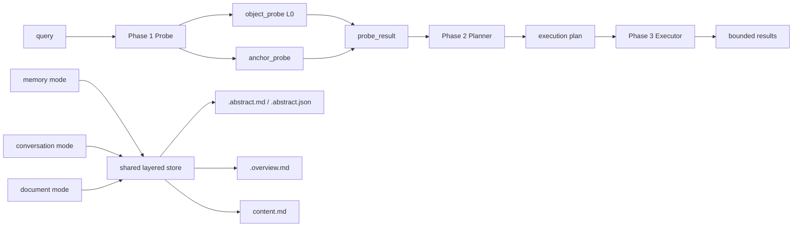

# refactor: rebuild memory retrieval around scoped object-first probe and layered execution

## Overview

Replace the current broad leaf-first recall path with a scoped, object-first retrieval path that borrows the right pieces from OpenViking without copying its full storage model:

- Phase 1 `probe` becomes a **scoped starting-point locator**, not a broad presearch
- Phase 2 `planner` becomes **evidence-driven arbitration**, not class-first widening
- Phase 3 `executor` becomes **bounded object retrieval with optional cone**, not candidate-pool inflation
- all three ingest modes (`memory`, `conversation`, `document`) converge on one layered store contract that makes `L0/L1` usable as retrieval surfaces rather than passive payload fields

This plan is intentionally destructive with respect to the remaining broad-search semantics:

- no internal compatibility layer
- no dual retrieval pipelines
- no continued reliance on “search a wide leaf pool, then repair with rerank/cone”

The public interface may stay stable, but the internal retrieval path should become a flag-day replacement.

## Problem Frame

The current implementation already has pieces of an object-aware system:

- `abstract_json`
- `memory_kind`
- `parent_uri`
- `session_id`
- `structured_slots`
- `anchor_hits`

But the hot path still behaves like a broad text retrieval system:

- `probe` performs one unified search, then extracts anchors from the returned records
- `planner` interprets low confidence as a signal to widen recall
- `executor` inflates candidate pools before rerank
- aggregate results are deduped but not re-capped to the requested `limit`
- `conversation` / `document` / `memory` write paths do not yet generate `L0/L1` in ways that support object-first retrieval consistently

That mismatch creates the benchmark failure pattern already seen in LoCoMo:

- scope is too wide
- exact time/entity questions are weak
- top-k is noisy because the system returns far more than the nominal `top_k`
- latency is high because too much work happens before the search space is reduced

The OpenViking comparison clarifies the missing architectural move:

> OpenViking uses global search only to find object or directory starting points, then performs bounded local retrieval. OpenCortex still uses global-ish search as the main retrieval step.

The purpose of this plan is to close that gap.

## Requirements Trace

- R1. Retrieval must become `scope-first` and `object-first`, not `leaf-first`.
- R2. Phase 1 `probe` must emit start-point evidence, not broad semantic candidates masquerading as a probe result.
- R3. `anchor_hits` must stop being only a byproduct of record hits and become a first-class probe surface.
- R4. `planner` must use evidence to constrain or escalate retrieval, not widen blindly on uncertainty.
- R5. `executor` must preserve strict candidate and result bounds all the way through final output.
- R6. `L0/L1` must become true retrieval surfaces for all three ingest modes.
- R7. `conversation`, `document`, and `memory` must converge on one layered object contract.
- R8. No internal compatibility layer should preserve the old broad-search behavior behind flags or adapters.
- R9. Public recall/search entry points may remain stable, but they must route only to the new chain.
- R10. The hot path must avoid remote-LLM dependence by default.

## Success Criteria

This refactor is successful when all of the following are true:

- A scoped conversation recall request always applies conversation/session constraints during probe and execution.
- `probe` searches only bounded `L0/object` and `anchor` surfaces, not the broad leaf pool.
- `planner` can stop at `L0` or `L1` without forcing deep retrieval.
- `executor` never returns more than the requested `limit` after aggregation.
- `executor` never inflates raw candidate count beyond explicit bounded caps.
- `L0/L1/L2` generation differs by mode where needed, but all modes land on the same durable contract.
- the old broad leaf-first path is removed rather than kept alongside the new path.
- benchmark traces can attribute failures to `probe`, `planner`, `executor`, or store quality.

## Implementation Status Audit (2026-04-15)

- Unit 1: complete
  - The phase contract has been moved into `src/opencortex/intent/types.py`, and characterization coverage exists in `tests/test_memory_probe.py`, `tests/test_intent_planner_phase2.py`, and `tests/test_memory_runtime.py`.
  - The old `router / recall_planner / memory_runtime` file split is gone from the main retrieval path.
- Unit 2: complete
  - Shared layered object projection is now centered on `.abstract.json`, `anchor_hits`, lineage, and `memory_kind`.
  - `memory`, `conversation`, and `document` all persist through the same object contract, with conversation immediate/merge lifecycle covered by `tests/test_context_manager.py`, `tests/test_conversation_immediate.py`, and document projection covered by `tests/test_document_mode.py`.
- Unit 3: complete
  - The dual-surface probe exists (`object_probe` + `anchor_probe`) and conversation scope filtering is wired through probe filters.
  - Fixed on 2026-04-15: probe now targets explicit retrieval surfaces (`retrieval_surface=l0_object` and `anchor_surface=true`) instead of relying only on the generic `is_leaf=True` leaf pool convention.
  - Fixed on 2026-04-15: anchor projections are now materialized as dedicated derived records, probe hits are remapped back to source objects, and conversation merge/end cleanup removes immediate projection descendants together with their source entries.
- Unit 4: complete
  - Planner and executor now emit bounded depth, cap, rerank, and cone posture.
  - Fixed on 2026-04-15: executor now keeps `bind_start_points` as a hard execution constraint whenever probe/planner produced start-point evidence, so execution no longer reopens a scoped broad-leaf fallback in those cases.
  - Fixed on 2026-04-15: `L1` sufficiency arbitration now happens after inspecting retrieved `L1` evidence, and execution upgrades to `L2` only when overview coverage is insufficient.
- Unit 5: partial
  - Old top-level retrieval files are gone, and benchmark-side LoCoMo support plus investigation docs have landed.
  - Fixed on 2026-04-15: benchmark adapters now emit a stable `retrieval_contract` describing endpoint, method, and whether session-scoped recall was enabled.
  - Fixed on 2026-04-15: LoCoMo retrieval now explicitly enables session-scoped recall against the conversation session instead of relying on unscoped prepare defaults.
  - Fixed on 2026-04-15: benchmark and HTTP contract tests now expect runtime phase attribution to include post-`L1` hydration and the `hydrate` timing stage.
  - Remaining gap: the plan’s benchmark re-baseline requirement is not fully closed for PersonaMem / LongMemEval / QASPER on the post-cutover path only.
  - Remaining gap: this plan originally referenced `benchmarks/adapters/personamem.py` and `benchmarks/adapters/longmemeval.py`, but the current repo uses `benchmarks/adapters/memory.py` and `benchmarks/adapters/conversation.py`.

## Scope Boundaries

- In scope:
  - probe / planner / executor cutover
  - scope filtering redesign for conversation/document/object retrieval
  - layered store contract and mode-specific `L0/L1` generation
  - bounded cone execution as a downstream retrieval feature
  - benchmark and regression attribution

- Out of scope:
  - training a query classifier
  - introducing a second primary memory store
  - replicating OpenViking’s full directory taxonomy
  - introducing remote LLM planning into the hot path
  - building a graph-native database as a prerequisite for cone

## Key Technical Decisions

- Keep one public interface, replace one internal path: callers may continue using the same recall/search APIs, but those APIs must route only to the new retrieval chain.
- `probe` remains the Phase 1 name, but its semantics change from “cheap broad presearch” to “scoped starting-point locator”.
- Phase 1 becomes dual-surface:
  - `object_probe` over `L0`
  - `anchor_probe` over derived anchor entries
- `planner` is evidence-driven and scope-constrained:
  - it should prefer `L0/L1` arbitration
  - it should escalate to `L2` or cone only when evidence justifies it
- low confidence should no longer imply broad global widening by default; it should imply narrower verification inside a bounded scope.
- `executor` owns hard caps:
  - raw candidate cap
  - cone expansion cap
  - rerank cap
  - final output cap
- `.abstract.json` remains the canonical machine-readable object surface.
- For v1 conversation retrieval scope, `session_id` is the only conversation isolation key.
  - Do not introduce `conversation_id` unless product semantics later require one conversation to span multiple OpenCortex sessions.
- `conversation`, `memory`, and `document` may use different `L0/L1` generation strategies, but they must persist the same layered object contract.
- Conversation durable memory follows one retrieval-visible lifecycle:
  - `immediate`: each commit writes layered objects and extracts anchors immediately.
  - `merged`: merge rewrites those objects into fewer durable entries, then re-extract anchors from the merged result.
  - `final` is optional and only used when another consolidation step materially improves retrieval quality.
  - Superseded conversation objects must leave the retrieval surface once their replacement is committed.
- old retrieval behavior is removed, not preserved behind internal compatibility shims.

## Open Questions

### Resolved During Planning

- Should this update reuse the existing public API surface: yes
- Should the old internal retrieval behavior remain behind flags: no
- Should `probe` search two surfaces instead of one broad surface: yes
- Should `conversation` recall gain hard scope filters: yes
- Should v1 introduce `conversation_id` in addition to `session_id`: no
- Should `planner` shift from widening-on-uncertainty to bounded arbitration: yes
- Should `document` and `conversation` use different `L0/L1` generation strategies while sharing one store contract: yes

### Deferred to Implementation

- Exact on-disk or vector projection shape for anchor entries
- Exact `L0 sufficiency` thresholds and `L1 arbitration` thresholds
- Exact cone edge families for v1
- Exact per-mode `L0/L1` prompting and fallback heuristics
- Exact benchmark target deltas by dataset after cutover

## High-Level Technical Design

## Implementation Units

- [x] **Unit 1: Lock the new retrieval contract and characterization gates**

**Goal:** Define the final `probe -> planner -> executor` contract and characterization gates first, so the later cutover can happen without inventing a temporary half-compatible retrieval path.

**Requirements:** R1, R2, R4, R5, R8, R9

**Dependencies:** None

**Files:**
- Modify: `src/opencortex/intent/types.py`
- Test: `tests/test_memory_probe.py`
- Test: `tests/test_intent_planner_phase2.py`
- Test: `tests/test_memory_runtime.py`

**Approach:**
- Finalize the contract so Phase 1 emits only:
  - scoped object candidates
  - anchor hits
  - bounded evidence fields
- Remove stale DTO fields that preserve legacy broad-search semantics at the contract boundary.
- Add characterization coverage that locks:
  - bounded phase payloads
  - final `limit` invariants
  - planner low-confidence semantics
- Do not cut over hot-path probe/planner/executor behavior in this unit.
  - Behavioral replacement starts only after Unit 2 makes the store contract usable.

**Test scenarios:**
- Happy path: phase DTO serialization produces a `SearchResult`-compatible shape with bounded candidate fields and no legacy broad-route fields.
- Edge case: planner contract tests lock that low-confidence means bounded verification semantics, not implicit global widening.
- Edge case: runtime contract tests lock that final aggregated result count must always be `limit` or fewer.
- Error path: empty probe payloads still serialize into explicit bounded fallback contracts.

**Verification:**
- No remaining phase contract refers to legacy broad-search assumptions such as implicit widening by confidence.
- Unit 1 ends with contracts and tests locked, not with a partially cut-over retrieval path.

- [x] **Unit 2: Upgrade the store contract so `L0/L1` become real retrieval surfaces**

**Goal:** Make the store write paths generate layered objects in a form that the new retrieval chain can actually use.

**Requirements:** R3, R6, R7, R10

**Dependencies:** Unit 1

**Files:**
- Modify: `src/opencortex/orchestrator.py`
- Modify: `src/opencortex/memory/domain.py`
- Modify: `src/opencortex/memory/mappers.py`
- Modify: `src/opencortex/storage/cortex_fs.py`
- Modify: `src/opencortex/context/manager.py`
- Test: `tests/test_memory_domain.py`
- Test: `tests/test_document_mode.py`
- Test: `tests/test_conversation_merge.py`
- Test: `tests/test_conversation_immediate.py`

**Approach:**
- Keep `.abstract.json` as the canonical machine-readable surface.
- Add or standardize the fields needed for scope-first retrieval:
  - `session_id`
  - `parent_uri`
  - `msg_range`
  - `source_doc_id`
  - lineage and anchor projections needed for bounded expansion
- Make each ingest mode produce the same layered object contract while allowing different generation strategies:
  - `memory`: one-shot object bundle generation
  - `conversation`: immediate object write with anchors, merge-time object consolidation with re-extracted anchors, then optional session-end final consolidation
  - `document`: bottom-up `L1`, then derived `L0`
- Keep conversation retrieval scope on `session_id` only in v1.
- Require superseded conversation objects to leave the retrieval surface after merge/final replacement.

**Test scenarios:**
- Happy path: all three modes persist one common layered object contract.
- Happy path: `.abstract.json` contains stable machine-readable anchor and lineage fields.
- Edge case: conversation immediate objects expose anchors before merge, and merged objects preserve `session_id` lineage and `msg_range`.
- Edge case: conversation merge replaces superseded immediate objects in the retrieval surface instead of duplicating them.
- Edge case: document parent/child lineage remains usable after object projection.
- Error path: missing optional `L1` data degrades predictably without breaking `L0` or `content`.

**Verification:**
- Retrieval no longer depends on ad hoc record shape differences between modes.
- `L0/L1` can be consumed as proper retrieval layers for every mode.
- Conversation retrieval never sees both superseded and replacement objects at the same time.

- [x] **Unit 3: Rebuild Phase 1 probe as a scoped starting-point locator**

**Goal:** Replace the current one-shot broad presearch with a real Phase 1 probe that finds objects and anchors inside a bounded scope.

**Requirements:** R1, R2, R3, R5, R9, R10

**Dependencies:** Unit 2

**Files:**
- Modify: `src/opencortex/intent/probe.py`
- Modify: `src/opencortex/orchestrator.py`
- Modify: `src/opencortex/memory/mappers.py`
- Test: `tests/test_memory_probe.py`
- Test: `tests/test_locomo_bench.py`
- Test: `tests/test_context_manager.py`

**Approach:**
- Split Phase 1 into:
  - `object_probe`: searches object `L0`
  - `anchor_probe`: searches anchor projections
- Ensure conversation recall uses hard conversation/session scope in probe filters.
- Ensure document recall can use source-aware scope when available.
- Return probe evidence that can support planning without requiring a second broad search.

**Test scenarios:**
- Happy path: conversation query probes only within the correct conversation/session scope.
- Happy path: anchor hits can be returned even when the correct object is not the top semantic `L0` hit.
- Edge case: no anchor hits but strong object hit still yields a valid bounded probe result.
- Edge case: no object hits but strong anchor hit still yields planner-usable evidence.
- Error path: probe failure degrades to explicit bounded fallback instead of wide global search.

**Verification:**
- Probe no longer relies on “hit record first, then extract anchors” as its only anchor source.
- Scoped datasets such as LoCoMo can no longer accidentally compete against the full benchmark corpus during Phase 1.

- [x] **Unit 4: Rebuild Phase 2 planner and Phase 3 executor as bounded object-first retrieval**

**Goal:** Make planning and execution operate inside the scope discovered by Phase 1, using `L0/L1` for arbitration and only using `L2` or cone when justified.

**Requirements:** R4, R5, R6, R8, R9

**Dependencies:** Unit 3

**Files:**
- Modify: `src/opencortex/intent/planner.py`
- Modify: `src/opencortex/intent/executor.py`
- Modify: `src/opencortex/orchestrator.py`
- Modify: `src/opencortex/retrieve/cone_scorer.py`
- Test: `tests/test_intent_planner_phase2.py`
- Test: `tests/test_memory_runtime.py`
- Test: `tests/test_cone_scorer.py`

**Approach:**
- Planner should consume:
  - object candidates
  - anchor hits
  - probe evidence
- Planner should emit:
  - hard scope bindings
  - anchor constraints
  - retrieval depth
  - bounded candidate budgets
  - cone and rerank decisions
- Executor should:
  - retrieve within object/session/doc scope
  - use `L1` for sufficiency arbitration
  - hydrate `L2` only when needed
  - run cone as bounded object/anchor neighborhood expansion
  - preserve hard output caps after aggregation

**Test scenarios:**
- Happy path: `L0` stops early when evidence is sufficient.
- Happy path: `L1` arbitration decides whether `L2` hydration is required.
- Edge case: low-confidence result stays bounded inside the scoped object neighborhood.
- Edge case: cone expands only from selected object/anchor starting points.
- Error path: executor degrade steps narrow or skip optional work before violating scope or result-count guarantees.

**Verification:**
- No planner or executor path widens back to global broad-search behavior.
- Cone no longer acts as a generic candidate-pool inflator.

- [ ] **Unit 5: Remove old retrieval behavior, re-baseline benchmarks, and prove the new path**

**Goal:** Delete the old path, make benchmark attribution reflect the new phases, and verify that the system is truly running the new retrieval model end to end.

**Requirements:** R5, R8, R9, R10

**Dependencies:** Unit 4

**Files:**
- Modify: `src/opencortex/orchestrator.py`
- Modify: `src/opencortex/context/manager.py`
- Modify: `benchmarks/adapters/locomo.py`
- Modify: `benchmarks/adapters/memory.py`
- Modify: `benchmarks/adapters/conversation.py`
- Modify: `benchmarks/oc_client.py`
- Test: `tests/test_locomo_bench.py`
- Test: `tests/test_eval_contract.py`
- Test: benchmark sample runs under `docs/benchmark/`

**Approach:**
- Delete remaining code paths that preserve the old broad-search semantics.
- Ensure benchmark traces expose:
  - Phase 1 probe scope
  - planner stop/escalate decision
  - executor candidate caps and degrade steps
- Re-run representative retrieval-only and end-to-end samples:
  - LoCoMo
  - PersonaMem
  - LongMemEval
  - QASPER when relevant
- Write fresh benchmark notes against the new path only; do not mix pre-cutover and post-cutover numbers.

**Test scenarios:**
- Happy path: benchmark logs show scoped probe, bounded execution, and capped final results.
- Edge case: retrieval-only and end-to-end runs can be distinguished clearly in output artifacts.
- Edge case: sample benchmark queries with exact time/entity constraints reflect the new filter path rather than only rerank bonuses.
- Error path: degraded runs still preserve phase attribution and do not silently fall back to removed legacy behavior.

**Verification:**
- There is only one internal retrieval path left.
- Benchmark artifacts and logs provide enough evidence to explain wins and losses without reopening the architecture question.

## Rollout Order

Use this exact order:

1. Unit 1: lock contracts and characterization gates
2. Unit 2: make store contract support the new retrieval model
3. Unit 3: replace probe with scoped object + anchor start-point detection
4. Unit 4: replace planner and executor with bounded object-first retrieval
5. Unit 5: delete old behavior and re-baseline benchmarks

This order matters:

- if Unit 1 changes hot-path behavior before store is fixed, the codebase will grow a temporary half-compatible retrieval path
- once Unit 1 locks contracts, store must be fixed before probe can become a real starting-point locator
- if probe is not fixed first, planner/executor will keep compensating for bad evidence
- if planner/executor are not fixed before benchmarking, metrics will remain noisy and hard to trust

## Risks and Controls

| Risk | Why it matters | Control |
| --- | --- | --- |
| Probe split lands without true scope filters | The new architecture would still behave like broad presearch | Add scope assertions in unit tests and benchmark traces before planner changes |
| Store writes remain inconsistent across modes | Retrieval will regress differently for memory/document/conversation | Make Unit 2 mode parity a hard gate before Unit 3 cutover |
| Planner still widens globally under uncertainty | Latency and ranking noise stay high | Add deterministic tests that low confidence remains bounded |
| Executor silently exceeds requested `limit` | top-k metrics remain unreliable | Add final-result-count assertions to runtime and benchmark tests |
| Cone turns into another pool inflator | Multi-hop quality will look worse while latency rises | Constrain cone to object/anchor neighborhoods only and cap its fanout |

## Final Note

This plan intentionally treats the OpenViking comparison as an architectural constraint, not just a source of ideas:

- global search is for finding starting points
- layered objects are retrieval surfaces
- scope is a hard filter
- deep retrieval is exceptional, not default

If the implementation preserves the current broad-search compensation pattern, then this refactor should be considered incomplete even if the code is renamed into `probe / planner / executor`.
