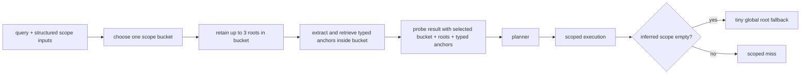

# refactor: implement scoped root-anchor probe

## Overview

Implement a minimal `root-first, anchor-second` retrieval path for the existing memory hot path. The change keeps the current `probe -> planner -> executor` split, but makes `probe` choose one active scope bucket before anchor-guided retrieval, makes explicit caller scope authoritative, and keeps v1 local expansion constrained to storage capabilities the repo already supports.

Execution note (final, 2026-04-15): fallback-oriented exploration in this document is superseded by the implemented direction. The shipped path is `single bucket -> in-scope anchors -> scoped miss/no widening`.

## Final Scope

This refactor is complete for the final direction that was actually chosen during execution:

- `probe` selects one active scope bucket before object and anchor retrieval
- explicit scope remains authoritative and returns `scoped_miss` on miss
- planner/runtime stay on the chosen bucket and do not silently widen
- compatibility fields such as `fallback_ready` and runtime `trace.fallback` remain in the DTO/API surface, but are inactive in this shipped path

Anything that still reads like "tiny global root fallback" or "broad search last" below should be treated as superseded exploration notes, not remaining implementation work.

## Problem Frame

The current codebase already has pieces of the desired design, but they are not assembled in the required order:

- `probe` still runs `object_probe`, `anchor_probe`, and `starting_point_probe` in parallel instead of making root selection the control point.
- orchestrator scope is currently flattened into one merged filter, which loses the distinction between authoritative caller scope and inferred scope ordering.
- planner and executor consume `starting_points`, but they still tolerate multi-root unions and topic-flattened anchor handoff in ways that dilute the intended precision.

That leaves the system in a mixed state:

- scoped retrieval exists, but not as the first decision
- anchors exist, but they can still behave like generic rerank signals instead of typed in-scope guidance
- explicit scope can still be treated too much like just another filter instead of a hard boundary

This plan implements the stricter control flow defined in the origin document while avoiding a bigger retrieval rewrite. The work stays inside the current hot path and does not redesign cone scoring, storage schema, or ingest contracts (see origin: `docs/brainstorms/2026-04-15-scoped-root-anchor-probe-requirements.md`).

## Requirements Trace

- R1. Determine retrieval scope before anchor-guided expansion.
- R2. Respect ordered scope precedence: `target_uri` > `session_id` > `source_doc_id` > `context_type` roots > tiny global root search.
- R3. Select exactly one active scope bucket per normal-path pass.
- R4. Treat root discovery as a first-class probe output.
- R5. Search inside explicit scope first instead of reopening a broad leaf pool.
- R6. Keep tiny global root search capped and root-only.
- R7. Keep explicit caller-provided scope authoritative; scoped miss stays scoped.
- R8. Extract anchors only after the active bucket is chosen.
- R9. Allow anchors to rank/filter only inside scope.
- R10. Keep local expansion inside chosen scope.
- R11. Preserve anchor type through handoff where possible.
- R12. Prevent strong anchors from overriding stronger path boundaries.
- R13. Keep the hot path simple and explainable.
- R14. Limit v1 expansion to one-hop or bucket-local behavior the current store already supports.
- R15. Do not add a root-anchor binding scorer or global arbitration layer.
- R16. Allow fallback only in the explicit order and only for inferred scope.
- R17. Emit trace data that shows selected bucket, retained roots, typed anchors, and fallback behavior.

## Scope Boundaries

- In scope:
  - `src/opencortex/orchestrator.py` probe input shaping and scoped execution fallback behavior
  - `src/opencortex/intent/probe.py` ordered root selection, typed anchor handoff, and probe trace changes
  - `src/opencortex/intent/planner.py` bucket-aware and typed-anchor-aware planning
  - `src/opencortex/intent/types.py` trace and handoff contract updates
  - regression coverage for probe, planner, runtime, and search contract surfaces

- Out of scope:
  - storage schema migration or new hierarchy fields
  - cone scorer algorithm redesign
  - full recursive traversal beyond reliable one-hop or bucket-local filtering
  - ingest-path changes for conversation/document/memory writes
  - copying OpenViking directory taxonomy or m_flow bundle scoring

### Deferred to Separate Tasks

- benchmark re-baselining across all datasets after the new path lands
- any post-v1 deeper recursive traversal once storage-level child lookup is proven reliable

## Context & Research

### Relevant Code and Patterns

- `src/opencortex/intent/probe.py` already has the three probe surfaces, `starting_points`, and `scope_level`, but still executes them in parallel and emits only count-level trace data.
- `src/opencortex/orchestrator.py` builds shared scope filters in `_build_scope_filter()` and performs the actual scoped retrieval in `_execute_object_query()`.
- `src/opencortex/intent/planner.py` already consumes `starting_points`, `query_entities`, and `starting_point_anchors`, but it still extracts session scope opportunistically from all returned roots and flattens root-derived anchors into topic-like signals.
- `tests/test_memory_probe.py`, `tests/test_recall_planner.py`, `tests/test_memory_runtime.py`, and `tests/test_http_server.py` already cover hot-path contracts and are the right places to lock behavior without inventing a new test harness.

### Institutional Learnings

- `docs/solutions/best-practices/memory-intent-hot-path-refactor-2026-04-12.md` reinforces that probe, planner, and runtime should stay phase-native rather than leaking each other's responsibilities.

### External References

- None. The repo already has strong local patterns for this hot path, so planning should follow repo reality rather than add external design pressure.

## Key Technical Decisions

- **Introduce structured probe scope inputs instead of relying only on merged filters.**
  - Rationale: the current merged `scope_filter` loses bucket ordering and whether scope is authoritative. Root-first logic needs structured inputs, not just the final AND clause.

- **Treat `target_uri` and `context_type` as bucket selectors, not as already-materialized storage roots.**
  - Rationale: the current store contract does not expose OpenViking-style directory roots for these inputs. In v1, `target_uri` means "search within this prefix as the selected bucket", and `context_type` means "search within this typed slice as the selected bucket". Only `session_id` / `source_doc_id` buckets may retain concrete root records from `starting_point_probe`.

- **Choose one active bucket per pass, but allow a tiny retained root set inside that bucket.**
  - Rationale: this preserves OpenViking’s “find the right tree first” behavior without forcing a single URI winner when a bucket legitimately has 2-3 strong roots.

- **Treat explicit caller scope as a hard boundary.**
  - Rationale: `target_uri`, `session_id`, and `source_doc_id` are user- or caller-supplied constraints, not soft hints. A miss in those buckets should not silently broaden in the same pass.

- **Keep v1 local expansion storage-realistic.**
  - Rationale: current code can reliably do one-hop `parent_uri` filtering and bucket-local `session_id` / `source_doc_id` filtering; it does not yet justify deeper recursive traversal.

- **Preserve typed anchors from selected roots through planner and execution.**
  - Rationale: the current pipeline already has entity/time/topic distinctions; flattening root-derived anchors into generic topic signals would throw away the main m-flow-inspired precision gain.

- **Make fallback an execution policy attached to inferred scope only.**
  - Rationale: this keeps the normal path explainable and avoids reopening broad search on explicitly scoped requests.

## Open Questions

### Resolved During Planning

- What cap should the tiny global root search use in v1: `3`, matching the current probe `top_k` default and keeping fallback small.
- Should v1 local expansion use recursive traversal: no; use one-hop child retrieval when `parent_uri` lookup is reliable, otherwise degrade to bucket-local filtering.
- What should trigger the final broad fallback: only inferred scope paths may widen, and only after the selected bucket returns zero rescored candidates in the normal scoped pass.
- Should this work update the existing `2026-04-16-001` plan in place: no; this plan supersedes that older starting-point direction because the origin requirements changed materially.
- Where should selected bucket and retained roots live: on `SearchResult` as behavior-bearing fields, with trace carrying the same information for attribution. Trace-only storage is not sufficient because planner and execution need these values as control inputs.
- Should the plan add a new bucket enum: no; reuse `ScopeLevel` for the active bucket class and add an explicit authoritative/inferred flag plus selected-root fields rather than inventing a second overlapping taxonomy.

### Deferred to Implementation

- Exact helper names and DTO field names for structured probe scope inputs
- Exact field naming for selected-root trace mirrors versus behavior-bearing fields

## High-Level Technical Design

> *This illustrates the intended approach and is directional guidance for review, not implementation specification. The implementing agent should treat it as context, not code to reproduce.*

### Bucket Selection Matrix

| Input state | Active bucket | Allowed next step on miss |
|---|---|---|
| `target_uri` present | `target_uri` prefix bucket | return scoped miss |
| no `target_uri`, `session_id` present | `session_id` roots | return scoped miss |
| no stronger explicit scope, `source_doc_id` present | `source_doc_id` roots | return scoped miss |
| no explicit scope, `context_type` available | `context_type` typed bucket | tiny global root fallback |
| no explicit or typed scope | tiny global root search | broad search last |

### Intended Flow

## Implementation Units

- [x] **Unit 1: Add structured scope-input and trace contracts**

**Goal:** Give `probe` enough structured input to implement ordered bucket selection and give downstream code enough trace surface to explain what happened.

**Requirements:** R2, R3, R7, R17

**Dependencies:** None

**Files:**
- Modify: `src/opencortex/intent/types.py`
- Modify: `src/opencortex/orchestrator.py`
- Test: `tests/test_recall_planner.py`
- Test: `tests/test_http_server.py`

**Approach:**
- Add a lightweight structured scope-input contract that preserves:
  - whether scope came from `target_uri`, `session_id`, `source_doc_id`, or inferred context
  - whether the scope is authoritative
  - any root-search hints that `probe` must respect before widening
- Define the behavior-bearing probe output contract in this unit:
  - selected bucket stays on `SearchResult` via `scope_level`
  - authoritative vs inferred scope is explicit on the probe result
  - retained root URIs live on `SearchResult` for planner/execution consumption and are mirrored into trace for attribution
- Keep the existing merged filter capability, but stop treating it as the only probe input.
- Extend the phase-native trace contract so probe/runtime payloads can carry:
  - selected bucket
  - retained root URIs
  - whether scope was authoritative
  - fallback stage or scoped miss status
- Keep the shape minimal; do not add a new generic policy framework.

**Patterns to follow:**
- `src/opencortex/orchestrator.py` phase handoff methods: `probe_memory()`, `plan_memory()`, `bind_memory_runtime()`
- `src/opencortex/intent/types.py` phase-native DTO style from the current hot-path contract
- `docs/solutions/best-practices/memory-intent-hot-path-refactor-2026-04-12.md`

**Test scenarios:**
- Happy path: `probe_memory()` passes explicit `target_uri` as authoritative structured scope input and the resulting pipeline payload exposes the selected bucket.
- Happy path: session-scoped request passes `session_id` as authoritative without relying on later planner inference.
- Happy path: `target_uri` and `context_type` inputs are represented as selected buckets even when no concrete storage root objects exist for them.
- Edge case: unscoped query produces inferred-scope inputs only and leaves final fallback eligibility open.
- Error path: empty or missing structured scope input still serializes to a valid global/default probe contract.
- Regression: probe cache keys differ when the same query is executed under different authoritative/inferred scope posture or different selected bucket inputs.
- Integration: HTTP/search payloads continue to expose phase-native `memory_pipeline` data while adding the new selected-bucket/fallback attribution.

**Verification:**
- An implementer can tell from the DTO contract alone whether a request was explicitly scoped or inferred.
- No caller has to reverse-engineer bucket precedence from a merged filter string.

- [x] **Unit 2: Rebuild probe around ordered bucket selection and typed anchor handoff**

**Goal:** Make `probe` choose one bucket first, keep at most a tiny root set inside that bucket, then run scoped object and anchor retrieval inside that bucket.

**Requirements:** R1, R4, R5, R6, R8, R9, R10, R11, R12, R13

**Dependencies:** Unit 1

**Files:**
- Modify: `src/opencortex/intent/probe.py`
- Modify: `src/opencortex/intent/types.py`
- Test: `tests/test_memory_probe.py`

**Approach:**
- Change probe control flow from “three probes in parallel” to:
  1. evaluate scope inputs in precedence order
  2. select one active bucket
  3. retain at most 3 roots inside that bucket
  4. run object and anchor retrieval inside the selected bucket
  5. emit selected roots, typed anchors, and scoped miss/fallback readiness
- Use bucket-specific root semantics:
  - `session_id` / `source_doc_id`: retain concrete root records from `starting_point_probe`
  - `target_uri`: treat the prefix itself as the selected bucket boundary; do not require synthetic root records
  - `context_type`: treat the typed slice as the selected bucket boundary; do not invent synthetic roots unless a later iteration introduces them explicitly
- Keep object and anchor retrieval logic lightweight; do not add a global rescoring stage.
- Preserve anchor types from selected roots where available:
  - entity stays entity
  - time stays time
  - topic remains topic
- If authoritative scope produces no roots or no usable scoped candidates, emit a scoped miss instead of broadening in the same pass.
- For inferred scope, mark the result as eligible for the next fallback stage rather than broadening immediately inside probe.
- Update probe caching so the cache key includes structured scope posture and selected-bucket-driving inputs, not only the merged `scope_filter`.

**Execution note:** Start with characterization coverage in `tests/test_memory_probe.py` before reshaping probe control flow.

**Patterns to follow:**
- Existing `MemoryBootstrapProbe` helper structure in `src/opencortex/intent/probe.py`
- Current `starting_points`, `query_entities`, and `scope_level` output contract
- Existing probe tests in `tests/test_memory_probe.py`

**Test scenarios:**
- Happy path: explicit `target_uri` request selects only the `target_uri` prefix bucket, does not require synthetic roots, and runs object/anchor retrieval only inside that prefix.
- Happy path: unscoped query with no explicit roots chooses a `context_type` typed bucket or tiny global root bucket before anchor-guided retrieval.
- Edge case: multiple matching roots inside one bucket are retained up to cap, but roots from `session_id` and `source_doc_id` are never mixed in one pass.
- Edge case: root-derived entity/time anchors are preserved with their type instead of being emitted only as generic topic strings.
- Error path: authoritative `session_id` scope with zero scoped candidates returns a scoped miss and does not reopen global search.
- Error path: inferred bucket with zero rescored candidates marks fallback readiness without yet claiming a broad hit.
- Regression: identical query text under two different structured scope inputs does not reuse a cached probe result from the wrong bucket.

**Verification:**
- Probe trace tells a reviewer which bucket won and why.
- Probe no longer needs a reader to infer bucket precedence from parallel search counts.

- [x] **Unit 3: Align planner and execution with single-bucket semantics**

Progress note (2026-04-15): single-bucket planner/runtime posture and scoped miss behavior landed. Follow-up direction changed during execution: inferred-scope fallback chaining is no longer being pursued for this refactor.

**Goal:** Make planner and object execution consume the new bucket/anchor semantics without reintroducing cross-bucket unions or silent widening.

**Requirements:** R3, R7, R9, R10, R11, R14, R16, R17

**Dependencies:** Unit 2

**Files:**
- Modify: `src/opencortex/intent/planner.py`
- Modify: `src/opencortex/orchestrator.py`
- Modify: `src/opencortex/intent/executor.py`
- Test: `tests/test_recall_planner.py`
- Test: `tests/test_memory_runtime.py`

**Approach:**
- Update planner to treat the selected bucket as authoritative plan posture rather than inferring scope from all available starting points.
- Stop flattening root-derived anchors into topic-only planner inputs; keep typed anchors flowing into query plan groups.
- In execution:
  - use one-hop `parent_uri` filtering only when container-scoped child lookup is reliable
  - otherwise degrade to bucket-local `session_id` or `source_doc_id` filtering
  - for `target_uri` and `context_type` buckets, execute against the selected prefix or typed slice directly rather than expecting retained concrete roots
  - never union roots across different bucket levels in the same pass
- Make fallback behavior explicit:
  - authoritative scope -> scoped miss
  - inferred scope -> one tiny global root fallback pass -> broad search last
- Record fallback actions in runtime trace using the existing `fallback` trace channel rather than adding a second execution-report surface.

**Patterns to follow:**
- `src/opencortex/intent/planner.py` existing `semantic_plan()` and `_extract_anchors()`
- `src/opencortex/orchestrator.py` existing `_execute_object_query()` scoped filter handling
- `src/opencortex/intent/executor.py` existing execution/fallback trace envelope

**Test scenarios:**
- Happy path: planner receives selected `session_only` bucket and keeps `session_scope` tied to that single bucket.
- Happy path: container-scoped retrieval uses one-hop `parent_uri` children when roots are reliable.
- Happy path: `target_uri`-scoped execution stays inside the selected prefix bucket even without retained concrete roots.
- Edge case: selected roots include both session and document evidence from earlier search stages, but planner/execution honor only the chosen bucket for the pass.
- Edge case: typed entity/time anchors from selected roots survive into grouped planner anchors and execution rerank inputs.
- Error path: authoritative `source_doc_id` request returns scoped miss instead of tiny global root fallback.
- Error path: inferred `context_type` bucket with zero rescored candidates records fallback action to tiny global roots, then broad search only if the fallback also produces no usable candidates.
- Integration: runtime trace `fallback` section explains which widening step, if any, was taken.

**Verification:**
- Planner and executor can no longer silently reopen weaker scope buckets.
- Runtime trace explains why a miss stayed scoped or why fallback was permitted.

- [x] **Unit 4: Lock regression coverage for phase-native and public contract surfaces**

Progress note (2026-04-15): regression coverage now locks selected-bucket posture, scoped miss contract, scoped runtime binding, and HTTP-visible probe/runtime flags for the single-bucket path. Fallback fields remain API-compatible but inactive.

**Goal:** Ensure the new semantics stay stable across probe, planner, runtime, and externally visible search payloads.

**Requirements:** R13, R16, R17

**Dependencies:** Unit 3

**Files:**
- Modify: `tests/test_memory_probe.py`
- Modify: `tests/test_recall_planner.py`
- Modify: `tests/test_memory_runtime.py`
- Modify: `tests/test_http_server.py`

**Approach:**
- Extend existing characterization-style tests instead of creating a new large harness.
- Add contract assertions at the lowest layer that proves each behavior:
  - probe tests for bucket selection and typed anchors
  - planner/runtime tests for single-bucket execution and fallback gating
  - HTTP contract tests for externally visible `memory_pipeline` attribution
- Keep benchmark re-baselining out of this unit; only lock behavior the repo can test deterministically in-process.

**Execution note:** Implement test-first for each newly introduced contract field or fallback rule.

**Patterns to follow:**
- Existing contract-style tests in `tests/test_recall_planner.py`
- Existing runtime trace assertions in `tests/test_memory_runtime.py`
- Existing end-to-end API payload assertions in `tests/test_http_server.py`

**Test scenarios:**
- Happy path: search API returns `memory_pipeline.probe/planner/runtime` with selected bucket, retained roots, typed anchors, and no fallback on a successful scoped request.
- Happy path: inferred scope request that needed tiny global root fallback exposes that fallback in runtime trace.
- Edge case: explicit scope request with zero scoped results returns a scoped miss contract and no global widening trace.
- Edge case: probe trace remains valid when there are zero retained roots but fallback is still eligible.
- Integration: end-to-end search through orchestrator and HTTP preserves phase-native envelopes after the new fields are added.

**Verification:**
- The new semantics are locked in regression tests at DTO, runtime, and API contract layers.
- Future work cannot silently revert to parallel broadening or cross-bucket union behavior.

## System-Wide Impact

- **Interaction graph:** `probe_memory()` must pass structured scope input into `MemoryBootstrapProbe`; `plan_memory()` must consume the selected bucket and typed anchors; `_execute_object_query()` must apply that posture without widening it.
- **Error propagation:** explicit-scope misses should propagate as scoped misses, not as hidden successful broad recalls.
- **State lifecycle risks:** no storage writes are changed, but trace semantics and retrieval control flow both change; regressions will show up as wrong widening, not data corruption.
- **API surface parity:** search/HTTP payloads that expose `memory_pipeline` need to preserve existing phase-native keys while adding the new attribution.
- **Integration coverage:** orchestrator-level and HTTP-level tests are required because unit tests alone will not prove that scoped miss and fallback attribution survive serialization.
- **Unchanged invariants:** the public retrieval entry points, main `probe -> planner -> runtime` split, and current storage schema stay in place.

## Risks & Dependencies

| Risk | Mitigation |
|------|------------|
| Structured scope input duplicates information already present in merged filters and drifts over time | Keep the new scope input minimal and derive it in one place inside `src/opencortex/orchestrator.py` |
| Probe rewrite accidentally reopens global search semantics | Add characterization tests first and lock explicit-scope miss behavior before refactoring |
| Typed anchor preservation becomes a broad DTO expansion | Carry only the anchor kinds already supported by `QueryAnchorKind` |
| Container-scoped traversal relies on unreliable child lookup | Gate v1 behavior to one-hop `parent_uri` only where existing tests prove it works; otherwise degrade to bucket-local filters |
| Trace expansion causes payload churn | Reuse existing phase-native envelopes and fallback trace channel instead of inventing a parallel diagnostics payload |

## Remaining Follow-Up

- A separate follow-up may continue the `context_manager` / `immediate` / `anchor_projection` cleanup line, but it is not part of this probe refactor.
- Benchmark re-baselining remains a separate task after deterministic in-repo behavior is stable.

## Documentation / Operational Notes

- After implementation, the superseded plan `docs/plans/2026-04-16-001-refactor-probe-starting-point-plan.md` should be marked obsolete or cross-linked so future work does not follow the older direction by mistake.
- Benchmark re-baselining should happen in a separate execution pass after deterministic in-repo contract tests are green.

## Sources & References

- **Origin document:** `docs/brainstorms/2026-04-15-scoped-root-anchor-probe-requirements.md`
- Related code: `src/opencortex/intent/probe.py`
- Related code: `src/opencortex/intent/planner.py`
- Related code: `src/opencortex/intent/executor.py`
- Related code: `src/opencortex/orchestrator.py`
- Related tests: `tests/test_memory_probe.py`
- Related tests: `tests/test_recall_planner.py`
- Related tests: `tests/test_memory_runtime.py`
- Related tests: `tests/test_http_server.py`
- Institutional learning: `docs/solutions/best-practices/memory-intent-hot-path-refactor-2026-04-12.md`
- Superseded prior direction: `docs/plans/2026-04-16-001-refactor-probe-starting-point-plan.md`
