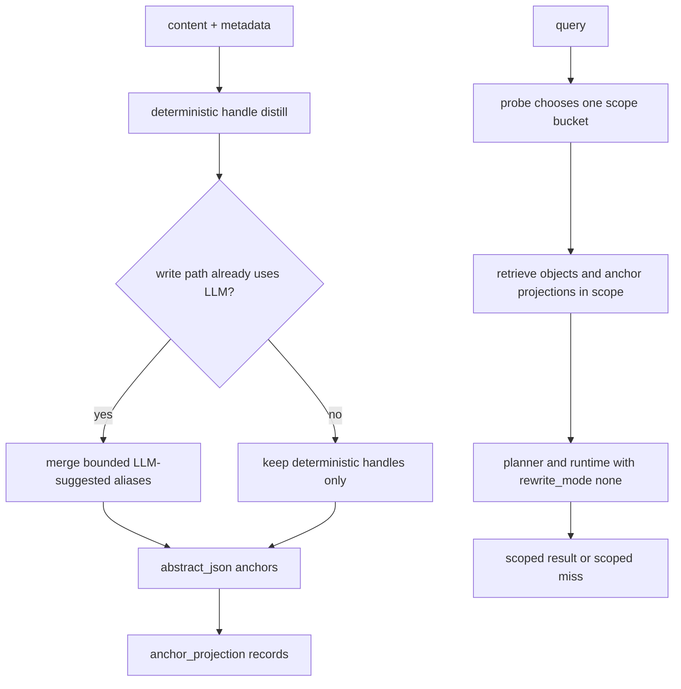

# refactor: move anchor distill to write path

## Overview

Complete the remaining delta toward the scoped root + anchor retrieval design by moving anchor sharpening to ingest, reusing the existing `abstract_json` and `anchor_projection` surfaces, and removing retrieval-time HyDE from the normal `search()` hot path. The shipped `probe -> planner -> executor` split and current single-bucket scoped behavior remain intact.

## Problem Frame

OpenCortex already landed the hard part of the OpenViking-inspired direction: `probe` now selects one active scope bucket, explicit scope stays authoritative, and the normal path no longer silently widens on scoped miss. What still drifts from the intended design in the origin document is the anchor side of the system.

Today, write-time anchor surfaces are present but still too generic, while the retrieval hot path still pays for a per-query HyDE rewrite in `src/opencortex/orchestrator.py`. That is the wrong cost center. The origin document explicitly moved the “make the query easier to hit” work to ingest time: the system should write sharper handles once, then let scoped retrieval reuse them many times.

This plan therefore focuses on three concrete outcomes:

- keep the current single-bucket scope contract unchanged
- make write-time anchors sharper and more reusable
- make planner/runtime/API contracts truthful about there being no retrieval-time rewrite or fallback ladder on the shipped path

## Requirements Trace

- R1-R7. Preserve the current single-bucket, authoritative scope path from the origin document; no unit in this plan may reopen cross-bucket search or implicit widening.
- R8-R11. Distill sharper write-time anchors and aliases into the existing canonical anchor surfaces without replacing stored summaries or content.
- R12-R14. Keep anchors as in-scope precision signals only, and keep local expansion storage-realistic and bounded.
- R15. Remove per-query LLM rewrite / HyDE from the normal retrieval path.
- R16-R17. Keep fallback ladder behavior inactive; scoped miss remains scoped and trace stays explicit.
- R18. Keep `memory_pipeline`, benchmark attribution, and planner/runtime payloads aligned with the shipped no-rewrite path.

## Scope Boundaries

- In scope:
  - write-time anchor distill for memory/resource ingest paths
  - anchor projection refresh behavior on add/update/merge paths
  - removal of retrieval-time HyDE from `search()`
  - planner/query contract cleanup so rewrite semantics stay truthful
  - regression coverage for HTTP, benchmark attribution, probe, and ingest behavior

- Out of scope:
  - redesigning the existing single-bucket probe architecture
  - adding a new storage schema or migration
  - reintroducing fallback ladders or broad-search widening
  - deep recursive expansion beyond the current one-hop or bucket-local behavior
  - copying m_flow bundle scoring or OpenViking taxonomy structures

### Deferred to Separate Tasks

- full benchmark re-baselining across every dataset after the implementation lands
- removal of inert compatibility fields only after downstream API and benchmark consumers are confirmed clean

## Context & Research

### Relevant Code and Patterns

- `src/opencortex/orchestrator.py` already owns both write-time abstract generation (`_derive_layers()`, `_build_abstract_json()`) and read-time retrieval (`search()`), making it the natural place to remove search-time HyDE and merge in better write-time handles.
- `src/opencortex/memory/mappers.py` already derives `MemoryAbstract.anchors` from bounded structured slots, and `src/opencortex/orchestrator.py` already projects those anchors into `anchor_projection` records. This is the right surface to sharpen rather than adding a second parallel schema.
- `src/opencortex/intent/probe.py` already searches `anchor_projection` records inside the selected scope. Better write-time handles can therefore improve retrieval without a new probe architecture.
- `src/opencortex/intent/planner.py` still computes `rewrite_mode` metadata even though the retrieval hot path should no longer imply an actual rewrite stage. This contract needs to become truthful.
- `tests/test_memory_domain.py`, `tests/test_conversation_immediate.py`, `tests/test_memory_probe.py`, `tests/test_recall_planner.py`, `tests/test_intent_planner_phase2.py`, `tests/test_http_server.py`, and `tests/test_benchmark_runner.py` already cover the exact surfaces this refactor touches.

### Institutional Learnings

- `docs/solutions/best-practices/memory-intent-hot-path-refactor-2026-04-12.md` reinforces the phase-native boundary: probe stays cheap, planner owns retrieval posture, runtime owns execution tradeoffs.
- `docs/solutions/best-practices/single-bucket-scoped-probe-2026-04-16.md` locks the key invariant for this plan: scope stays single-bucket and authoritative before anchor expansion.

### External References

- None. Local patterns are strong enough, and the user explicitly wants the design kept simple and grounded in the current repository.

## Key Technical Decisions

- **Build on the shipped single-bucket probe instead of reopening scope design.**
  - Rationale: the root-first behavior is already in place. Replanning that area would increase risk without helping the remaining anchor problem.

- **Reuse `abstract_json["anchors"]` and `anchor_projection` as the only write-time retrieval surfaces.**
  - Rationale: these fields already feed object payloads, projection records, and probe retrieval. Reusing them avoids a schema fork and keeps the change surgical.

- **Use deterministic handle distill everywhere, and only add LLM help where the write path already pays for LLM work.**
  - Rationale: `add()` and document ingest already call `_derive_layers()`, so they can piggyback optional LLM-suggested handles without adding a new round trip. `_write_immediate()` must stay deterministic and LLM-free.

- **Treat distilled handles as additive retrieval metadata, not canonical content replacement.**
  - Rationale: the origin document explicitly rejects replacing summaries or overviews. Distilled handles exist to improve searchability, not to become the stored truth.

- **Remove retrieval-time HyDE entirely from the normal path and make planner/query metadata reflect that truth.**
  - Rationale: the measured latency problem sits in search-time rewrite, not in scoped probe/planner/runtime. The plan should eliminate the hot-path round trip, not hide it behind metadata.

- **Keep compatibility fields compatible but inert in this refactor.**
  - Rationale: `fallback_ready`, `trace.fallback`, and similar payload fields can remain for contract stability, but this work must not reactivate them or let them imply a widening policy that no longer exists.

## Open Questions

### Resolved During Planning

- What cap should the tiny global root search keep on the normal path: `3`, matching the current bounded probe posture.
- How many distilled handles should one object keep by default: cap at `6`, aligning with the existing bounded anchor/query posture and avoiding projection bloat.
- What should count as a bad handle: reject empty values, duplicates, generic category labels, paragraph-like text, and weak fragments that have no concrete anchor signal unless they come from explicit entity/time metadata.
- Where may LLM-assisted handle generation run: only inside write paths that already invoke `_derive_layers()`; `_write_immediate()` stays deterministic.
- What should planner/query metadata say after HyDE is removed: the hot path should serialize `rewrite_mode` as `none` and stop implying hidden rewrite work.

### Deferred to Implementation

- Exact helper placement for deterministic handle distill between `src/opencortex/memory/mappers.py` and `src/opencortex/orchestrator.py`
- Whether any inert compatibility fields can be fully removed in a follow-up cleanup once benchmark and HTTP consumers are confirmed not to depend on them

## High-Level Technical Design

> *This illustrates the intended approach and is directional guidance for review, not implementation specification. The implementing agent should treat it as context, not code to reproduce.*

### Before vs After

| Surface | Current drift | Planned shape |
|---|---|---|
| Write path | `abstract/overview` plus often-generic anchors | deterministic distill everywhere, optional LLM-assisted aliasing only on existing LLM write paths |
| Probe input | scope-first retrieval already shipped | unchanged; better write-time anchors feed the same scoped probe surfaces |
| Search hot path | `probe -> planner -> search-time HyDE -> retrieve` | `probe -> planner -> retrieve`, with existing anchor surfaces doing the precision work |
| Public contract | planner may still imply rewrite modes; payloads still expose inert fallback fields | rewrite metadata stays truthful; compatibility fallback fields remain present but inactive |

### Intended Flow

## Implementation Units

- [ ] **Unit 1: Sharpen canonical write-time anchors**

**Goal:** Distill bounded, concrete retrieval handles into the existing canonical anchor payload so better anchor surfaces exist before search begins.

**Requirements:** R8, R9, R10, R11, R13

**Dependencies:** None

**Files:**
- Modify: `src/opencortex/memory/mappers.py`
- Modify: `src/opencortex/orchestrator.py`
- Test: `tests/test_memory_domain.py`
- Test: `tests/test_conversation_immediate.py`

**Approach:**
- Extend the current slot-to-anchor mapping so canonical anchors favor concrete entities, times, paths, module names, operation phrases, and explicit metadata over generic category text.
- Keep anchor generation bounded and deterministic: cap the stored handles, deduplicate aggressively, and reject generic or paragraph-style candidates.
- Continue to store distilled handles in the existing `abstract_json["anchors"]`, flat `anchor_hits`, and `anchor_projection` surfaces rather than introducing a new schema.

**Patterns to follow:**
- `src/opencortex/memory/mappers.py` current `memory_abstract_from_record()` and `_anchor_entries_from_slots()`
- `src/opencortex/orchestrator.py` current `_memory_object_payload()` and `_anchor_projection_records()`

**Test scenarios:**
- Happy path: a record with explicit entities, time refs, and path-like metadata produces bounded canonical anchors that preserve those concrete handles.
- Happy path: a document or memory record with a meaningful non-generic topic contributes that topic as an additive handle without replacing the abstract.
- Edge case: duplicate values across entities, keywords, and topic inputs collapse to one stored handle.
- Edge case: generic category-like values such as `events` or `summary` do not become standalone distilled anchors.
- Error path: empty or weak metadata still produces a valid abstract payload with zero or few anchors rather than noisy filler.
- Integration: `_write_immediate()` continues to create `anchor_projection` records from the canonical anchors it stores.

**Verification:**
- An implementer can inspect one stored record and see sharp retrieval handles in `abstract_json`, `anchor_hits`, and derived anchor projections without any second schema.

- [ ] **Unit 2: Piggyback LLM-assisted handle distill on existing write paths**

**Goal:** Let write paths that already invoke LLM summarization add better aliases without adding a new ingest-time round trip or changing the immediate-write contract.

**Requirements:** R8, R9, R10, R11, R13

**Dependencies:** Unit 1

**Files:**
- Modify: `src/opencortex/prompts.py`
- Modify: `src/opencortex/orchestrator.py`
- Test: `tests/test_ingestion_e2e.py`
- Test: `tests/test_conversation_immediate.py`

**Approach:**
- Extend the existing layer-derivation prompt/parse path so it can optionally return bounded handle suggestions in the same LLM response already used for `abstract`, `overview`, `keywords`, and `entities`.
- Merge any LLM-suggested handles with the deterministic distill from Unit 1, using the deterministic validator as the final gate for dedupe and rejection.
- Keep `_write_immediate()` on the deterministic path only so immediate searchability remains available without an LLM.
- Ensure add/update/merge flows refresh `anchor_projection` records from the latest canonical anchor set instead of leaving stale projections behind.

**Execution note:** Start with characterization coverage around existing write paths so the refactor does not accidentally make immediate writes require an LLM.

**Patterns to follow:**
- `src/opencortex/orchestrator.py` current `_derive_layers()`, `_build_abstract_json()`, and `_sync_anchor_projection_records()`
- `src/opencortex/prompts.py` current `build_layer_derivation_prompt()`

**Test scenarios:**
- Happy path: a normal `add()` call using `_derive_layers()` stores merged deterministic + LLM-suggested handles in the canonical anchor payload.
- Happy path: document ingest keeps section/document lineage while also producing bounded handle aliases for retrieval.
- Edge case: LLM output returns weak or duplicate handles; deterministic validation drops them without failing the write.
- Error path: no LLM configured still produces usable canonical anchors through deterministic distill only.
- Integration: updating or merging an existing object refreshes its `anchor_projection` children so old aliases do not linger.

**Verification:**
- LLM-assisted writes gain sharper aliases, but immediate writes and no-LLM environments still produce valid retrieval anchors.

- [ ] **Unit 3: Remove retrieval-time HyDE and make planner contracts truthful**

**Goal:** Eliminate the hot-path LLM rewrite round trip and stop the planner/query payload from implying rewrite behavior that no longer exists.

**Requirements:** R13, R15, R16, R17, R18

**Dependencies:** Unit 2

**Files:**
- Modify: `src/opencortex/orchestrator.py`
- Modify: `src/opencortex/intent/planner.py`
- Modify: `src/opencortex/intent/types.py`
- Modify: `src/opencortex/prompts.py`
- Modify: `src/opencortex/config.py`
- Test: `tests/test_intent_planner_phase2.py`
- Test: `tests/test_recall_planner.py`
- Test: `tests/test_http_server.py`
- Test: `tests/test_perf_fixes.py`

**Approach:**
- Remove the search-time HyDE block from `MemoryOrchestrator.search()` so query embedding happens directly against the user query and scoped planner output.
- Keep the current `probe -> planner -> executor` phase boundary unchanged; this unit removes a rewrite stage rather than moving responsibilities between phases.
- Make `MemoryQueryPlan` serialization truthful for the shipped path so planner payloads do not imply a hidden rewrite stage.
- Choose the smallest safe cleanup for config and prompts: either remove dead HyDE prompt/config wiring outright or keep compatibility comments explicit that the field is inert on the current path.

**Execution note:** Start with a failing regression that proves search no longer blocks on a pre-retrieval LLM rewrite call.

**Patterns to follow:**
- `docs/solutions/best-practices/memory-intent-hot-path-refactor-2026-04-12.md`
- `src/opencortex/orchestrator.py` current phase handoff around `probe_memory()`, `plan_memory()`, and `bind_memory_runtime()`

**Test scenarios:**
- Happy path: planner payload serializes with `rewrite_mode` set to `none` on the normal memory hot path.
- Happy path: `search()` with an LLM-configured orchestrator still returns scoped results without making an extra rewrite-only model call.
- Edge case: no-LLM and LLM-enabled configurations produce the same hot-path contract for `memory_pipeline`.
- Error path: scoped miss behavior remains unchanged after HyDE removal and does not reopen fallback behavior.
- Integration: HTTP `/api/v1/memory/search` continues to expose `probe`, `planner`, and `runtime`, while no field suggests an active retrieval rewrite stage.
- Integration: the latency regression test proves search completion no longer depends on a slow rewrite callback before retrieval.

**Verification:**
- Search latency no longer scales with a hypothetical-answer prompt, and the public planner payload no longer advertises a rewrite stage that does not exist.

- [ ] **Unit 4: Re-lock scoped retrieval and benchmark consumers around write-time anchors**

**Goal:** Ensure the improved anchor source actually benefits in-scope retrieval while keeping scoped-miss, benchmark, and API consumers aligned with the shipped contract.

**Requirements:** R1, R2, R3, R4, R5, R6, R7, R12, R14, R16, R17, R18

**Dependencies:** Unit 3

**Files:**
- Test: `tests/test_memory_probe.py`
- Test: `tests/test_memory_runtime.py`
- Test: `tests/test_benchmark_runner.py`
- Test: `tests/test_locomo_bench.py`

**Approach:**
- Add regression coverage that proves probe can hit improved `anchor_projection` records inside the selected scope without reopening weaker scope buckets.
- Keep the current one-hop or bucket-local runtime behavior unchanged; this unit locks that invariant with regression coverage rather than extending expansion depth.
- Keep runtime and benchmark assertions focused on the shipped contract: selected scope, scoped miss, planner/runtime trace, and inert fallback compatibility fields.
- Validate that benchmark attribution still reads the same `memory_pipeline` envelope after the write-time anchor and no-HyDE changes.

**Patterns to follow:**
- `tests/test_memory_probe.py` current anchor-only hit and scope-contract cases
- `tests/test_benchmark_runner.py` current `memory_pipeline` attribution assertions
- `docs/solutions/best-practices/single-bucket-scoped-probe-2026-04-16.md`

**Test scenarios:**
- Happy path: an anchor-only query hits a stored object through a distilled `anchor_projection` record inside the chosen scope.
- Happy path: benchmark attribution continues to extract `probe`, `planner`, and `runtime` from `memory_pipeline` after HyDE removal.
- Edge case: scoped retrieval with improved handles still honors the selected bucket and does not mix roots from multiple bucket levels.
- Error path: explicit scope with zero in-scope candidates remains a scoped miss and benchmark/API payloads do not imply fallback widening.
- Integration: runtime trace and benchmark adapter metadata remain compatible even when compatibility `fallback` fields stay empty.

**Verification:**
- The repo has regression coverage proving that better write-time handles improve retrieval precision without changing the single-bucket scoped contract.

## System-Wide Impact

- **Interaction graph:** write-time abstract derivation feeds `abstract_json`, which feeds `anchor_projection`, which feeds scoped probe retrieval, which feeds planner/runtime and benchmark/API serialization.
- **Error propagation:** write-time distill failures should degrade to deterministic anchors or no extra handles; search should not fail just because optional alias generation is absent.
- **State lifecycle risks:** add/update/merge paths must keep `anchor_projection` children in sync with the latest canonical anchors or retrieval will drift.
- **API surface parity:** `memory_pipeline`, HTTP responses, and benchmark attribution must tell the same story about selected scope, scoped miss, and no-rewrite retrieval.
- **Integration coverage:** write then search, anchor-only retrieval, scoped miss behavior, and benchmark attribution are the cross-layer scenarios that unit-local tests alone will not prove.
- **Unchanged invariants:** single-bucket scope ordering, explicit-scope authority, phase-native `probe -> planner -> runtime`, and current hydration arbitration rules do not change in this plan.

## Risks & Dependencies

| Risk | Mitigation |
|------|------------|
| Distill rules are too loose and produce noisy anchors | Bound the handle cap, reject generic or paragraph-style text, and lock behavior with targeted anchor-payload tests |
| Distill rules are too strict and miss useful aliases | Merge deterministic handles with optional LLM suggestions on existing write paths, and keep explicit entity/time metadata first-class |
| Search-time cleanup leaves misleading contract drift behind | Update planner/query serialization and HTTP/benchmark assertions in the same change set |
| Anchor projections become stale after update or merge paths | Refresh derived projection records whenever canonical anchor payloads change |

## Documentation / Operational Notes

- After implementation, rerun the same benchmark sample set that exposed HyDE latency so the before/after comparison stays apples-to-apples.
- If `hyde_enabled` remains temporarily for config compatibility, document it as inert on the normal memory search path rather than leaving its meaning ambiguous.

## Sources & References

- **Origin document:** `docs/brainstorms/2026-04-15-scoped-root-anchor-probe-requirements.md`
- Related code: `src/opencortex/orchestrator.py`
- Related code: `src/opencortex/memory/mappers.py`
- Related code: `src/opencortex/intent/probe.py`
- Related code: `src/opencortex/intent/planner.py`
- Institutional guidance: `docs/solutions/best-practices/memory-intent-hot-path-refactor-2026-04-12.md`
- Institutional guidance: `docs/solutions/best-practices/single-bucket-scoped-probe-2026-04-16.md`
- Related plan: `docs/plans/2026-04-15-001-refactor-scoped-root-anchor-probe-plan.md`
