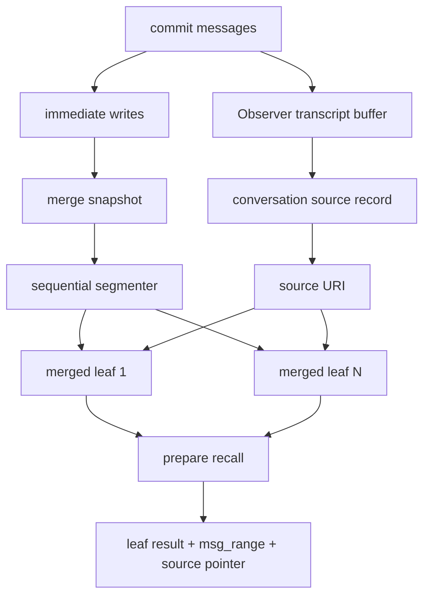
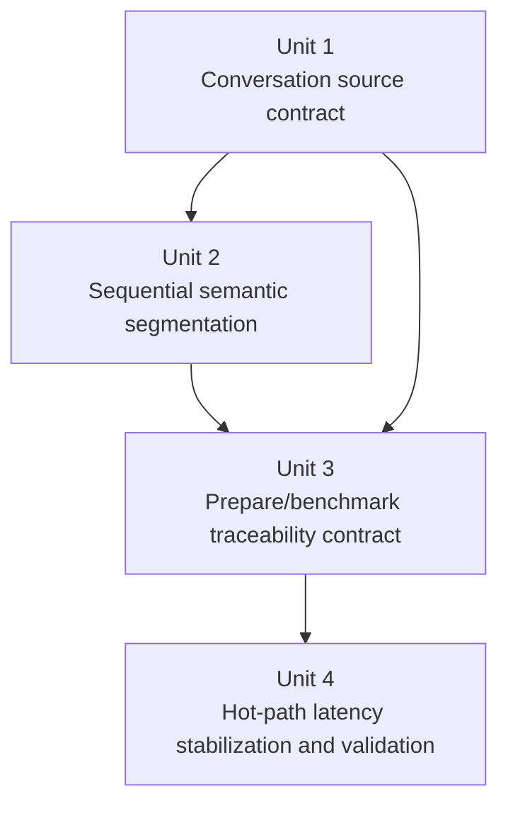

# refactor: segment conversation merge for traceable recall

## Overview

Replace the current one-snapshot-one-leaf conversation merge behavior with a deterministic sequential segmenter that writes multiple retrieval-visible merged leaves per conversation window while preserving a stable transcript source for traceability.

The plan deliberately keeps the existing `prepare -> commit -> end` lifecycle, keeps merged leaves as the primary recall surface, and limits latency work to hot-path fixes already implied by the current investigation:

- keep search-side background side effects off the hot path
- move probe query embedding off the event loop
- validate the new merge shape and tail latency against LoCoMo conversation runs

## Problem Frame

The current conversation path in `src/opencortex/context/manager.py` still merges an entire buffer snapshot into one `events` record. That shape is now the clearest retrieval quality problem in LoCoMo conversation mode:

- long conversations collapse into a tiny number of huge merged leaves
- anchors and summaries become mixed-session aggregates instead of local evidence
- relevant evidence often reaches `top3` but not `top1`
- once immediate records are cleaned up, there is no durable transcript source in the default configuration to support stable source tracing

The repo also now confirms an operational constraint that changes the implementation approach:

- `src/opencortex/alpha/observer.py` stores transcript data in memory only
- `src/opencortex/orchestrator.py:session_end()` only persists transcript-derived traces when the optional `TraceSplitter + TraceStore` path is enabled
- default config keeps that path off

That means the new traceability contract cannot depend on the optional trace pipeline. It must create its own durable conversation source record or equivalent stable source surface inside the normal conversation lifecycle.

Related but distinct from merge quality, the recent LoCoMo latency investigation showed tail latency is dominated by hot-path embedding and background work contention, not by vector search alone. One hotfix has already landed in `src/opencortex/orchestrator.py` to remove post-search background side effects from the hot path. This plan carries the remaining latency work only as bounded support for the conversation merge refactor, not as a broader retrieval redesign.

## Requirements Trace

- R1-R5. Conversation merge must produce multiple sequential semantic leaves instead of one snapshot blob.
- R6-R10. Traceability must survive immediate cleanup and must not depend on optional trace infrastructure (see origin: `docs/brainstorms/2026-04-16-conversation-semantic-merge-traceability-requirements.md`).
- R11-R14. Recall must stay leaf-first, with finer anchors and no separate transcript retrieval path.
- R15-R18. v1 must stay simple: no graph layer, no fallback ladder, no planner/probe protocol rewrite.
- R19. Conversation benchmark tail latency must not retain avoidable hot-path stalls once merge segmentation is introduced. This comes from the latency investigation requested during planning, not from the origin requirements doc.

## Scope Boundaries

- In scope:
  - deterministic sequential segmentation inside `ContextManager._merge_buffer()`
  - durable conversation source persistence independent of `TraceSplitter`
  - leaf-level traceability metadata in prepare payloads
  - benchmark and regression coverage for multi-leaf conversation sessions
  - bounded hot-path latency fixes directly tied to the investigated probe/search stalls

- Out of scope:
  - replacing merged leaves with transcript search as the primary recall mode
  - introducing a multi-level conversation tree, graph propagation, or a new retrieval planner
  - enabling or redesigning the optional trace/archivist pipeline as a prerequisite
  - a full retrieval latency overhaul beyond the known probe/search hot-path issues

### Deferred to Separate Tasks

- Re-baselining every benchmark dataset beyond LoCoMo conversation once the new merge shape stabilizes
- Any future transcript durability overhaul for non-conversation session types

## Context & Research

### Relevant Code and Patterns

- `src/opencortex/context/manager.py`
  - owns buffer lifecycle, merge snapshotting, immediate cleanup, prepare formatting, and end-of-session sequencing
  - existing helpers such as `_take_merge_snapshot()`, `_restore_merge_snapshot()`, `_aggregate_immediate_metadata()`, and `_delete_immediate_families()` define the failure-safety pattern this work should preserve
- `src/opencortex/alpha/observer.py`
  - currently keeps transcripts only in memory and drops them on `flush()`
- `src/opencortex/orchestrator.py`
  - `session_end()` proves the current trace pipeline is optional
  - `search()` and `_embed_retrieval_query()` show the existing hot-path phase boundaries to preserve
- `src/opencortex/http/models.py`
  - `ContextPrepareMemoryItem` is the typed boundary for adding leaf traceability fields
- `benchmarks/adapters/locomo.py`
  - already maps merged outputs back to evidence sessions using `meta.msg_range` and “tightest overlapping record wins”
- `tests/test_context_manager.py`
  - already covers merge cleanup, merged record visibility, and end-of-session behavior
- `tests/test_locomo_bench.py`
  - already covers `msg_range`-based mapping and fallback-to-time-ref behavior for merged conversation outputs
- `tests/test_perf_fixes.py`
  - already covers hot-path non-blocking expectations and the recently removed search side effects

### Institutional Learnings

- `docs/solutions/best-practices/memory-intent-hot-path-refactor-2026-04-12.md`
  - retrieval work should stay explicitly phase-native rather than leaking new behavior across probe/planner/runtime
- `docs/solutions/best-practices/single-bucket-scoped-probe-2026-04-16.md`
  - scoped recall should stay explainable and benchmark-contract-aware; merge changes should not force a new retrieval contract

### External References

- None. The repo already contains strong local patterns for this work, so planning stayed local.

## Key Technical Decisions

- **Persist a deterministic conversation source URI separate from merged leaf retrieval.**
  - Rationale: default deployments do not persist transcripts through the optional trace pipeline, so traceability must ride on a conversation-owned durable source record.
- **Use sequential deterministic segmentation inside the merge worker rather than clustering or planner-guided segmentation.**
  - Rationale: the user explicitly asked to avoid complexity, and `ContextManager` already has the right lifecycle control to segment by message order.
- **Keep merged leaves as the only normal recall surface.**
  - Rationale: transcript/source records support traceability only; they should not become a second search mode that reopens ranking complexity.
- **Expose traceability through leaf metadata in the prepare response.**
  - Rationale: source tracing is only useful if callers can see the source pointer and covered range directly from recalled items.
- **Treat latency work as hot-path hygiene, not as a new retrieval initiative.**
  - Rationale: the diagnosed tail latency issue is dominated by synchronous probe embedding and former search-side side effects, so the fix should stay small and measurable.

## Open Questions

### Resolved During Planning

- Should transcript traceability rely on the optional `TraceSplitter` path: no.
- Should v1 use a deterministic session-scoped conversation source surface that merged leaves can reference before or after end-of-session persistence: yes.
- Should segmentation live in `ContextManager` rather than planner/probe/runtime: yes.
- Should prepare/search responses surface traceability fields on recalled merged leaves: yes.
- Should the latency portion of this plan stop at known hot-path issues instead of reopening full retrieval redesign: yes.

### Deferred to Implementation

- Exact threshold values for segment breaks based on time-reference changes, anchor overlap, and segment token cap.
- Exact category/context-type choice for the durable conversation source record, as long as it remains non-primary for recall.
- Exact naming of traceability response fields added to `ContextPrepareMemoryItem`.
- Exact benchmark acceptance thresholds for “top1 improves enough” after the first segmented merge pass lands.

## High-Level Technical Design

> *This illustrates the intended approach and is directional guidance for review, not implementation specification. The implementing agent should treat it as context, not code to reproduce.*

## Implementation Units

- [ ] **Unit 1: Establish a durable conversation source contract**

**Goal:** Add a deterministic, conversation-scoped source record and reference contract so merged leaves can trace back to durable original transcript content even when immediate records are removed and the trace pipeline is disabled.

**Requirements:** R6, R7, R8, R9, R10, R17

**Dependencies:** None

**Files:**
- Modify: `src/opencortex/context/manager.py`
- Modify: `src/opencortex/alpha/observer.py`
- Modify: `src/opencortex/orchestrator.py`
- Test: `tests/test_context_manager.py`
- Test: `tests/test_observer.py`

**Approach:**
- Define one stable conversation source identity per session that merged leaves can reference without inventing per-leaf transcript copies.
- Persist the source through the normal conversation lifecycle instead of depending on optional trace extraction.
- Keep the source out of the primary recall surface while making it readable enough to support “show me the original conversation span” workflows.
- Preserve the current session cleanup ordering so source persistence and merge cleanup cannot silently orphan traceability pointers.

**Execution note:** Start with characterization coverage for current `Observer` and `ContextManager._end()` behavior before introducing a new durable source surface.

**Patterns to follow:**
- `src/opencortex/context/manager.py:_take_merge_snapshot()`
- `src/opencortex/context/manager.py:_restore_merge_snapshot()`
- `src/opencortex/orchestrator.py:session_end()`

**Test scenarios:**
- Happy path: ending a conversation session with trace splitter disabled still leaves one durable conversation source record addressable by session-scoped merged leaves.
- Happy path: a merged leaf stores a stable source pointer and a precise message range after immediate cleanup finishes.
- Edge case: repeated `end` or duplicate turn handling does not create duplicate conversation source records for the same session.
- Error path: if source persistence fails, session end reports partial failure instead of silently returning a closed session with unusable source pointers.
- Integration: a merged leaf created before final session end still resolves to the same deterministic source identity once the session closes.

**Verification:**
- Conversation sessions remain searchable through merged leaves, and every merged leaf can identify a durable source record plus its covered message range without relying on immediate records.

- [ ] **Unit 2: Replace blob merge with sequential semantic segmentation**

**Goal:** Split each merge snapshot into one or more ordered semantic segments and write one merged leaf per segment instead of one merged transcript blob.

**Requirements:** R1, R2, R3, R4, R5, R11, R12, R13, R15, R16

**Dependencies:** Unit 1

**Files:**
- Modify: `src/opencortex/context/manager.py`
- Test: `tests/test_context_manager.py`
- Test: `tests/test_conversation_merge.py`

**Approach:**
- Build a small deterministic segmenter over the detached merge snapshot rather than over the live buffer.
- Use only simple sequential break signals: time-reference boundary, weak anchor/topic overlap between adjacent messages, and segment-size ceiling.
- Carry segment-local metadata into each `add()` call so every merged leaf gets its own `msg_range`, time refs, and anchor-friendly content.
- Keep immediate cleanup transactional at the segment-batch level: if segment writing fails, restore the snapshot and avoid partially deleting immediate families.

**Execution note:** Add failing characterization tests for “single merged record today” before changing `_merge_buffer()` so the new multi-leaf outcome is explicit.

**Patterns to follow:**
- `src/opencortex/context/manager.py:_aggregate_immediate_metadata()`
- `src/opencortex/context/manager.py:_merge_buffer()`
- `tests/test_context_manager.py:test_merge_buffer_replaces_immediate_records_with_merged_object`

**Test scenarios:**
- Happy path: a homogeneous short snapshot still produces one merged leaf with the expected `msg_range`.
- Happy path: a snapshot spanning two clear temporal/topic shifts produces multiple merged leaves in message order.
- Edge case: segment boundaries remain monotonic and non-overlapping even when adjacent messages share some anchors.
- Edge case: segment-local metadata uses the tightest covered range rather than the entire snapshot range.
- Error path: if writing the second segment fails, the detached snapshot is restored and immediate records remain retrievable.
- Integration: after a successful segmented merge, superseded immediate records and their derived anchor children are removed exactly once.

**Verification:**
- One merge snapshot can now yield multiple merged leaves, each with narrower anchors and non-overlapping source ranges, while preserving current cleanup guarantees.

- [ ] **Unit 3: Surface traceability through prepare and benchmark contracts**

**Goal:** Make the new source pointer and segment boundaries visible to callers and keep LoCoMo benchmark mapping stable when one conversation produces many merged leaves.

**Requirements:** R7, R8, R9, R10, R11, R14, R18

**Dependencies:** Unit 1, Unit 2

**Files:**
- Modify: `src/opencortex/context/manager.py`
- Modify: `src/opencortex/http/models.py`
- Modify: `benchmarks/adapters/locomo.py`
- Test: `tests/test_http_server.py`
- Test: `tests/test_locomo_bench.py`

**Approach:**
- Extend the prepare memory item contract with minimal traceability fields rather than exposing raw internal metadata blobs.
- Keep the benchmark-side session mapping anchored on `msg_range` overlap, preserving the current “tightest overlap wins” behavior when multiple merged leaves exist.
- Ensure these fields are additive and do not change the primary semantics of `memory`, `overview`, or `content`.
- Keep the contract backward-compatible for callers that ignore the new fields.

**Patterns to follow:**
- `src/opencortex/context/manager.py:_format_memories()`
- `src/opencortex/http/models.py:ContextPrepareMemoryItem`
- `benchmarks/adapters/locomo.py:_map_session_uris()`

**Test scenarios:**
- Happy path: `prepare` returns merged memory items with source pointer and message-range fields populated for conversation-backed recalls.
- Happy path: LoCoMo ingest and QA mapping still resolve the tightest overlapping merged leaf per evidence session after segmentation.
- Edge case: when a record lacks `msg_range`, benchmark mapping still falls back to existing time-ref logic without crashing.
- Edge case: non-conversation memory items continue to validate through the same response model without requiring traceability fields.
- Integration: HTTP prepare serialization, benchmark ingest mapping, and context manager formatting all agree on the same traceability field names and meanings.

**Verification:**
- Callers can inspect a recalled merged leaf and immediately determine both its covered span and where to fetch the durable transcript source, while benchmark mapping remains deterministic.

- [ ] **Unit 4: Finish hot-path latency stabilization and lock benchmark validation**

**Goal:** Remove the remaining known hot-path latency stall in probe embedding, keep the recent search-side side-effect removal in place, and validate the segmented conversation path against LoCoMo conversation metrics and trace timings.

**Requirements:** R11, R12, R13, R18, R19

**Dependencies:** Unit 2, Unit 3

**Files:**
- Modify: `src/opencortex/intent/probe.py`
- Modify: `src/opencortex/orchestrator.py`
- Test: `tests/test_perf_fixes.py`
- Test: `tests/test_http_server.py`

**Approach:**
- Move probe query embedding off the event loop using the same non-blocking posture already used by retrieval query embedding.
- Preserve the just-landed removal of post-search background side effects so segmented conversation runs do not reintroduce hot-path contention.
- Keep timing attribution explicit so benchmark traces can still separate `probe`, `retrieve`, and downstream execution stages after the refactor.
- Validate with LoCoMo conversation runs that focus on both retrieval quality and tail-latency shape rather than only aggregate recall.

**Patterns to follow:**
- `src/opencortex/orchestrator.py:_embed_retrieval_query()`
- `tests/test_perf_fixes.py`
- `docs/solutions/best-practices/memory-intent-hot-path-refactor-2026-04-12.md`

**Test scenarios:**
- Happy path: concurrent probe requests with a slow embedder do not block the event loop while embedding runs.
- Happy path: search no longer schedules access-stat or recall-bookkeeping side effects during hot-path execution.
- Edge case: probe still returns a degraded result when asynchronous embedding fails.
- Integration: HTTP prepare responses continue to report coherent stage timing fields after probe embedding moves off the event loop.
- Integration: segmented LoCoMo conversation retrieval improves leaf diversity without regressing the known latency hotfix.

**Verification:**
- Tail latency no longer shows avoidable probe-side event-loop stalls, and LoCoMo conversation traces still expose clean phase timing while using the new segmented merge output.

## System-Wide Impact

- **Interaction graph:** `ContextManager.commit/end`, `Observer`, conversation merge, `orchestrator.add()`, prepare response formatting, typed HTTP models, and LoCoMo benchmark mapping all change together.
- **Error propagation:** source persistence and segment writing need explicit partial-failure behavior so immediate cleanup never succeeds while traceability fails silently.
- **State lifecycle risks:** deterministic source IDs, segment-local `msg_range`, and immediate cleanup must stay aligned or callers will see stale trace pointers.
- **API surface parity:** `ContextPrepareResponse` and benchmark adapters must agree on the additive traceability fields even though the primary recall contract stays the same.
- **Integration coverage:** end-to-end tests must prove that merged leaves remain searchable, source pointers remain readable, and LoCoMo mapping still picks the correct leaf.
- **Unchanged invariants:** `prepare`, `commit`, and `end` remain the public lifecycle; merged leaves remain the normal recall surface; transcript/source records do not become a second search mode.

## Risks & Dependencies

| Risk | Mitigation |
|------|------------|
| Segmentation creates too many tiny leaves and hurts ranking instead of helping it | Keep v1 segmentation deterministic and conservative, with threshold tuning backed by LoCoMo characterization tests and benchmark traces |
| Traceability depends on an optional subsystem again by accident | Persist conversation source records directly in the conversation lifecycle and test with trace splitter disabled |
| Partial segment writes delete immediate records before replacements are durable | Reuse snapshot-restore semantics and keep cleanup after all segment writes succeed |
| Additive response fields drift between context manager, HTTP models, and benchmark adapter expectations | Lock one field contract in typed models and reinforce it with HTTP + adapter integration tests |
| Probe latency work expands into a broader retrieval rewrite | Constrain this plan to moving probe embedding off the event loop and preserving the already-landed search-side hotfix |

## Documentation / Operational Notes

- Update any benchmark notes or reviewer guidance that currently assume “one conversation merge snapshot becomes one merged record.”
- Capture at least one LoCoMo conversation comparison after implementation showing:
  - merged leaf count per session
  - `Recall@1` movement
  - tail-latency shape before/after
- If traceability fields are exposed publicly, document them in the memory context protocol docs after the implementation stabilizes.

## Sources & References

- **Origin document:** `docs/brainstorms/2026-04-16-conversation-semantic-merge-traceability-requirements.md`
- Related code:
  - `src/opencortex/context/manager.py`
  - `src/opencortex/alpha/observer.py`
  - `src/opencortex/orchestrator.py`
  - `src/opencortex/intent/probe.py`
  - `src/opencortex/http/models.py`
  - `benchmarks/adapters/locomo.py`
- Related plans:
  - `docs/plans/2026-04-14-001-refactor-memory-retrieval-openviking-alignment-plan.md`
  - `docs/plans/2026-04-16-003-refactor-write-time-anchor-distill-plan.md`
- Institutional learnings:
  - `docs/solutions/best-practices/memory-intent-hot-path-refactor-2026-04-12.md`
  - `docs/solutions/best-practices/single-bucket-scoped-probe-2026-04-16.md`
