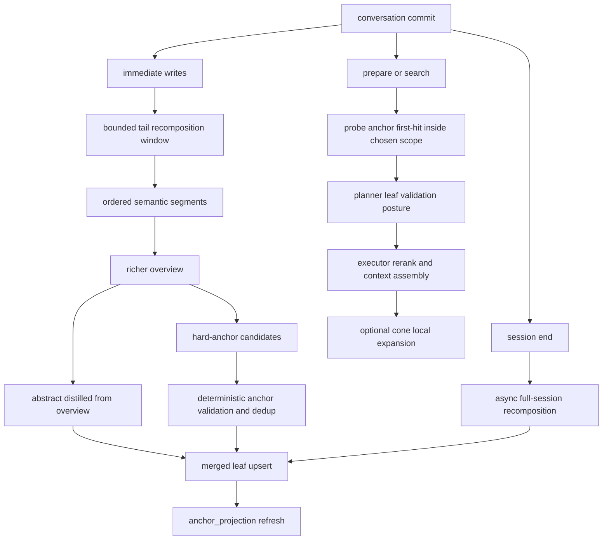
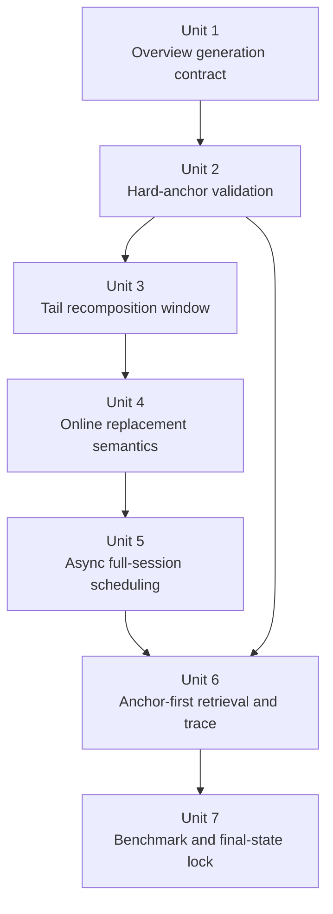

# refactor: align conversation retrieval to overview-first hard anchors

## Overview

Recenter conversation retrieval around the actual quality bottleneck that remains in the current repo state: not probe scope selection, but the write-time quality of durable conversation leaves.

The planned cut keeps the shipped `probe -> planner -> executor` phase split and keeps leaf objects as the only user-visible recall unit, but changes four load-bearing parts of the conversation path:

- write-time layer derivation becomes `overview first -> abstract from overview -> dedicated hard anchors`
- online conversation merge stops behaving like append-only segmentation and becomes bounded tail recomposition
- `session end` schedules one async full-session recomposition pass that converges the final merged leaf set
- normal retrieval becomes `anchor first-hit -> leaf validation/rerank -> optional cone second-order expansion`

This plan is intentionally narrow and destructive with respect to fallback thinking:

- no fallback ladder
- no second transcript search mode
- no long-lived compatibility layer
- no retrieval-time rewrite or HyDE rescue path

## Problem Frame

The current workspace already contains part of the previous conversation refactor:

- `src/opencortex/context/manager.py` now splits merge snapshots into ordered segments
- merged leaves already carry `msg_range`
- `session end` already persists a durable `conversation_source`
- `src/opencortex/orchestrator.py` already materializes `anchor_projection` children

That means the main problem has shifted. The hot path no longer primarily fails because conversation data is one huge blob or because probe cannot choose a root. The remaining weakness is that durable leaf representation is still too summary-shaped:

- `src/opencortex/orchestrator.py:_derive_layers()` still asks one LLM response to co-produce `abstract`, `overview`, `keywords`, and `anchor_handles`
- `abstract` still behaves like a peer summary rather than a distilled view of a richer `overview`
- `anchor_handles` are still partly a byproduct of summary generation instead of a dedicated first-hit retrieval surface
- online merge still writes new merged leaves from the detached immediate snapshot only, rather than allowing the recent durable tail to be recomposed
- the current session-end path flushes and persists source traceability, but it does not yet run the final async recomposition pass required to converge the merged leaf set
- probe still merges object hits and anchor hits into one candidate picture, while planner cone posture is still broader than the new requirements want for normal conversation recall

The result is predictable in conversation benchmarks:

- different events under one broad topic still collapse into similar leaf summaries
- anchors are present but often not hard enough to win the first hit cleanly
- correct evidence reaches the candidate set, but not consistently as `top1`
- cone remains available, but its role is not yet clearly demoted to second-order local expansion

The origin document already resolved the product direction: the right v1 is not “more semantic merging” in the abstract. It is `overview-first + hard anchors`, with segmentation and recomposition serving that representation contract.

## Requirements Trace

- R1-R6. Every durable conversation leaf must follow one write contract: richer `overview` first, then `abstract` distilled from it, and this must hold for both online and end-of-session recomposition.
- R7-R11. Hard anchors must become a dedicated additive retrieval surface that owns first-hit precision without replacing the leaf contract.
- R12-R19. Conversation segmentation must remain ordered and simple, but online merge must become bounded tail recomposition and `session end` must run one async full-session replacement pass.
- R20-R24. Retrieval must become `anchor first-hit -> leaf validation/rerank -> planner/executor assembly`, while cone is retained only as conditional second-order expansion and trace remains explainable.
- R25-R28. The implementation must stay surgical: no fallback ladder, no transcript-primary retrieval mode, no dual protocol, no retrieval-time rewrite rescue.

## Scope Boundaries

- In scope:
  - conversation leaf write contract in `src/opencortex/orchestrator.py` and `src/opencortex/memory/mappers.py`
  - online conversation tail recomposition in `src/opencortex/context/manager.py`
  - async session-end full recomposition and merged-leaf replacement semantics
  - anchor-first conversation retrieval behavior across `probe`, `planner`, `executor`, and typed response contracts
  - benchmark and regression coverage for LoCoMo / conversation-style evidence attribution

- Out of scope:
  - introducing a second transcript retrieval path
  - planner/probe protocol redesign beyond what is needed for anchor-first behavior and cone demotion
  - graph propagation, multi-level memory trees, or global scoring matrices
  - runtime fallback widening, query rewrite, or HyDE
  - a mandatory backfill of every legacy collection before this refactor can ship

### Deferred to Separate Tasks

- one-shot offline backfill for already-persisted historical conversation leaves if a long-lived collection must be normalized without re-ingest
- any future attempt to generalize session-end full recomposition beyond conversation memory
- mechanical rename or consolidation of the stale `src/opencortex/intent/` package once the retrieval behavior stabilizes

## Context & Research

### Relevant Code and Patterns

- `src/opencortex/context/manager.py`
  - already owns conversation buffering, snapshot merge, ordered segment building, `msg_range`, and durable `conversation_source` persistence
  - current `_merge_buffer()` is the immediate place to convert append-style segment writes into bounded tail recomposition
- `src/opencortex/orchestrator.py`
  - `_derive_layers()` still co-generates `abstract`, `overview`, `keywords`, and `anchor_handles`
  - `_build_abstract_json()`, `_memory_object_payload()`, and `_anchor_projection_records()` already define the canonical leaf and anchor surfaces
  - `add()` already accepts explicit `uri`, which keeps replacement-oriented merged-leaf writes simple and avoids inventing a second object type
- `src/opencortex/memory/mappers.py`
  - already centralizes handle distillation and bad-handle filtering through `_extract_topics()` and `_anchor_entries_from_slots()`
  - this is the right final validation gate for “short, hard, matchable” anchors
- `src/opencortex/prompts.py`
  - `build_layer_derivation_prompt()` is where the current parallel-summary contract is encoded
- `src/opencortex/intent/probe.py`
  - already treats `anchor_projection` as a first-class searchable surface and remaps anchor hits back to leaf payloads
  - this is the right place to make matched-anchor evidence explicit instead of letting anchors and objects blur together semantically
- `src/opencortex/intent/planner.py`
  - already computes `association_budget`; this is the lever to demote cone for default conversation retrieval without reopening a new protocol
- `src/opencortex/retrieve/cone_scorer.py`
  - already behaves like second-order association logic, which aligns with the new requirements if its trigger conditions are tightened
- `benchmarks/adapters/locomo.py` and `benchmarks/adapters/conversation.py`
  - already rely on `msg_range` and leaf-level evidence attribution, so they should stay leaf-first and only absorb additive trace signals

### Institutional Learnings

- `docs/solutions/best-practices/memory-intent-hot-path-refactor-2026-04-12.md`
  - keeps the retrieval hot path phase-native; this plan must improve anchor-first behavior without collapsing probe/planner/executor responsibilities
- `docs/solutions/best-practices/single-bucket-scoped-probe-2026-04-16.md`
  - keeps scope selection authoritative before anchor expansion; better anchors must stay inside the chosen bucket, not reopen widening behavior

### External References

- The exact OpenViking and m-flow reference implementations are already pinned in the origin requirements document. This plan intentionally carries their borrowed decisions forward through the origin file instead of duplicating sibling-repo file references here.

## Implementation Status Audit (2026-04-16)

- Already present in the current workspace:
  - ordered conversation segmentation
  - `msg_range` on merged leaves
  - durable `conversation_source`
  - `anchor_projection` records
- Still missing or misaligned:
  - `overview -> abstract` derivation order on conversation leaves
  - dedicated hard-anchor generation rather than summary-side byproducts
  - bounded online tail recomposition over recent merged leaves
  - async session-end full recomposition and final merged-set convergence
  - explicit anchor-first retrieval traces and cone demotion semantics

## Key Technical Decisions

- **Treat the current segmented merge + source traceability work as baseline, not as the target state.**
  - Rationale: those pieces already exist in the workspace. Re-planning them as greenfield would mis-sequence the remaining work.

- **Keep one leaf object contract and improve how it is written.**
  - Rationale: the origin document explicitly keeps leafs as the durable recall unit. Anchors remain additive retrieval surfaces, not a replacement object model.

- **Move generated writes to `overview first -> abstract from overview`, but preserve explicit caller overrides when both `abstract` and `overview` are already supplied.**
  - Rationale: conversation merged leaves need the new contract, while explicit user-provided summaries elsewhere should not be silently rewritten.

- **Keep hard-anchor generation in the write path and run it through deterministic validation.**
  - Rationale: the repo already has canonical anchor slots and projection records. The simplest correct cut is to improve those surfaces, not add a parallel schema.

- **Do not add a second LLM round trip just to satisfy `overview -> abstract`.**
  - Rationale: the simplest version is one richer layer-derivation call that returns `overview` and candidate hard anchors, followed by deterministic abstract distillation and anchor validation inside the repo.

- **Change online conversation merge from append-only segmentation to bounded tail recomposition.**
  - Rationale: once new messages arrive, the recent durable tail is exactly where leaf boundaries are most likely wrong. Recomposition should target that tail, not the whole session.

- **Use one async full-session recomposition pass at `session end` to converge the final merged set.**
  - Rationale: online recomposition should stay bounded for latency; the final global correction belongs off the hot path.

- **Keep replacement semantics simple: merged leaves stay session-scoped, replacement-oriented, and leaf-first.**
  - Rationale: the plan should not introduce a second visible merged set or a new compatibility reader. Steady state must expose one converged merged leaf set per session.

- **Demote cone to conditional second-order expansion only for relational or exploratory queries with strong entity anchors.**
  - Rationale: the repo already has cone machinery. The right cut is not removal, but a much narrower trigger policy.

- **Trace must explain anchor quality, recomposition quality, and cone usage directly.**
  - Rationale: once representation becomes the primary bottleneck, debugging must answer whether failure came from weak anchors, weak overview, or bad segment boundaries.

## Open Questions

### Resolved During Planning

- Should this plan update the old semantic-merge plan in place: no. The origin requirements changed enough that a new plan should supersede the old one.
- Should leafs remain the only durable retrieval-visible result object: yes.
- Should hard anchors be stored in existing canonical surfaces (`abstract_json`, `anchor_projection`, `anchor_hits`) instead of a new schema: yes.
- Should online recomposition cover the whole session on every commit: no. It should recompute only a bounded recent tail plus current immediates.
- Should `session end` full recomposition block the end response: no. It should run asynchronously after normal end-of-session closeout.
- Should cone stay on for normal conversation recall by default: no. It should require a relational or exploratory posture plus strong entity-anchor evidence.

### Deferred to Implementation

- Exact numeric caps for the online recomposition window: leaf count, message count, and token ceiling
- Exact deterministic URI scheme or replacement bookkeeping for recomposed merged leaves
- Exact naming of the additive trace fields for matched anchors, recomposition stage, and cone usage
- Exact acceptance thresholds for “hard enough” handles beyond the already-known disqualifiers: generic labels, paragraph-like text, and weak anchorless fragments

## High-Level Technical Design

> *This illustrates the intended approach and is directional guidance for review, not implementation specification. The implementing agent should treat it as context, not code to reproduce.*

## Alternative Approaches Considered

- **Keep pushing “semantic merge first” and postpone write-contract changes**
  - Rejected because the current repo state already proves segmentation alone is not the main bottleneck. Without better `overview` and harder anchors, merge quality still collapses into generic leaves.

- **Make transcript or conversation-source records a second primary retrieval path**
  - Rejected because it would add a second ranking protocol and violate the leaf-first contract the origin document explicitly keeps.

- **Use a second LLM call to derive `abstract` after generating `overview`**
  - Rejected for v1 because it adds latency and cost without changing the core information source. A deterministic distillation step from the richer overview is the simpler cut.

- **Delete cone entirely**
  - Rejected because the existing cone machinery is already in the repo and still has value for relational or exploratory expansion. The requirements only demote it; they do not require removal.

## Anti-Drift Guardrails

- A phase only counts if it moves a shipped conversation path closer to `overview-first + hard anchors + recomposition + anchor-first retrieval`; local refactors with no contract change do not count as progress.
- If a change improves prompts or anchor payloads but the normal conversation retrieval path still behaves like blended object/anchor retrieval, the work is not done.
- If online merge remains append-only and only `session end` changes, the work is not done.
- If async full-session recomposition exists but steady state can still expose both old and new merged sets, the work is not done.
- If cone remains active for ordinary factual conversation recall, the work is not done.
- If benchmark or HTTP contract updates merely accommodate old behavior instead of locking the new behavior, the work is not done.
- No implementation unit may introduce fallback widening, transcript-primary retrieval, retrieval-time rewrite, or a long-lived compatibility reader as a shortcut to green tests.

## Final-State Completion Standard

This refactor is complete only when all of the following are true at the same time. Until then, execution should be treated as in progress and should not be paused as “done”.

- New generated conversation leaves are written with `overview` as the primary semantic surface, `abstract` deterministically distilled from that overview, and validated hard anchors stored in the canonical anchor surfaces.
- Online conversation merge no longer behaves as append-only segmentation; new messages can trigger bounded tail recomposition over the recent durable tail.
- `session end` schedules one async full-session recomposition pass, and successful convergence leaves exactly one retrieval-visible merged leaf set for the session.
- Default conversation retrieval behaves as `anchor first-hit -> leaf validation/rerank -> executor context assembly`, with leafs remaining the only user-visible result objects.
- Cone is off for ordinary factual conversation recall and only activates for relational or exploratory posture with strong entity-anchor evidence.
- The normal path contains no retrieval-time rewrite, HyDE, fallback widening, transcript-primary search mode, or dual-read compatibility layer.
- Typed `/api/v1/context` and `/api/v1/memory/search` contracts expose additive traceability for matched anchors, `msg_range`, `source_uri`, recomposition stage, and cone usage where applicable.
- Targeted regression tests for write contract, recomposition, retrieval posture, and benchmark attribution all pass.
- A conversation benchmark slice or representative sample run shows the new chain is actually exercised end-to-end rather than hidden behind legacy behavior.

## Interim Stop Rules

The following intermediate states are explicitly not acceptable stopping points:

- Unit 1 or Unit 2 lands, but online merge is still append-only.
- Online tail recomposition lands, but replacement semantics still allow competing merged tails.
- Session-end async recomposition lands, but steady state can still expose both online and final merged sets.
- Anchor-first probe evidence lands, but planner still leaves cone enabled for ordinary factual conversation recall.
- HTTP or benchmark payloads are updated, but the shipped path can still silently fall back to legacy blended retrieval behavior.
- All targeted unit tests pass, but no representative end-to-end conversation run proves the final chain is actually exercised.

## Implementation Units

- [x] **Unit 1: Rebuild generated write derivation around overview-first**

**Goal:** Make generated conversation leaves produce richer `overview` first and derive `abstract` from that overview instead of treating them as parallel peer summaries.

**Requirements:** R1, R2, R3, R4, R6

**Dependencies:** None

**Files:**
- Modify: `src/opencortex/prompts.py`
- Modify: `src/opencortex/orchestrator.py`
- Test: `tests/test_conversation_immediate.py`
- Test: `tests/test_context_manager.py`

**Approach:**
- Change generated-write derivation so the LLM produces a richer `overview` and bounded anchor candidates, not an independent peer `abstract`.
- Distill `abstract` deterministically from the generated `overview`, reusing the repo’s existing overview-first migration helpers where that keeps behavior simple and consistent.
- Keep explicit caller-supplied `abstract + overview` pairs unchanged so the refactor stays surgical outside generated conversation writes.
- Keep this unit focused on the `overview -> abstract` contract only; hard-anchor validation belongs to the next unit so the behavioral delta stays reviewable.

**Patterns to follow:**
- `src/opencortex/orchestrator.py:_build_abstract_json()`
- `src/opencortex/migration/v032_overview_first.py`

**Test scenarios:**
- Happy path: a generated conversation leaf with multiple concrete facts yields a richer `overview` and a shorter derived `abstract` that is recognizably downstream of that overview rather than a parallel summary.
- Happy path: a merged conversation write and an immediate conversation write both land on the same `overview -> abstract` contract.
- Edge case: explicit caller-provided `abstract` and `overview` remain unchanged when both are already supplied.
- Edge case: generated `overview` with leading weak filler still produces a deterministic abstract rooted in the actual overview content.
- Error path: no LLM configured still produces a valid leaf contract with a safe abstract fallback and no runtime failure.

**Verification:**
- Inspecting one generated conversation leaf now shows `overview` as the primary semantic surface and `abstract` as a shorter derivative of it rather than a parallel summary.

- [x] **Unit 2: Harden canonical anchors into a dedicated first-hit retrieval surface**

**Goal:** Turn anchor candidates into validated hard anchors that are short, concrete, deduplicated, and fully synchronized into canonical leaf and projection surfaces.

**Requirements:** R7, R8, R9, R10, R11

**Dependencies:** Unit 1

**Files:**
- Modify: `src/opencortex/orchestrator.py`
- Modify: `src/opencortex/memory/mappers.py`
- Test: `tests/test_conversation_immediate.py`
- Test: `tests/test_context_manager.py`
- Test: `tests/test_memory_domain.py`

**Approach:**
- Treat `src/opencortex/memory/mappers.py` as the final hard-anchor validator: reject generic labels, paragraph-style handles, and weak fragments; deduplicate aggressively; cap the stored anchors.
- Refresh `anchor_projection` children only from the validated canonical anchor set so probe consumes one truthful surface.
- Keep anchors additive: they sharpen first-hit retrieval but do not replace leaf `overview`, `abstract`, `content`, or traceability metadata.

**Patterns to follow:**
- `src/opencortex/orchestrator.py:_anchor_projection_records()`
- `src/opencortex/memory/mappers.py:_extract_topics()`
- `src/opencortex/memory/mappers.py:_anchor_entries_from_slots()`

**Test scenarios:**
- Happy path: validated hard anchors preserve concrete entities, times, and path-like handles and flow into both `abstract_json["anchors"]` and derived `anchor_projection` records.
- Happy path: two semantically similar but concretely different leaves keep distinct hard anchors rather than collapsing into the same generic topic handles.
- Edge case: duplicated entities or repeated time references across metadata and generated anchor candidates collapse to one stored handle.
- Edge case: paragraph-style or generic handles such as `events` or `summary` are rejected even if the LLM emits them.
- Error path: sparse metadata still yields a valid leaf with few or zero anchors instead of noisy filler handles.
- Integration: probe-visible `anchor_projection` records remain synchronized with the canonical validated anchor set after merged-leaf rewrites.

**Verification:**
- The canonical stored anchors are now dedicated first-hit handles rather than generic summary leftovers, and anchor projections are a faithful derivative of those stored anchors.

- [x] **Unit 3: Convert online conversation merge into a bounded recomposition window**

**Goal:** Allow new conversation messages to recompute the recent durable tail so segment boundaries, overviews, abstracts, and hard anchors can evolve with new evidence.

**Requirements:** R6, R12, R13, R14, R15, R16, R17

**Dependencies:** Unit 2

**Files:**
- Modify: `src/opencortex/context/manager.py`
- Test: `tests/test_context_manager.py`
- Test: `tests/test_conversation_merge.py`

**Approach:**
- Replace the current “detached immediate snapshot only” merge behavior with a recomposition window that includes the current immediate snapshot plus a bounded recent merged tail from the same session.
- Re-run ordered segment construction over the recomposition window, then rewrite the affected merged leaves so `msg_range`, `overview`, `abstract`, and anchors all stay aligned.
- Keep recomposition bounded by a small recent window; exact caps are deferred, but the algorithm shape must not scan the whole session on every commit.
- Preserve current failure safety: if recomposition fails, restore the detached immediate snapshot and leave the previous durable tail queryable.
- Keep traceability intact by carrying forward `source_uri` and precise `msg_range` for every recomposed leaf.

**Execution note:** Start with characterization coverage for the current append-style merge behavior so the new recomposition outcome is explicit and reviewable.

**Patterns to follow:**
- `src/opencortex/context/manager.py:_build_snapshot_segments()`
- `src/opencortex/context/manager.py:_take_merge_snapshot()`
- `src/opencortex/context/manager.py:_restore_merge_snapshot()`

**Test scenarios:**
- Happy path: new messages that continue the same local topic cause the recent durable tail to be recomposed instead of appending a fresh unrelated leaf.
- Happy path: a clear topic or time shift keeps the previous tail leaf stable and produces a new downstream leaf with its own `msg_range`.
- Edge case: recomposition keeps segment ranges monotonic and non-overlapping even when adjacent entries share some anchors.
- Edge case: the bounded window does not pull the whole session back into online recomposition.
- Error path: if recomposition fails after the window is detached, the immediate snapshot is restored and the previously durable merged leaves remain available.
- Integration: superseded merged leaves and their derived anchor projections are removed exactly once after the replacement leaves succeed.

**Verification:**
- Recent conversation boundaries are no longer append-only; they evolve inside a bounded tail window while preserving the current session’s traceability guarantees.

- [x] **Unit 4: Lock online replacement semantics and cleanup for recomposed leaves**

**Goal:** Ensure online recomposition leaves one coherent durable tail view rather than accumulating stale merged leaves or stale anchor projections.

**Requirements:** R10, R13, R16, R17, R19

**Dependencies:** Unit 3

**Files:**
- Modify: `src/opencortex/context/manager.py`
- Test: `tests/test_context_manager.py`

**Approach:**
- Define the online replacement contract explicitly: recomposed merged leaves replace the affected prior durable tail leaves as one bounded session-scoped set.
- Remove superseded merged leaves and their derived anchor projections only after replacement succeeds.
- Keep cleanup and replacement idempotent so repeated commits or retries do not leave duplicate session-visible tails.
- Preserve `source_uri` and `msg_range` continuity so traceability survives replacement.

**Patterns to follow:**
- `src/opencortex/context/manager.py:_delete_immediate_families()`
- `src/opencortex/context/manager.py:_merge_buffer()`

**Test scenarios:**
- Happy path: successful online recomposition replaces the affected prior merged tail and leaves one retrieval-visible tail view.
- Edge case: duplicate commit or retry behavior does not accumulate duplicate recomposed merged leaves.
- Edge case: superseded anchor projections disappear together with the superseded merged leaves.
- Error path: failed replacement leaves the prior durable tail queryable and does not produce a half-replaced session tail.
- Integration: prepare/search after online recomposition sees only the replacement leaves for the affected tail window.

**Verification:**
- Online recomposition is now replacement-oriented rather than additive, so durable session tails do not drift into multiple competing versions.

- [x] **Unit 5: Add async full-session recomposition scheduling and convergence rules at session end**

**Goal:** Run one asynchronous full-session recomposition pass after session close so the final merged leaf set converges from complete session context rather than only the online tail view.

**Requirements:** R6, R18, R19

**Dependencies:** Unit 4

**Files:**
- Modify: `src/opencortex/context/manager.py`
- Test: `tests/test_context_manager.py`

**Approach:**
- After normal end-of-session flush and `conversation_source` persistence, schedule one background full-session recomposition task per session.
- Rebuild the full ordered session leaf set using the same overview-first and hard-anchor contract as online recomposition; there must not be a second summarization path.
- Keep the steady-state visibility contract replacement-oriented: the async pass should first compute the target full-session leaf set, then replace the session-scoped merged set as one logical set so steady state does not keep both versions queryable.
- Preserve failure safety: if the async full-session pass fails, the last successful online merged set remains available and traceable.
- Track recomposition stage in metadata or trace so operators can tell whether a hit came from the online tail pass or the final full-session convergence pass.
- Prevent overlapping recomposition writers for the same session so online recomposition and full-session convergence do not race.

**Patterns to follow:**
- `src/opencortex/context/manager.py:_end()`
- `src/opencortex/context/manager.py:_wait_for_merge_task()`
- `src/opencortex/context/manager.py:_persist_conversation_source()`

**Test scenarios:**
- Happy path: ending a session schedules one async full-session recomposition pass without blocking the normal end response.
- Happy path: after the async pass completes, the session exposes one converged merged leaf set rather than keeping both the online and final sets in steady state.
- Edge case: a session whose final recomposition produces the same boundaries does not churn unnecessary duplicate leaf records.
- Error path: if the async full-session recomposition fails, the previously available merged leaves remain searchable and traceable.
- Integration: merged leaves returned after async convergence still point to the same durable `conversation_source` and correct `msg_range`.

**Verification:**
- Session close no longer freezes the online tail approximation as the final truth; one asynchronous global pass converges the merged leaf set without introducing a second retrieval mode.

- [x] **Unit 6: Make conversation retrieval explicitly anchor-first and demote cone**

**Goal:** Turn hard anchors into the normal first-hit path for conversation retrieval, keep leafs as the final ranked objects, and narrow cone to second-order expansion only when the query posture justifies it.

**Requirements:** R20, R21, R22, R23, R24

**Dependencies:** Unit 2, Unit 5

**Files:**
- Modify: `src/opencortex/intent/probe.py`
- Modify: `src/opencortex/intent/planner.py`
- Modify: `src/opencortex/intent/executor.py`
- Modify: `src/opencortex/intent/types.py`
- Modify: `src/opencortex/orchestrator.py`
- Modify: `src/opencortex/http/models.py`
- Test: `tests/test_memory_probe.py`
- Test: `tests/test_intent_planner_phase2.py`
- Test: `tests/test_recall_planner.py`
- Test: `tests/test_cone_e2e.py`
- Test: `tests/test_http_server.py`
- Test: `tests/test_perf_fixes.py`
- Test: `tests/test_retrieval_support.py`

**Approach:**
- Keep probe scope selection unchanged, but make matched hard-anchor evidence explicit in the probe result and candidate trace instead of treating anchor/object hits as one blended semantic signal.
- Keep final ranking leaf-first: anchor hits should nominate or validate leaves, not replace them in the outward result contract.
- Tighten planner cone posture so `association_budget` stays `0` for normal conversation recall unless the query is relational or exploratory and the probe evidence includes strong entity anchors.
- Keep retrieval-time rewrite, HyDE, and fallback widening out of the conversation hot path.
- Extend typed search/prepare payloads with additive explainability fields for matched anchors, recomposition stage, and cone usage without changing the leaf-first result contract.

**Patterns to follow:**
- `src/opencortex/intent/probe.py:_candidate_record_payload()`
- `src/opencortex/intent/probe.py:_build_probe_result()`
- `src/opencortex/intent/planner.py:_build_search_profile()`
- `docs/solutions/best-practices/memory-intent-hot-path-refactor-2026-04-12.md`

**Test scenarios:**
- Happy path: a conversation query with a strong hard-anchor match returns the leaf object as the final result while exposing the matched anchor evidence in trace or typed payloads.
- Happy path: planner keeps `association_budget=0` for ordinary factual conversation recall even when anchors are present.
- Happy path: a relational or exploratory query with strong entity anchors can still enable bounded cone expansion.
- Edge case: anchor-projection hits remap cleanly back to leaf payloads and never leak projection objects into user-visible results.
- Edge case: recomposed conversation leaves remain explainable after retrieval through `msg_range`, `source_uri`, and additive recomposition-stage metadata.
- Error path: scoped miss behavior remains scoped and does not reopen fallback-style widening.
- Integration: `/api/v1/context` prepare and `/api/v1/memory/search` expose the same leaf-first contract plus additive trace fields.

**Verification:**
- The normal conversation recall path is now auditable as `probe anchor first-hit -> planner posture -> executor leaf result`, with cone clearly acting as an optional second-order extension rather than a default rescue mechanism.

- [x] **Unit 7: Re-lock benchmark attribution and final-state completion around the new leaf shape**

**Goal:** Keep benchmark adapters and external response contracts aligned with the new overview-first, anchor-first, recomposition-aware conversation behavior.

**Requirements:** R11, R19, R21, R24, R25, R26, R27, R28

**Dependencies:** Unit 6

**Files:**
- Modify: `benchmarks/adapters/conversation.py`
- Modify: `benchmarks/adapters/locomo.py`
- Test: `tests/test_locomo_bench.py`
- Test: `tests/test_benchmark_runner.py`
- Test: `tests/test_http_server.py`

**Approach:**
- Keep benchmark evidence attribution leaf-first and continue to use `msg_range` as the primary session-evidence mapping surface.
- Add only the trace signals that help diagnose the new system: matched anchors, recomposition stage, and cone usage when present.
- Preserve the current session-scoped conversation benchmark contract; the benchmark should validate the shipped retrieval path, not a special transcript-only path.
- Ensure benchmark and HTTP tests assert the absence of rewrite/fallback semantics on the normal path.
- Add a final-state validation slice that must fail if the system is still secretly exercising legacy blended retrieval or append-only merge behavior.

**Patterns to follow:**
- `benchmarks/adapters/locomo.py` current `msg_range` overlap mapping
- `benchmarks/adapters/conversation.py` current session-scoped ingest and retrieval metadata handling
- `tests/test_http_server.py` typed prepare/search contract coverage

**Test scenarios:**
- Happy path: LoCoMo evidence mapping still selects the tightest overlapping merged leaf after recomposition.
- Happy path: benchmark metadata records matched-anchor or recomposition signals without changing the primary leaf URI attribution.
- Edge case: when `msg_range` is unavailable in a synthetic fixture, the adapter still falls back to its existing temporal tie-break logic rather than inventing a new retrieval path.
- Error path: benchmark and HTTP contract tests fail if rewrite or fallback fields become behaviorally active again on the normal path.
- Integration: a recomposed conversation session can be ingested, retrieved, and benchmark-attributed without exposing transcript records as primary search hits.
- Integration: a representative conversation sample or benchmark slice exercises `overview-first leaf write -> tail/full recomposition -> anchor-first retrieval` as one end-to-end shipped chain.

**Verification:**
- Benchmarks and external contracts stay aligned with the shipped leaf-first retrieval semantics, and the final-state completion standard can be checked from code, tests, and one representative run instead of by assumption.

## System-Wide Impact

- **Interaction graph:** `src/opencortex/context/manager.py` owns conversation buffering and recomposition windows; `src/opencortex/orchestrator.py` owns canonical leaf/anchor materialization; `src/opencortex/intent/` consumes those surfaces for anchor-first retrieval; benchmark and HTTP layers expose the resulting trace contract.
- **Error propagation:** write-time layer derivation failures must degrade to safe leaf writes; recomposition failures must keep the previous durable tail or merged set visible; probe/planner/executor must continue to surface scoped-miss behavior explicitly.
- **State lifecycle risks:** stale `anchor_projection` children, duplicate merged leaves after replacement, leaked async recomposition tasks, and mismatch between `msg_range` and rewritten leaf content are the main lifecycle hazards.
- **Concurrency boundary:** session locks and recomposition tasks must keep one session from running overlapping online and full-session recomposition writes at the same time.
- **API surface parity:** `/api/v1/context` prepare and `/api/v1/memory/search` must expose the same additive conversation trace fields where applicable.
- **Integration coverage:** the critical end-to-end paths are `commit -> tail recomposition -> prepare`, `end -> async full recomposition -> prepare/search`, and benchmark ingest/retrieval over session-scoped conversation data.
- **Unchanged invariants:** leaf objects remain the only normal retrieval result objects; transcript or conversation-source records do not become a second primary search mode; no fallback widening or retrieval-time rewrite is reintroduced.

## Risks & Dependencies

| Risk | Mitigation |
|------|------------|
| Hard-anchor validation becomes too strict and hurts recall on sparse leaves | Keep leaf overview/object retrieval as the validation layer, cover sparse-anchor cases in unit tests, and cap validator aggressiveness before adding more heuristics |
| Online tail recomposition increases hot-path write cost | Keep the recomposition window bounded, keep one derivation call per segment, and reserve the global correction for async session-end recomposition |
| Async full-session recomposition leaves duplicate merged sets in steady state | Make replacement semantics explicit in metadata and tests, and keep only one converged session merged set queryable after success |
| Cone demotion accidentally hurts relational recall | Gate cone by query posture and strong entity-anchor evidence, then lock relational coverage with focused planner/runtime tests |
| Existing historical collections still contain old-style conversation leaves | Do not add runtime dual-read logic; if normalization of old collections matters, handle it as a separate one-shot backfill task |

## Documentation / Operational Notes

- This refactor should ship without a runtime compatibility layer. Fresh conversation writes must directly follow the new contract.
- If an existing collection must be normalized without re-ingest, the right follow-up is a one-shot admin or migration path modeled on `src/opencortex/migration/v032_overview_first.py`, not a dual-read retrieval path.
- Sample and benchmark validation should continue to use fresh session-scoped conversation ingest so the measured effect comes from the shipped write/retrieval contract rather than mixed historical data.

## Sources & References

- **Origin document:** `docs/brainstorms/2026-04-16-conversation-overview-first-hard-anchors-requirements.md`
- Related code:
  - `src/opencortex/context/manager.py`
  - `src/opencortex/orchestrator.py`
  - `src/opencortex/memory/mappers.py`
  - `src/opencortex/intent/probe.py`
  - `src/opencortex/intent/planner.py`
  - `src/opencortex/intent/executor.py`
  - `src/opencortex/retrieve/cone_scorer.py`
  - `src/opencortex/prompts.py`
- Related learnings:
  - `docs/solutions/best-practices/memory-intent-hot-path-refactor-2026-04-12.md`
  - `docs/solutions/best-practices/single-bucket-scoped-probe-2026-04-16.md`
- Related plans:
  - `docs/plans/2026-04-16-003-refactor-write-time-anchor-distill-plan.md`
  - `docs/plans/2026-04-16-004-refactor-conversation-semantic-merge-plan.md`
