# feat: Minimum-cost retrieval with fact points

## Overview

当前 recall 质量瓶颈在候选集生成层——anchor_projection 语义丰富度不足（单术语 + 零向量），且 probe 窄搜索 (top_k=10-20) 导致完全漏召。

本 plan 在现有 Qdrant 单集合架构上实现三层检索面（leaf / anchor / fact_point），通过 URI 链接的 minimum-cost 路径打分取代当前 score fusion 加权平均，同时修复 anchor 零向量问题并移除 `should_recall` 前置门控。

## Problem Frame

Plan 005（overview-first + hard anchors）和 Plan 003（write-time anchor distill）已落地。Recall 质量仍不足，根因：

1. **anchor_projection 语义贫乏**：单术语 + 零向量，不可被向量搜索命中
2. **无原子事实层**：缺少 m-flow 式 FacetPoint（短事实句），中层锚点和 leaf 之间没有精确命中面
3. **probe 窄搜索 + should_recall 门控**：probe top_k 过低，should_recall=false 直接跳过整个检索链路

结合 OpenViking（三层 FS + scope-first）和 m-flow（Facet/FacetPoint + 倒锥形代价传播）设计精髓，在 Qdrant 单集合上落地新检索架构。(see origin: `docs/brainstorms/2026-04-16-minimum-cost-retrieval-with-fact-points-requirements.md`)

## Requirements Trace

- R1-R7: Fact Point Layer (write-time)
- R4a: 派生记录继承源 leaf 访问控制
- R8-R11: Anchor Layer Enhancement (write-time)
- R12-R19: Minimum-Cost Retrieval (read-time)
- R20-R22: Wide Search Window
- R23-R25: Two-Layer Write Strategy + lifecycle
- R26-R28, R28a: Probe Gate & Scope Selection
- R29-R33: Compatibility & Migration
- R34-R36: Trace & Explainability

## Scope Boundaries

- fact_point 数据模型、生成、质量门控、存储
- anchor 短语化 + 嵌入向量修复
- URI-based minimum-cost 路径打分（独立 scorer，作为主打分机制）
- 三层并行向量搜索 + URI 投射
- should_recall 门控移除
- 派生记录生命周期管理
- trace 扩展

### Deferred to Separate Tasks

- fact_point 语义去重 R6（核心功能验证后）
- `retrieval_surface` 命名统一（`l0_object` → `leaf`）
- probe anchor 搜索升级为向量搜索（当前保持文本匹配）

## Context & Research

### Relevant Code and Patterns

- `src/opencortex/orchestrator.py` — `_derive_layers()` (line 1223), `_anchor_projection_records()` (line 1498), `_sync_anchor_projection_records()` (line 1572), `_execute_object_query()` (line 2781), `_score_object_record()` (line 2628), `_apply_cone_rerank()` (line 2563)
- `src/opencortex/retrieve/cone_scorer.py` — `ConeScorer` with `DIRECT_HIT_PENALTY=0.3`, `HOP_COST=0.05`, `compute_cone_scores()`
- `src/opencortex/prompts.py` — `build_layer_derivation_prompt()` (line 169), JSON schema: `overview/keywords/entities/anchor_handles`
- `src/opencortex/intent/planner.py` — `semantic_plan()` line 108: `if recall_mode == "auto" and not probe_result.should_recall: return None`
- `src/opencortex/storage/qdrant/adapter.py` — `_to_point()` line 770: zero vector fallback `[0.0] * dim`
- `src/opencortex/models/embedder/base.py` — `embed_batch()` exists on all embedder implementations (sync, needs `run_in_executor`)
- URI prefix cleanup pattern: `_sync_anchor_projection_records()` → `remove_by_uri(prefix)` + re-create
- Access control inheritance pattern: `_anchor_projection_records()` already copies `scope`, `source_tenant_id`, `source_user_id`, `project_id`, `session_id`, `source_doc_id` from source leaf

### Institutional Learnings

- **Hot-path phase boundary** (`docs/solutions/best-practices/memory-intent-hot-path-refactor-2026-04-12.md`): probe returns evidence only, planner shapes posture, runtime executes. New fact_point retrieval must fit within runtime phase, not create separate execution paths.
- **Single-bucket scope** (`docs/solutions/best-practices/single-bucket-scoped-probe-2026-04-16.md`): All retrieval surfaces (fact_point/anchor/leaf) must operate within the chosen scope bucket. Fact_points are precision signals, not scope-widening mechanisms. Removing `should_recall` must not reintroduce implicit widening.
- **Plan 005 cone demotion**: Entity-based cone expansion is conditional (association_budget > 0 + entity evidence). URI-based min-cost scoring is a different mechanism and operates independently.

## Key Technical Decisions

- **两种打分机制共存，独立调用**：URI-based minimum-cost path scoring (新增, always active) 和 entity-based cone expansion (现有, 条件触发) 是不同机制。URI paths 是 parent-child 确定性链接，entity paths 是共现概率关联。两者独立调用，不共享 guard clause：URI scoring 无条件执行 → entity cone 仅在 `association_budget > 0` 且 `entity_index.is_ready()` 时触发。Cone-expanded candidates 只获得 `_cone_bonus`，不参与 URI path scoring（它们没有三层搜索出处）。(see origin: R12)

- **URI path scorer 独立于 ConeScorer**：`compute_uri_path_scores()` 作为独立纯函数放在 `src/opencortex/retrieve/uri_path_scorer.py`，不放在 ConeScorer 上。原因：(1) ConeScorer 的职责是 entity-based graph scoring，依赖 EntityIndex；URI scorer 是纯计算，零依赖。(2) ConeScorer 条件实例化（`cone_retrieval_enabled`），但 URI scoring 必须无条件执行。(3) 遵循 `retrieval_support.py` 中 `anchor_rerank_bonus()` 的模式——独立 scoring 函数由 orchestrator 直接调用。(see origin: R12, R15-R19)

- **URI path score 在 fusion 中的位置**：URI path score (`1.0 - min_cost`) 替代原始向量 `_score` 作为打分起点。`_score_object_record()` 中的补充信号（reward, active_count, kind, scope, doc）保持 additive，但基础分从 vector similarity 变为 URI path score。`DIRECT_HIT_PENALTY` 加入 `CortexConfig`，初始值 **0.15**（非 0.30），给 anchor/fp 路径微弱优势但不剧烈改变分数分布。待 fact_point 充分覆盖后可 ramp 到 0.30。score_threshold 语义偏移 ≤0.15，可控。Unit 5 须加 benchmark gate：在固定 golden set 上 top-5 recall 不退化。(see origin: R12, R19)

- **三层搜索各自 filter**：共享 scope/tenant/access filter，但 leaf search 加 `is_leaf=True` + `memory_kind`，anchor/fact_point search 加各自 `retrieval_surface` filter，不加 `is_leaf`/`memory_kind`。(see origin: R14, R28)

- **写入顺序改为 write-new-then-delete-old**：R25 要求原子替换语义。URI 是内容寻址 (sha1 digest)，相同内容产生相同 URI（幂等 upsert）。新集合写入成功后再删旧集合。半失败时旧集合仍可用。(see origin: R25)

- **批量嵌入**：anchor (0-6) + fact_point (0-8) 文本合并为单次 `embed_batch()` 调用 (sync, `run_in_executor`)，避免 14 次串行 embed 调用。**注意**：`CachedEmbedder.embed_batch()` 当前实现是循环单次调用（`[self.embed(t) for t in texts]`），会把 50ms batch 退化为 250ms+ 串行。实现时需修复为 cache-miss 批量查询 + inner `embed_batch()` 批量嵌入。(see origin: R9)

- **_derive_layers fast path 不生成 fact_point**：当 user 同时提供 abstract + overview 时跳过 LLM，不生成 fact_point/anchor。此行为可接受——显式提供两层的调用方不需要 LLM enrichment。(see origin: R5, R7)

- **should_recall 移除后保留 scoped_miss 快速退出**：planner 不再用 should_recall 门控，但 `_execute_object_query` 可在 probe 返回 authoritative empty scope 时快速退出（三层搜索在空 scope 内必然返回空）。(see origin: R28a)

## Open Questions

### Resolved During Planning

- **embed 批量支持？** 已确认 `embed_batch()` 存在于所有 embedder 实现，支持单次 batch 调用
- **collection_schemas 需改动？** 不需要。`retrieval_surface` 已是 indexed string field，`fact_point` 只是新值
- **fact_point URI 命名方案？** `{source_uri}/fact_points/{sha1_digest[:12]}`，与 `/anchors/{digest}` 平行
- **三层搜索 filter 差异？** 每层独立 filter，共享 scope/tenant/access，各自加 `retrieval_surface`/`is_leaf`/`memory_kind`
- **ConeScorer 两种机制如何交互？** URI-based 是主打分(always, 独立模块)，entity-based 是候选扩展(conditional, ConeScorer)。Cone-expanded candidates 只获得 `_cone_bonus`，不参与 URI path scoring（它们没有三层搜索出处）。若 candidate 同时出现在 leaf search 和 cone expansion 中，URI path score 来自其搜索出处，不来自 expansion
- **R12 说"扩展 ConeScorer"，plan 为何独立模块？** 规划期间确认 ConeScorer 是 entity-based scorer（依赖 EntityIndex，条件实例化），URI scoring 是纯计算零依赖。将两者放在同一 class 违反 SRP 且有实例化冲突。此为规划期间对 R12 实现方式的修正——需同步更新需求文档 Key Decisions 部分。
- **Origin doc Core Concept 显示 fp→anchor→leaf 两跳，plan 为何单跳？** R4/R15 已澄清 fact_point 通过 `projection_target_uri` 直接链接到 leaf（单跳），`source_anchor_uri` 仅用于 trace。Origin doc 的 Core Concept 示意图在 R4/R15 后已过时。
- **collection_schemas.py 需要改动吗？** 不需要。`retrieval_surface` 已是 indexed keyword field，`"fact_point"` 只是新的 metadata value，无 schema DDL 变更。Origin doc Impact Analysis 表中标记为修改，但指的是"新增索引值"而非 schema 变更。

### Deferred to Implementation

- fact_point LLM 提取 prompt 的最终措辞微调（Unit 1 给出方向性 sketch）
- anchor 短语化具体策略：LLM 直接生成短句 vs 拼接 anchor_type+anchor_value（实现时对比效果）
- 三层搜索 top-k 配置值的精确调优（先用 R20 建议值 60/40/20，后续 benchmark 调参）
- fact_point 与 entity index 的关联方式（fact_point 的 entities 是否录入 EntityIndex）

## High-Level Technical Design

> *This illustrates the intended approach and is directional guidance for review, not implementation specification. The implementing agent should treat it as context, not code to reproduce.*

```mermaid
flowchart TD
    subgraph WriteTime["Write Path (merge/recomposition)"]
        DL["_derive_layers()"] -->|LLM JSON| Parse["Parse: overview, anchor_handles, fact_points"]
        Parse --> AnchorBuild["_anchor_projection_records()"]
        Parse --> FPBuild["_fact_point_records()"]
        AnchorBuild --> BatchEmbed["embed_batch(anchor_texts + fp_texts)"]
        FPBuild --> BatchEmbed
        BatchEmbed --> SyncDerived["_sync_derived_records()"]
        SyncDerived -->|write new| Qdrant[(Qdrant)]
        SyncDerived -->|then delete old| Qdrant
    end

    subgraph ReadTime["Read Path (_execute_object_query)"]
        EmbedQ["embed(query)"] --> ThreeSearch["asyncio.gather()"]
        ThreeSearch --> FPSearch["fact_point search (top-60)"]
        ThreeSearch --> AnchorSearch["anchor search (top-40)"]
        ThreeSearch --> LeafSearch["leaf search (top-20)"]
        FPSearch --> URIProject["URI projection → leaf set"]
        AnchorSearch --> URIProject
        LeafSearch --> URIProject
        URIProject --> MinCost["uri_path_scorer.compute_uri_path_scores()"]
        MinCost --> Rank["rank by min path cost ↑"]
        Rank --> ACLCheck["re-validate leaf visibility"]
        ACLCheck --> Result["MatchedContext[]"]
    end
```



**Path cost model** (directional):
```
Path types:
  direct:      cost = leaf_distance + DIRECT_HIT_PENALTY (0.30)
  anchor→leaf: cost = anchor_distance + HOP_COST (0.05)
  fp→leaf:     cost = fp_distance + HOP_COST (0.05)
                 if fp_distance < 0.10: HOP_COST *= 0.5  (conditional discount)

Per leaf: final_cost = min(all_paths)
Ranking:  ascending by final_cost (lower = better)
Supplementary: reward_score, active_count as tiebreakers
```

## Prerequisites

1. **Plan 005 代码必须提交并通过测试后才能开始本 plan。** 涉及文件：`orchestrator.py`, `manager.py`, `planner.py`, `server.py`。本 plan 的行号引用基于 Plan 005 已落地的代码。
2. **`CachedEmbedder.embed_batch()` 修复**：当前实现是 `[self.embed(t) for t in texts]`（serial loop），需修复为 cache-miss 批量查询 + inner `embed_batch()` 批量嵌入。修复文件：`src/opencortex/models/embedder/cache.py`。验证：assert `embed_batch(N)` 对 N 个 cache-miss 文本只调用一次 inner `embed_batch()`，不是 N 次 `embed()`。此修复独立于本 plan 主题，但 Unit 2/3 的写路径延迟预算依赖它。

## Implementation Units

- [ ] **Unit 1: Foundation — prompt extension + constants + fact_point URI scheme**

**Goal:** 扩展 LLM derivation prompt 请求 `fact_points` 字段，定义 fact_point URI 前缀和 min-cost 常量。无行为变更——LLM 返回的 fact_points 暂时不被消费。

**Requirements:** R1, R2, R3 (prompt guidance), R4 (URI scheme)

**Dependencies:** None

**Files:**
- Modify: `src/opencortex/prompts.py`
- Modify: `src/opencortex/orchestrator.py` (new `_fact_point_prefix()` static method, parallel to `_anchor_projection_prefix()`)
- Test: `tests/test_recall_planner.py` (prompt regression)

**Approach:**
- `build_layer_derivation_prompt()` 的 JSON schema 新增 `fact_points` 字段，0-8 个条目，每个是原子事实句 (<80 字符)
- prompt 内嵌质量门控指导：必须含具体实体/数字/时间/路径，拒绝泛词、段落式文本
- `orchestrator._fact_point_prefix(uri)` → `f"{uri}/fact_points"`
- 常量定义延迟到 Unit 4（`uri_path_scorer.py` 在 Unit 4 创建）
- `_derive_layers()` 解析 LLM 响应中的 `fact_points` 字段，返回 `{"fact_points": list}` 加入结果 dict。缺失/畸形时返回空 list（R7 退化行为）

**Technical design:**

> *Directional guidance for prompt extension:*

```
"fact_points": ["atomic fact 1", "atomic fact 2", "..."]

Rules for fact_points:
- 0-8 atomic fact statements extracted from the content
- Each must be a complete, self-contained statement under 80 characters
- Must contain at least one concrete signal: entity name, number, date, file path, technical term
- Reject: generic descriptions, paragraph-style text, text that requires surrounding context
- Good: "Alice moved to Hangzhou on May 1", "Migration uses batch size 500 to avoid downtime"
- Bad: "discussed the plan", "some changes were made", "the system was updated"
```

**Patterns to follow:**
- `_anchor_projection_prefix()` (orchestrator.py:1494) — static method URI prefix pattern
- `build_layer_derivation_prompt()` (prompts.py:169) — existing JSON schema extension pattern

**Test scenarios:**
- Happy path: LLM 返回包含 fact_points 的完整 JSON → `_derive_layers()` 返回 dict 含 `fact_points` list
- Happy path: LLM 返回 0 个 fact_points（合法） → `fact_points` 为空 list
- Edge case: LLM 响应不含 `fact_points` key → 返回空 list, 不报错
- Edge case: `fact_points` 值为非 list 类型 → 返回空 list
- Edge case: `_derive_layers()` fast path (user 提供 abstract+overview) → 返回 `fact_points: []`
- Error path: LLM 调用失败 → no-LLM fallback 返回 `fact_points: []`

**Verification:**
- `_derive_layers()` 在所有路径下返回 dict 含 `fact_points` key (list)
- 现有测试通过——新字段是 additive，不影响现有消费者

---

- [ ] **Unit 2: Write path — anchor embedding fix + phrase upgrade**

**Goal:** 修复 anchor_projection 零向量问题，升级 overview 从单术语到短语，使 anchor 层可被向量搜索命中。

**Requirements:** R8, R9, R11, R4a

**Dependencies:** None (independent of Unit 1)

**Files:**
- Modify: `src/opencortex/orchestrator.py` (`_anchor_projection_records()`, `_sync_anchor_projection_records()`)
- Test: `tests/test_context_manager.py` (anchor embedding verification)

**Approach:**
- `_anchor_projection_records()` 当前 `overview` 字段直接用 `anchor_text`（单术语）。升级为 `f"{anchor_type}: {anchor_text}"` 或 LLM 生成的短句（若 anchor 已是短句则直接用）
- `_sync_anchor_projection_records()` 改为 async：收集所有 anchor overview 文本 → 单次 `embed_batch()` (via `run_in_executor`) → 将 `EmbedResult` 的 `dense_vector`/`sparse_vector` 写入 projection record 的 `vector`/`sparse_vector` 字段
- `_to_point()` 在 adapter 中已处理 vector 字段——当 record dict 含 `vector` key 时使用实际向量，不再 fallback 到零向量
- 继承访问控制字段的模式已存在（line 1536-1541），确认完整性

**Patterns to follow:**
- `_embed_retrieval_query()` (orchestrator.py:2613) — `run_in_executor` + `embed_query` pattern
- `_anchor_projection_records()` (orchestrator.py:1498) — 现有 record builder

**Test scenarios:**
- Happy path: anchor projection record 包含非零 `vector` 字段 → Qdrant 存储实际向量
- Happy path: anchor overview 为短语格式 (e.g. "entity: Alice relocated to Hangzhou") → 向量语义信号更丰富
- Edge case: 0 个 anchor → 无 embed 调用，无 projection record
- Edge case: anchor_text 长度 < 4 字符（R11 最短要求） → 被过滤，不生成 projection
- Error path: `embed_batch()` 失败 → projection records 仍写入但使用零向量 fallback（退化到当前行为），日志 warning
- Integration: 通过 `orchestrator.add()` 触发 → anchor projection 写入 Qdrant → 用向量搜索可命中

**Verification:**
- anchor projection records 在 Qdrant 中存储非零向量
- `storage.search()` with `retrieval_surface="anchor_projection"` + query vector 可返回相关 anchor
- 现有 anchor 文本匹配搜索不受影响

---

- [ ] **Unit 3: Write path — fact_point generation + quality gate + sync**

**Goal:** 在 merge/recomposition 路径生成 fact_point 记录，通过质量门控后写入 Qdrant。

**Requirements:** R1, R2, R3, R4, R4a, R5, R7, R10, R24, R25
**Constraints:** R23 (_write_immediate 不生成 fact_point — 现有行为，本 unit 不得违反)

**Dependencies:** Unit 1 (prompt + URI scheme + _derive_layers parsing)

**Files:**
- Modify: `src/opencortex/orchestrator.py` (new `_fact_point_records()`, new `_is_valid_fact_point()`, extend `_sync_anchor_projection_records()` to also handle fact_point records)
- Test: `tests/test_context_manager.py` (fact_point generation in merge flow)

**Approach:**
- 新增 `_is_valid_fact_point(text: str) -> bool`：质量门控函数，借鉴 m-flow `is_bad_point_handle()` 逻辑
  - 拒绝条件：len < 8, len > 80, 无具体信号（无数字/CamelCase/ALL_CAPS/中文量词/路径/实体名），段落式（含换行）
  - 具体信号检测：regex `[\d]|[A-Z][a-z]+[A-Z]|[A-Z]{2,}|[\u4e00-\u9fa5].*[\d]|[/\\.]`。**注意**：此 regex 源自 m-flow 英文技术文档场景，需在实现时用 20+ 条中文对话 fact_point 候选做 spot-check。若中文 pass rate < 40%，扩展 regex 加入中文专名模式（连续 2+ 汉字实体名）和时间表达式
- 新增 `_fact_point_records(source_record, fact_points_list)` → 构建 fact_point Qdrant records
  - URI: `{source_uri}/fact_points/{sha1(text)[:12]}`
  - `retrieval_surface: "fact_point"`, `is_leaf: False`, `anchor_surface: False`
  - `meta.derived: True`, `meta.derived_kind: "fact_point"`, `meta.projection_target_uri: source_uri`
  - `meta.source_anchor_uri`: 关联 anchor URI（通过文本匹配 anchor_handles，可选）
  - `overview`: fact_point 文本（作为语义搜索面）
  - 继承源 leaf 所有访问控制字段（与 anchor_projection 相同模式）
- 嵌入策略：与 Unit 2 的 anchor 嵌入合并——在 `_sync_derived_records()` 中收集所有 anchor overview + fact_point search_text，单次 `embed_batch()`
- 写入顺序（R25）：write-new-then-delete-old
  1. 生成新 anchor + fact_point records with fresh URIs
  2. `upsert()` all new records
  3. 成功后 `remove_by_uri(old_anchor_prefix)` + `remove_by_uri(old_fact_point_prefix)`
  4. 半失败：旧记录仍然可用

**Execution note:** Start with a test that verifies fact_point records appear in Qdrant after `orchestrator.add()` with LLM-generated content.

**Patterns to follow:**
- `_anchor_projection_records()` (orchestrator.py:1498) — record builder pattern, field inheritance
- `_sync_anchor_projection_records()` (orchestrator.py:1572) — prefix cleanup + re-create pattern (to be upgraded to write-then-delete)

**Test scenarios:**
- Happy path: `_derive_layers()` 返回 3 个 fact_points → 质量门控通过 → 3 个 fact_point records 写入 Qdrant
- Happy path: fact_point 继承源 leaf 的 scope/tenant/user/project → record 字段正确
- Edge case: LLM 返回 10 个 fact_points → 截断为 8 (R1 上限)
- Edge case: fact_point 文本 "discussed the plan" → `_is_valid_fact_point()` 返回 False → 被过滤
- Edge case: 所有 fact_points 被质量门控过滤 → leaf 退化为 anchor-only (R7)
- Edge case: `_derive_layers()` 返回空 fact_points list → 不生成 fact_point records
- Error path: `embed_batch()` 失败 → fact_point records 使用零向量写入或跳过，anchor records 不受影响
- Error path: 新 record upsert 部分失败 → 旧 records 仍然可用 (write-then-delete)
- Integration: conversation merge buffer → `orchestrator.add()` → fact_point records 出现在 Qdrant

**Verification:**
- `storage.search()` with `retrieval_surface="fact_point"` + query vector 返回相关 fact_point records
- fact_point records 的 `meta.projection_target_uri` 正确指向源 leaf URI
- `_write_immediate()` 路径不生成 fact_point (R5, R23)
- 质量门控正确拒绝泛词/段落式文本

---

- [ ] **Unit 4: Read path — URI-based minimum-cost scoring (standalone module)**

**Goal:** 实现 `compute_uri_path_scores()` 纯函数，URI-linked 三层路径打分。独立于 ConeScorer。

**Requirements:** R12, R15, R16, R17, R18, R19

**Dependencies:** None (standalone pure function)

**Files:**
- Create: `src/opencortex/retrieve/uri_path_scorer.py` (constants + function)
- Create: `tests/test_uri_path_scorer.py`

**Approach:**
- 实现 `compute_uri_path_scores(leaf_hits, anchor_hits, fact_point_hits) -> Dict[str, float]`
  - 输入：三个 list of dicts，每个 dict 含 `_score`, `uri`, `meta.projection_target_uri` (anchor/fp) 或 leaf URI
  - 输出：`{leaf_uri: min_path_cost}` — 每个 leaf 的最小路径代价
- 算法 (directional):
  1. 建立 `leaf_paths: Dict[str, List[float]]`
  2. leaf_hits: 每个 leaf → `paths.append(leaf_distance + URI_DIRECT_PENALTY)`
  3. anchor_hits: 通过 `projection_target_uri` 关联 leaf → `paths.append(anchor_distance + URI_HOP_COST)`
  4. fact_point_hits: 通过 `projection_target_uri` 关联 leaf → hop = URI_HOP_COST; if fp_distance < HIGH_CONFIDENCE_THRESHOLD: hop *= HIGH_CONFIDENCE_DISCOUNT → `paths.append(fp_distance + hop)`
  5. 每个 leaf: `min_cost = min(paths)`
- 纯函数，零依赖（不需要 EntityIndex、storage、class state）
- ConeScorer 不变——entity-based scoring 仍独立存在

**Patterns to follow:**
- `anchor_rerank_bonus()` (retrieval_support.py) — orchestrator 直接调用的独立 scoring 函数模式
- `compute_cone_scores()` (cone_scorer.py:93) — path enumeration + min selection 逻辑

**Test scenarios:**
- Happy path: leaf 有 direct + anchor + fact_point 三条路径 → 返回 min(三条) 的 cost
- Happy path: fact_point distance=0.05 (< 0.10) → hop cost discounted to 0.025 → path cost = 0.075
- Happy path: leaf 只有 direct hit (无 anchor/fp) → cost = distance + 0.30
- Edge case: anchor 指向的 leaf 不在 leaf_hits 中 → leaf 仍然出现在结果中（通过 anchor 路径发现）
- Edge case: 多个 fact_point 指向同一 leaf → 取 min 路径
- Edge case: 空输入（所有三个 list 为空） → 返回空 dict
- Edge case: fact_point distance=0.10 (exactly threshold) → 不触发 discount
- Edge case: `_score` 为 0.0（cone-expanded candidate）→ 不参与 URI scoring（无三层搜索出处的 candidate 不传入此函数）

**Verification:**
- `compute_uri_path_scores()` 返回正确的 per-leaf minimum cost
- direct hit penalty 鼓励 anchor/fp 路径（direct cost > anchor/fp cost when distances similar）
- high-confidence discount 对近完美 fp 匹配生效
- ConeScorer 现有测试不受影响（完全独立模块）

---

- [ ] **Unit 5: Read path — three-layer parallel search + score integration**

**Goal:** 在 `_execute_object_query()` 中实现三层并行向量搜索，通过 URI 投射汇聚到 leaf 集合，用 `compute_uri_path_scores()` 作为主打分。

**Requirements:** R12, R13, R14, R20, R21, R22, R28, R29, R30, R31, R34, R35

**Dependencies:** Unit 2 (anchor embeddings), Unit 3 (fact_point records), Unit 4 (URI path scorer)

**Files:**
- Modify: `src/opencortex/orchestrator.py` (`_execute_object_query()`, `_score_object_record()`)
- Modify: `src/opencortex/retrieve/types.py` (`MatchedContext` dataclass + `to_memory_search_result()` + `FindResult._context_to_dict()` — 新字段必须加入两个 serializer 方法)
- Modify: `src/opencortex/http/models.py` (trace fields in API response)
- Test: `tests/test_context_manager.py` (end-to-end retrieval with fact_points)
- Test: `tests/test_uri_path_scorer.py` (integration with three-layer input)

**Approach:**
- `_execute_object_query()` 改造：
  1. embed query **once**, 将 pre-computed query vector 传入三层搜索（不能 triple-embed 同一 query）
  2. 构建 base scope filter (scope/tenant/access, 从现有 `final_filter` 提取)
  3. 三个 filter 变体：
     - `leaf_filter`: base + `retrieval_surface="l0_object"` + `is_leaf=True` + `memory_kind`
     - `anchor_filter`: base + `retrieval_surface="anchor_projection"`
     - `fp_filter`: base + `retrieval_surface="fact_point"`
  4. `asyncio.gather(*searches, return_exceptions=True)` — 三层并行搜索，单层失败不阻塞其他层
  5. URI 投射：anchor/fp hits 的 `meta.projection_target_uri` → 收集 unique leaf URIs
  6. 若 URI 投射发现 leaf_hits 中未包含的 leaf → **单次** `storage.search(collection, filter={"op":"must","field":"uri","conds":uri_list}, limit=len(uri_list))` 加载（注意：`storage.get()` 接受 internal IDs 不是 URIs，必须用 filter-based search）
  7. `compute_uri_path_scores(leaf_hits, anchor_hits, fp_hits)` → per-leaf min cost
  8. 每个 leaf 的 primary score = `1.0 - min_cost`（替代原始 `_score` 作为基础分）
  9. `_score_object_record()` 中的补充信号 (reward, active_count, kind, scope, doc) 在 URI path score 基础上 additive
  10. 排序：primary score 降序（即 min cost 升序）
- **Filter 构建**：三层搜索共享 `search_filter`（上游传入的 tenant/scope/access filter）作为 base。`kind_filter`、`start_point_filter` 也加入三层共享 base。然后各层追加自己的 `retrieval_surface` 条件。leaf search 额外加 `is_leaf=True`。anchor/fp search 不加 `is_leaf`/`memory_kind`
- 现有 entity-based `_apply_cone_rerank()` 保持条件触发，**独立于** URI scoring 调用。调用顺序：URI path scoring (unconditional) → cone expansion+scoring (conditional)。Cone-expanded candidates 获得 `_cone_bonus` 但不参与 URI path scoring
- **ACL 再验证**：URI 投射批量加载的 leaf record 必须经过与 `ConeScorer.expand_candidates()` (cone_scorer.py:73-84) 相同的 post-load field check：比较 `source_tenant_id` vs `tid`, `scope=="private"` 须 `source_user_id==uid`, `project_id` 匹配。提取为共享 helper `record_passes_acl(record, tid, uid, project_id)` 供两处复用
- trace 扩展：每个 `MatchedContext` 新增 `path_source` ("fact_point"/"anchor"/"direct"), `path_cost` (float), `path_breakdown` (dict)
- 历史数据兼容（R31）：无 fact_point 的 leaf → fp_hits 为空 → 退化为 anchor→leaf 或 direct

**Patterns to follow:**
- `_execute_object_query()` (orchestrator.py:2781) — 当前搜索+打分流程
- `_apply_cone_rerank()` (orchestrator.py:2563) — 条件触发的 expansion 模式（独立于 URI scoring）
- `expand_candidates()` (cone_scorer.py:40) — access control filtering on expanded records

**Test scenarios:**
- Happy path: query 命中 fact_point (distance=0.05) 指向 leaf A → leaf A 以 fp 路径排第一
- Happy path: query 同时命中 leaf B direct (distance=0.6) 和 anchor→leaf B (distance=0.15) → anchor 路径胜出 (0.15+0.05 < 0.6+0.30)
- Happy path: 无 fact_point 的历史 leaf → 通过 direct/anchor 路径正常检索 (R31)
- Edge case: fp 的 `projection_target_uri` 指向不存在的 leaf → 丢弃路径，trace 标记 `orphan_discarded` (R25)
- Edge case: 三层搜索都返回空 → 返回空 QueryResult（自然表达 "无可召回"）
- Edge case: anchor/fp 投射的 leaf 不在当前 scope → ACL 再验证过滤掉 (R4a)
- Error path: 一层搜索失败（`return_exceptions=True` 捕获异常）→ 其他两层结果仍可用，降级模式
- Error path: URI 投射批量加载失败 → 仅使用 leaf search 结果中已有的 leaf
- Integration: `ContextManager._plan_prepare_recall()` → `orchestrator.search()` → 三层搜索完整流程
- **Scoring invariant**: 同等 vector distance 下，fp 路径 leaf (distance=0.3, fp_distance=0.3) vs direct-only leaf (distance=0.3, 满 bonus stack: kind+anchor+probe+reward) → fp 路径 leaf 必须排在前面。若不满足，需调整 bonus cap 或用乘法而非加法组合
- **Benchmark gate**: 在固定 golden set 上 top-5 recall 不退化（对比 Plan 005 baseline）

**Verification:**
- 三层搜索 `asyncio.gather(return_exceptions=True)` 并行执行
- minimum-cost path scoring 是主排序信号（URI path score 替代 vector `_score` 作为基础分）
- trace 暴露 `path_source`, `path_cost`, `path_breakdown`
- SearchExplain 包含三层搜索 timing + URI 投射 timing

---

- [ ] **Unit 6: Gate removal — remove should_recall**

**Goal:** 移除 `should_recall` 门控，检索链路默认始终执行。

**Requirements:** R28a

**Dependencies:** None (independent, but best applied after Unit 5 for testing convenience)

**Files:**
- Modify: `src/opencortex/intent/planner.py` (`semantic_plan()`)
- Test: `tests/test_recall_planner.py`

**Approach:**
- 删除 `planner.py` line 108: `if recall_mode == "auto" and not probe_result.should_recall: return None`
- `recall_mode == "never"` 保持不变 (R28a)
- `should_recall` field 在 `SearchResult` 上保留（probe 仍设置它），但 planner 不再消费它
- 下游 `ContextManager._plan_prepare_recall` 中 `should_recall = planning.retrieve_plan is not None` 逻辑自然适配——planner 总返回 plan，manager 总执行 retrieval
- **轻量级快速退出**（替代原 should_recall gate）：在 `_execute_object_query()` 中，三层搜索前检查 probe evidence：若 `probe_result` 返回 0 candidates + 0 anchor_hits → 跳过三层搜索，直接返回空 QueryResult。这比 should_recall 更精确（不依赖 probe 的主观判断），也覆盖 global scope empty store 场景

**Patterns to follow:**
- `semantic_plan()` (planner.py:96) — 现有门控逻辑

**Test scenarios:**
- Happy path: `recall_mode="auto"` + `should_recall=False` → 仍然返回 RetrievalPlan (不再 return None)
- Happy path: `recall_mode="auto"` + `should_recall=True` → 返回 RetrievalPlan (行为不变)
- Happy path: `recall_mode="never"` → 返回 None (保持不变)
- Happy path: probe 0 candidates + 0 anchor_hits → 三层搜索不执行，返回空 (快速退出)
- Edge case: probe 0 candidates 但 1+ anchor_hits → 三层搜索执行（anchor 有匹配，fp 可能也有）
- Integration: 空 store + global scope → probe 零结果 → 快速退出 → 无不必要 Qdrant 调用

**Verification:**
- `semantic_plan()` 在 `recall_mode="auto"` 时始终返回非 None RetrievalPlan
- `recall_mode="never"` 仍然跳过检索
- 空 store 不触发三层搜索（通过候选计数快速退出）

---

- [ ] **Unit 7: Integration — lifecycle hardening + trace completion**

**Goal:** 确保派生记录生命周期正确跟随源 leaf，trace 字段完整。

**Requirements:** R25, R34, R35, R36, R4a

**Dependencies:** Unit 3 (fact_point sync), Unit 5 (trace fields)

**Files:**
- Modify: `src/opencortex/orchestrator.py` (lifecycle: `remove()`, supersede paths)
- Modify: `src/opencortex/context/manager.py` (`_delete_immediate_families` — verify cascade)
- Test: `tests/test_context_manager.py` (lifecycle cascade tests)

**Approach:**
- 验证并加固生命周期级联：
  - `orchestrator.remove(uri)` → `storage.remove_by_uri(uri)` 用 MatchText 匹配，已覆盖子 URI (`/anchors/*`, `/fact_points/*`)
  - `_delete_immediate_families()` → `remove_by_uri(uri)` 已级联
  - 重要：确认 recomposition 中 superseded leaf 的删除正确级联到 fact_point children
- orphan 处理：在 `_execute_object_query()` URI 投射阶段，若目标 leaf 不存在或 ACL 不通过 → 丢弃路径 + trace 标记 `orphan_discarded`
- trace 完整性检查：确认 Unit 5 添加的 `path_source`/`path_cost`/`path_breakdown` 在 HTTP API response 和 `recall_trace` 中正确暴露
- API 兼容：`MatchedContext` 新字段是 additive，不破坏现有 API 消费者

**Patterns to follow:**
- `_delete_immediate_families()` (manager.py) — existing cascade pattern
- `_records_to_matched_contexts()` (orchestrator.py:2713) — MatchedContext 构建

**Test scenarios:**
- Happy path: 删除源 leaf → 其 `/anchors/*` 和 `/fact_points/*` 都被删除
- Happy path: recomposition supersede old leaf → old fact_points 被清理，new fact_points 写入
- Edge case: 删除 leaf 后，搜索不再返回其 orphan fact_point (URI 投射 → leaf 不存在 → 丢弃)
- Edge case: write-then-delete 中新 records 写入失败 → 旧 records 仍可用
- Integration: conversation session end → recomposition → fact_point 更新 → trace 包含 path_source

**Verification:**
- 无 orphan fact_point/anchor 累积
- trace 在 API response 中完整暴露三层路径信息
- 现有生命周期测试不受影响

## System-Wide Impact

- **Interaction graph**: `_derive_layers()` → `_sync_derived_records()` → `embed_batch()` → `storage.upsert()` / `storage.remove_by_uri()`。`_execute_object_query()` → `storage.search()` ×3 → `compute_uri_path_scores()` (独立模块) → `_records_to_matched_contexts()`。所有通过 `orchestrator.add()` 触发的路径（direct add, merge, recomposition）都会生成 fact_point。
- **Error propagation**: LLM 失败 → fact_points 空 list → 退化为 anchor-only。`embed_batch()` 失败 → 零向量 fallback（退化到当前行为）。单层搜索失败 → 其他两层结果仍可用。URI 投射目标不存在 → orphan_discarded trace + 路径丢弃。
- **State lifecycle risks**: write-then-delete 顺序防止半失败导致零检索面。Recomposition 窗口可能短暂出现新旧 fact_point 共存，通过 leaf-level dedup 收敛。Session lock 防止 online/full recomposition 并发冲突（已有机制）。
- **API surface parity**: `MatchedContext` 新增 `path_source`/`path_cost`/`path_breakdown` 字段是 additive。MCP 工具 `recall` 返回的 trace 自动包含新字段。HTTP API `/api/search` 响应扩展。
- **Integration coverage**: 需要 end-to-end 测试覆盖 conversation merge → fact_point 生成 → 三层搜索 → minimum-cost 排序完整链路。
- **Latency budget**:

| Stage | Budget | Baseline |
|-------|--------|----------|
| Query embed | 30ms | 15-25ms |
| 三层搜索 (gather) | 100ms hard timeout | N/A (new), 预期 70-90ms |
| URI 投射 + leaf 批量加载 | 30ms | N/A (new) |
| Scoring + assembly | 20ms | ~10ms |
| **总 recall 路径** | **180ms** | ~80-120ms |
| 写路径 embed_batch(14) | 80ms (CachedEmbedder fix 后) | N/A (new) |

  Qdrant embedded mode 内部有线程池竞争，三层搜索不会完全并行（约 2-2.5x 单层时间）。Hybrid search (RRF) 比纯 dense 慢约 10-15ms。

- **Unchanged invariants**: probe scope selection 不变。`_write_immediate()` 不变。entity-based cone expansion 条件触发逻辑不变（独立于 URI scoring）。`recall_mode="never"` 不变。CortexFS 三层文件不变。ConeScorer 类不变。

## Risks & Dependencies

| Risk | Mitigation |
|------|------------|
| 写路径延迟增加（embed_batch 14 texts） | 单次 batch ~50ms（Prerequisites 中 CachedEmbedder fix 后）。用 `run_in_executor` 不阻塞 event loop |
| 三层搜索延迟 (3× Qdrant search) | `asyncio.gather(return_exceptions=True)` 并行；Qdrant embedded mode 内部竞争约 2-2.5x 单层；预期 70-90ms，100ms hard timeout |
| Query vector triple-embed | `_execute_object_query` 必须 embed once, 三层搜索共享 pre-computed vector |
| fact_point 质量门控过严/过松 | 先用 m-flow 验证过的规则（具体信号检测），后续 benchmark 调参 |
| should_recall 移除导致空 store 不必要检索 | 在 probe scoped_miss + authoritative 时可快速退出，避免空搜索开销 |
| write-then-delete 顺序变更影响现�� anchor sync | URI 是内容寻址 (sha1 digest)，相同内容 = 相同 URI（幂等 upsert）。`remove_by_uri` 用 MatchText substring 匹配，删旧前缀不影响新记录。单元测试覆盖半失败场景 |
| 与 Plan 005 未提交代码的合并冲突 | Plan 005 改动已在 working tree。先提交 Plan 005 代码，再开始本 plan |

## Sources & References

- **Origin document:** [docs/brainstorms/2026-04-16-minimum-cost-retrieval-with-fact-points-requirements.md](docs/brainstorms/2026-04-16-minimum-cost-retrieval-with-fact-points-requirements.md)
- **Institutional learnings:** `docs/solutions/best-practices/memory-intent-hot-path-refactor-2026-04-12.md`, `docs/solutions/best-practices/single-bucket-scoped-probe-2026-04-16.md`
- **Predecessor plans:** `docs/plans/2026-04-16-005-refactor-conversation-overview-first-hard-anchors-plan.md` (Plan 005, cone demotion), `docs/plans/2026-04-16-003-refactor-write-time-anchor-distill-plan.md` (Plan 003, anchor distill)
- **External references:** m-flow `facet_points_refiner.py` (quality gate), m-flow `bundle_scorer.py` (minimum-cost path), OpenViking `hierarchical_retriever.py` (scope-first retrieval)
