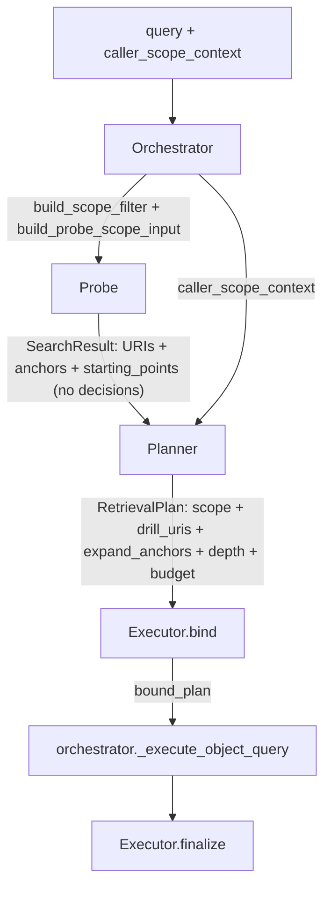

# refactor: Align probe-planner-executor phase boundaries

## Overview

将 recall 主链路的 `probe → planner → executor` 三阶段职责收敛回原始设计：probe 只做信号采集，planner 是唯一决策中心（scope + strategy + depth），executor 忠实执行不做语义判断。

## Problem Frame

当前三阶段的职责边界偏离了原始设计：
- Probe 包含 scope bucket 选择（`_select_scope_bucket()`）和 starting point 发现（`_starting_point_probe()`），这些是决策不是信号采集
- Planner 不控制 scope 和 URI/anchor 策略，只做被动的深度/预算推断
- Executor 的 `arbitrate_hydration()` 在执行后做二次深度决策

(see origin: `docs/brainstorms/2026-04-18-probe-planner-executor-alignment-requirements.md`)

## Requirements Trace

- R1-R6a. Probe 简化为信号采集器（不做策略决策，不设置 should_recall/scoped_miss）
- R7-R15. Planner 成为唯一决策中心（scope + URI 递归 + anchor 扩散 + depth + budget）
- R16-R20. Executor 忠实执行（删除 arbitrate_hydration）
- R21-R22. Trace 职责归属清晰

## Scope Boundaries

- In scope: probe/planner/executor 职责重新划分
- In scope: scope 选择从 probe 移到 planner
- In scope: arbitrate_hydration 从 executor 删除，深度预决移到 planner
- In scope: planner 输出新的配置对象契约（含 drill_uris、expand_anchors）
- Out of scope: fact_point 层（Plan 006）
- Out of scope: minimum-cost path scoring（Plan 006）
- Out of scope: conversation recomposition 机制

## Context & Research

### Relevant Code and Patterns

- `src/opencortex/intent/probe.py` — `MemoryBootstrapProbe`，900 行，包含 `_select_scope_bucket()`、`_starting_point_probe()`、`_object_probe()`、`_anchor_probe()`
- `src/opencortex/intent/planner.py` — `RecallPlanner`，400 行，`semantic_plan()` 被动读取 `probe_result.scope_level`
- `src/opencortex/intent/executor.py` — `MemoryExecutor`，310 行，`bind()`、`arbitrate_hydration()`、`finalize()`
- `src/opencortex/intent/types.py` — 所有 DTO：`SearchResult`、`RetrievalPlan`、`SearchCandidate` 等，均继承 `MemoryDomainModel`（Pydantic）
- `src/opencortex/intent/retrieval_support.py` — `build_scope_filter()`（line 30）、`build_probe_scope_input()`（line 81）、`build_start_point_filter()`（line 214）
- `src/opencortex/orchestrator.py` — `search()`（line 3918）、`probe_memory()`（line 3082）、`_execute_object_query()`（line 3571）

### Institutional Learnings

- `docs/solutions/best-practices/memory-intent-hot-path-refactor-2026-04-12.md` — 定义了三阶段的数据流契约：probe 返回 evidence only，planner 产出 retrieval posture，runtime 不重新解释语义
- `docs/solutions/best-practices/single-bucket-scoped-probe-2026-04-16.md` — 定义了 single-bucket scope 守则和 scoped_miss 守则。**注意**：该文档说 "hydration is an execution decision"，本次重构**有意覆盖**此条——所有决策集中到 planner

## Key Technical Decisions

- **Scope 决策移到 Planner**：probe 的 `_select_scope_bucket()` 拆分——信号采集部分（`_starting_point_probe()`）保留在 probe，决策逻辑移到 planner。Probe 对 starting point 的发现是 I/O 操作，合理留在 probe；但"选哪个 bucket"是决策，必须在 planner。
- **Planner 预决深度，覆盖旧 best practice**：有意覆盖 `single-bucket-scoped-probe-2026-04-16.md` 中 "hydration is an execution decision" 的守则。不确定时默认 L2。删除 executor 的 `arbitrate_hydration()`。
- **新增 `RetrievalPlan` 字段**：`drill_uris: list[str]`、`expand_anchors: list[str]`、`scope_filter: dict`。orchestrator 的 `_execute_object_query()` 消费这些字段。
- **Executor 保持薄层**：executor 的 `bind()` / `finalize()` 职责不变，只删除 `arbitrate_hydration()`。实际存储操作仍由 orchestrator 驱动。
- **Probe 输出 SearchResult 不再设置决策字段**：`should_recall`、`scoped_miss`、`scope_level`、`scope_source` 这些字段移到 planner 设置。Probe 的 SearchResult 只包含 URI 命中、anchor 命中和 evidence 信号。
- **保留 `_starting_point_probe()` 在 probe 中，覆盖 R3**：R3 要求移除 starting point 发现逻辑，但 `_starting_point_probe()` 是异步存储 I/O（按 session_id/source_doc_id 查询根节点），属于信号采集而非策略决策。将其移到 planner 会让 planner 承担 I/O 职责，违反决策中心的定位。因此保留在 probe，但 probe 不从中做 scope 决策——原样传给 planner。

## Open Questions

### Resolved During Planning

- **Probe 是否仍运行 starting_point_probe？** 是——`_starting_point_probe()` 是 I/O（存储搜索），保留在 probe 作为信号采集。但 probe 不从中做 scope 决策——它把 starting point 信号原样传给 planner。
- **`_execute_object_query` 如何消费新字段？** 当前已经直接读 `retrieve_plan` 而非 `bound_plan` 来获取 scope 信息（orchestrator.py line 3611-3652），只需改为从 `RetrievalPlan` 的新字段读取。
- **Planner 如何预决深度？** 保留现有 `_retrieval_depth()` 启发式（基于 confidence、coarse_class、regex）。移除 `arbitrate_l1` 返回值——planner 直接返回 L0/L1/L2。不确定时默认 L2 而非 L1。

### Deferred to Implementation

- Probe 内部是保持双表面并行（object + anchor）还是合并为单次查询——保持现有双表面，不在本次改
- `drill_uris` 和 `expand_anchors` 的具体使用策略——本次只加字段到 `RetrievalPlan`（默认空列表），planner 不实现填充方法，orchestrator 不消费这些字段。Plan 006 负责实现完整的 URI 递归和 anchor 扩散

## High-Level Technical Design

> *This illustrates the intended approach and is directional guidance for review, not implementation specification.*

**Before (current):**
- Probe: `_select_scope_bucket()` → scope decision → scoped `_object_probe()` + `_anchor_probe()`
- Planner: reads `probe_result.scope_level` passively
- Executor: `arbitrate_hydration()` post-retrieval depth override

**After:**
- Probe: `_starting_point_probe()` + `_object_probe()` + `_anchor_probe()` → raw signals only
- Planner: `_select_scope()` + `_retrieval_depth()` → scope + depth decision（drill_uris/expand_anchors 置空，Plan 006 实现）
- Executor: `bind()` + `finalize()` only, no arbitration

## Implementation Units

- [x] **Unit 1: Update phase contracts in types.py**

**Goal:** 扩展 `RetrievalPlan` 添加新字段，清理 `SearchResult` 的决策字段语义。

**Requirements:** R1, R4, R7, R13

**Dependencies:** None

**Files:**
- Modify: `src/opencortex/intent/types.py`
- Test: `tests/test_recall_planner.py`

**Approach:**
- `RetrievalPlan` 新增字段：`drill_uris: List[str]`、`expand_anchors: List[str]`、`scope_filter: Optional[Dict[str, Any]]`，默认空列表/None
- `SearchResult` 保留 `should_recall`、`scoped_miss`、`scope_level`、`scope_source` 字段（结构不变），但语义变更为：probe 只输出信号值，planner 负责设置最终决策值
- 删除 `SearchResult` 的 `_normalize_fields` validator 中对 `should_recall=false` 时清空所有字段的行为——这是决策逻辑，不属于 DTO

**Patterns to follow:**
- `MemoryDomainModel` Pydantic pattern in `types.py`
- 现有 `RetrievalPlan` 的 `to_dict()` 序列化

**Test scenarios:**
- Happy path: `RetrievalPlan` 包含 `drill_uris=["uri1"]` + `expand_anchors=["Alice"]` 序列化正确
- Happy path: `RetrievalPlan` 默认 `drill_uris=[]` + `expand_anchors=[]` 向后兼容
- Edge case: `SearchResult` 不再在 `should_recall=false` 时自动清空 `candidate_entries`

**Verification:**
- 现有 `test_recall_planner.py` 序列化测试通过
- 新字段序列化/反序列化正确

- [x] **Unit 2: Simplify probe to pure signal collector**

**Goal:** 从 probe 中移除所有决策逻辑，保留纯信号采集。

**Requirements:** R1, R2, R3, R5, R6, R6a

**Dependencies:** Unit 1

**Files:**
- Modify: `src/opencortex/intent/probe.py`
- Test: `tests/test_memory_probe.py`

**Approach:**
- 删除 `_select_scope_bucket()` 方法
- 保留 `_starting_point_probe()` 作为信号采集——但不再从其结果中做 scope 决策。Probe 直接运行三个并行搜索（object + anchor + starting_point），合并结果为 `SearchResult`
- `probe()` 方法简化：接收 `scope_filter` 作为搜索约束（由 orchestrator 传入），直接用于三个搜索的 base filter，不再内部修改 filter
- 删除 `probe()` 末尾的 scoped_miss 判断（line 264-268）
- `SearchResult` 输出：`should_recall=True`（常量，probe 不判断）、`scoped_miss=False`（常量）、`scope_level=GLOBAL`（默认，planner 重新设置）
- 保留 LRU cache，cache key 包含 scope_filter

**Patterns to follow:**
- 现有 `_timed_probe()` pattern 用于计时
- 现有 `_build_probe_result()` 用于结果组装

**Test scenarios:**
- Happy path: probe 返回 URI 命中 + anchor 命中 + starting points，`should_recall=True` 恒定
- Happy path: probe 接受外部 scope_filter 并用于所有搜索
- Edge case: 空 query 返回空信号，`should_recall=True`（不再返回 False）
- Edge case: 嵌入失败返回空信号集合，不抛异常
- Edge case: probe 不再设置 `scoped_miss=True`
- Integration: cache 包含 scope_filter，不同 session 的 probe 结果不互相污染

**Verification:**
- `test_memory_probe.py` 更新后通过
- Probe 代码中不包含 `_select_scope_bucket`、`scoped_miss = True`、`should_recall = False` 的赋值

- [x] **Unit 3: Rebuild planner as decision center**

**Goal:** Planner 接管 scope 选择、URI/anchor 策略、深度预决。

**Requirements:** R7, R8, R9, R10, R11, R12, R13, R14, R15

**Dependencies:** Unit 1, Unit 2

**Files:**
- Modify: `src/opencortex/intent/planner.py`
- Modify: `src/opencortex/intent/retrieval_support.py`
- Test: `tests/test_intent_planner_phase2.py`
- Test: `tests/test_recall_planner.py`

**Approach:**
- 新增 `_select_scope()` 方法：从 `probe_result.starting_points` 元数据 + 调用方 `scope_input` 推断最终 scope。逻辑从 probe 的 `_select_scope_bucket()` 迁移——优先级不变：target_uri > session_id > source_doc_id > context_type > global。**必须物化 `scope_filter` dict**：不只设置 `scope_level`，还需从 starting_points 中提取具体的 session_id / source_doc_id 值，构建 `RetrievalPlan.scope_filter`（同 orchestrator 当前在 `_execute_object_query` line 3611-3652 做的 scope_only_filter 构建逻辑）
- `drill_uris` 和 `expand_anchors` 字段在 Unit 1 添加到 `RetrievalPlan`，planner 在 `semantic_plan()` 中填充为空列表。具体消费逻辑延迟到 Plan 006
- 修改 `_retrieval_depth()`：移除 `arbitrate_l1` 语义。不确定时默认 L2 而非 L1。返回最终深度，executor 不再仲裁
- 修改 `_decision_for_depth()`：删除返回 `'arbitrate_l1'` 的分支，直接返回 `RetrievalDepth` 枚举值
- 修改 `semantic_plan()` 输出：`RetrievalPlan` 包含 `scope_level`、`scope_filter`（物化的 filter dict）、`drill_uris`（空列表）、`expand_anchors`（空列表）、`retrieval_depth`（最终值）
- Scoped miss 判断移到 planner：当 `scope_authoritative=True` 且 probe 无候选时，返回 `None`（表示 scoped miss）

**Patterns to follow:**
- 现有 `_infer_class_prior()` pattern 用于启发式推断
- `retrieval_support.py` 的 `build_probe_scope_input()` 用于 scope 优先级

**Test scenarios:**
- Happy path: session_id scope 输入 → planner 选择 SESSION_ONLY + 正确 session_scope
- Happy path: global scope + probe 发现 session starting point → planner 收窄到 SESSION_ONLY
- Happy path: `semantic_plan()` 输出 `drill_uris=[]` + `expand_anchors=[]`（占位，Plan 006 实现）
- Edge case: authoritative scope + 空 probe → planner 返回 None（scoped miss）
- Edge case: 低置信度 → depth 默认 L2
- Edge case: 高置信度 + 少量候选 → depth 可以是 L0
- Edge case: probe 完全无信号（空 starting_points + 空 candidates） → depth L2、global scope
- Edge case: `_select_scope()` 物化 filter dict 包含具体 session_id 值（从 starting_points 提取）
- Edge case: `_decision_for_depth()` 不再返回 `'arbitrate_l1'` 字符串
- Error path: 非法 scope_input → 回退到 GLOBAL

**Verification:**
- `test_intent_planner_phase2.py` 和 `test_recall_planner.py` 更新后通过
- Planner 输出的 `RetrievalPlan` 包含 `scope_level`、`drill_uris`、`expand_anchors`、最终 `retrieval_depth`
- Planner 代码中包含 scoped miss 判断

- [x] **Unit 4: Remove arbitrate_hydration from executor**

**Goal:** 删除 executor 的深度仲裁，保持 bind/finalize。

**Requirements:** R16, R19, R20

**Dependencies:** Unit 3

**Files:**
- Modify: `src/opencortex/intent/executor.py`
- Test: `tests/test_memory_runtime.py`

**Approach:**
- 删除 `arbitrate_hydration()` 方法
- 删除 `_l1_overview_signal()` 方法（只被 arbitrate_hydration 使用）
- `bind()` 方法简化：移除 `hydration_allowed` 字段（不再需要）。`effective_depth` 直接等于 `planned_depth`（planner 已预决）
- `apply_degrade()` 中删除 `skip_hydration` 动作分支（原来设置 `hydration_allowed=False`，该字段已移除）。degrade 仅保留 `disable_rerank`、`disable_association`、`narrow_recall` 三个动作

**Patterns to follow:**
- 保持 `bind()` 返回 plain dict 的现有 pattern
- 保持 `finalize()` 的 `ExecutionResult` 封装 pattern

**Test scenarios:**
- Happy path: `bind()` 输出 `effective_depth == planned_depth`，无 hydration_allowed 字段
- Happy path: `finalize()` 输出完整 trace
- Edge case: degrade 不包含 `skip_hydration` 动作（已删除）
- Edge case: degrade `disable_rerank` 正常工作
- Edge case: `apply_degrade()` 不引用 `hydration_allowed` 字段

**Verification:**
- `test_memory_runtime.py` 更新后通过
- Executor 代码中不包含 `arbitrate_hydration`、`_l1_overview_signal`、`hydration_allowed`、`skip_hydration`

- [x] **Unit 5: Rewire orchestrator to new phase boundaries**

**Goal:** orchestrator 的 search() 调用链适配新的 probe/planner/executor 职责。

**Requirements:** R7, R17, R21, R22

**Dependencies:** Unit 3, Unit 4

**Files:**
- Modify: `src/opencortex/orchestrator.py`
- Modify: `src/opencortex/intent/retrieval_support.py`
- Modify: `src/opencortex/http/server.py` — `/api/v1/intent/should_recall` 端点适配（当前可能依赖 probe 的 should_recall）
- Modify: `src/opencortex/context/manager.py` — `prepare()` 中 `SearchResult(should_recall=False)` 默认值适配
- Test: `tests/test_context_manager.py`
- Test: `tests/test_recall_planner.py`

**Approach:**
- `probe_memory()`：继续构建 `scope_filter` 和 `scope_input` 传给 probe，但 probe 只用它们做搜索约束
- `plan_memory()`：传 `scope_input` 给 planner 的 `semantic_plan()`，planner 从 probe_result + scope_input 做完整决策
- `search()`：删除 `arbitrate_hydration` 调用（line 4089-4114）。depth 由 planner 预决，orchestrator 直接按 `planned_depth` 执行
- `_execute_object_query()`：从 `retrieve_plan.scope_filter` 读 scope 约束（替代当前从 probe_result 读的方式），从 `retrieve_plan.drill_uris` / `expand_anchors` 读策略（初始阶段仍用现有 start_point 逻辑，drill_uris/expand_anchors 作为附加信号）
- Scoped miss 处理：orchestrator 检查 `plan_memory()` 返回 None → 直接返回空结果（替代当前检查 `probe_result.scoped_miss`）
- `server.py`：`/api/v1/intent/should_recall` 端点——probe 不再设置 `should_recall`，需改为由 planner 决策或走完整三阶段
- `context/manager.py`：`prepare()` 创建 `SearchResult(should_recall=False)` 作为短路默认——需确认 probe 的 `should_recall=True` 恒定后此处语义是否仍需要

**Patterns to follow:**
- 现有 `search()` 的阶段化调用 pattern
- 现有 `_execute_object_query()` 的 filter 构建 pattern

**Test scenarios:**
- Happy path: search() 完整调用链 probe → plan → bind → execute → finalize
- Happy path: scoped miss 由 planner 返回 None 触发
- Edge case: `recall_mode="never"` 跳过全部三阶段
- Edge case: depth L2 不触发二次 arbitration
- Edge case: `/api/v1/intent/should_recall` 端点适配新的 probe 输出（should_recall 恒定 True）
- Integration: context manager `prepare()` 的 `SearchResult(should_recall=False)` 短路路径仍正确
- Integration: context prepare 通过 search() 走新链路

**Verification:**
- `test_context_manager.py` 和 `test_recall_planner.py` 通过
- orchestrator 代码中不包含 `arbitrate_hydration` 调用
- orchestrator 不直接读 `probe_result.scoped_miss`

- [x] **Unit 6: Update tests, best practice docs, and benchmark adapters**

**Goal:** 测试套件、best practice 文档和 benchmark 适配器反映新的阶段边界。

**Requirements:** R21, R22

**Dependencies:** Unit 5

**Files:**
- Modify: `tests/test_memory_probe.py`
- Modify: `tests/test_intent_planner_phase2.py`
- Modify: `tests/test_memory_runtime.py`
- Modify: `tests/test_recall_planner.py`
- Modify: `docs/solutions/best-practices/single-bucket-scoped-probe-2026-04-16.md`
- Modify: `docs/solutions/best-practices/memory-intent-hot-path-refactor-2026-04-12.md`
- Modify: `benchmarks/adapters/locomo.py`
- Modify: `benchmarks/oc_client.py`

**Approach:**
- 更新 `single-bucket-scoped-probe-2026-04-16.md`：将 "hydration is an execution decision" 改为 "depth is a planner decision"，将 "probe chooses exactly one active bucket" 改为 "planner chooses exactly one active bucket"
- 更新 `memory-intent-hot-path-refactor-2026-04-12.md`：反映新的阶段职责边界
- 更新 benchmark adapters：确保 `retrieval_contract` 元数据反映新链路
- 全量运行测试确认无回归

**Test scenarios:**
- Happy path: `python -m unittest discover -s tests -v` 全量通过
- Happy path: best practice 文档内容与当前代码一致
- Edge case: benchmark adapters 的 `retrieval_contract` 包含正确的阶段信息

**Verification:**
- 全部测试通过
- best practice 文档不包含与当前实现矛盾的描述
- benchmark adapters 不依赖旧的 probe scoped_miss 或 arbitrate_hydration 语义

## System-Wide Impact

- **Interaction graph:** `orchestrator.search()` → `probe.probe()` → `planner.semantic_plan()` → `executor.bind()` → `orchestrator._execute_object_query()` → `executor.finalize()`. 变更集中在这条链路。
- **Error propagation:** probe 失败 → 空信号 → planner 用空信号做保守决策（L2 + global）。Planner 返回 None → scoped miss。Executor degrade → 跳过可选步骤。
- **State lifecycle risks:** probe cache key 必须包含 scope_filter，否则不同 session 的结果会互相污染。
- **API surface parity:** HTTP `/api/v1/intent/should_recall` 需要适配——当前可能依赖 probe 的 should_recall。
- **Unchanged invariants:** 公共接口 `search()`、`recall`、context prepare 不变。tenant/user/project 隔离不变。`recall_mode="never"` 行为不变。

## Risks & Dependencies

| Risk | Mitigation |
|------|------------|
| Planner 预决深度在边界情况次优（无法看到 L1 overview 质量） | 不确定时默认 L2（保守策略），接受少量不必要的 L2 读取 |
| Probe unscoped 搜索返回噪声候选 | Orchestrator 继续传入 scope_filter 作为搜索约束，probe 搜索范围仍然有界 |
| best practice 文档更新遗漏 | Unit 6 显式更新两份文档 |
| Benchmark 回归 | Unit 6 全量运行测试 + benchmark 验证 |

## Sources & References

- **Origin document:** `docs/brainstorms/2026-04-18-probe-planner-executor-alignment-requirements.md`
- Best practice (被覆盖): `docs/solutions/best-practices/single-bucket-scoped-probe-2026-04-16.md`
- Best practice: `docs/solutions/best-practices/memory-intent-hot-path-refactor-2026-04-12.md`
- Related plan: `docs/plans/2026-04-14-001-refactor-memory-retrieval-openviking-alignment-plan.md`
- Related code: `src/opencortex/intent/probe.py`, `src/opencortex/intent/planner.py`, `src/opencortex/intent/executor.py`, `src/opencortex/intent/types.py`, `src/opencortex/intent/retrieval_support.py`, `src/opencortex/orchestrator.py`
