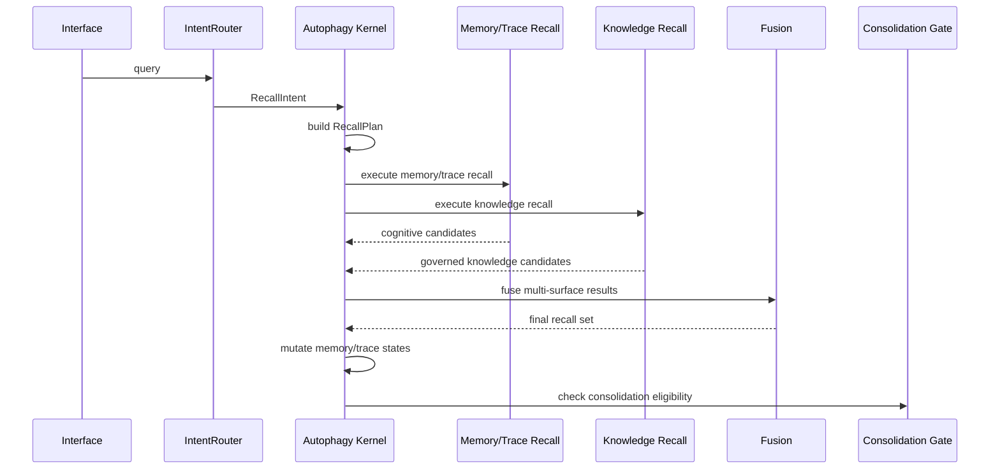

# OpenCortex Autophagy 认知内核设计

> 日期：2026-04-06
> 状态：Draft v1
> 范围：北极星架构
> 非目标：本文不定义 Phase 1 的实施计划

## 1. 目的

本文定义 OpenCortex 的北极星架构，即在现有 memory、trace、knowledge、cone retrieval 与 skill 系统之上，如何重新分层，形成一套长期稳定的终局设计。

本文的核心设计决策是：

`Autophagy 成为 memory 与 trace 的认知内核，但不吞并 knowledge governance 和 skill evolution。`

由此形成三层长期架构：

- 认知层：memory + trace
- 知识层：受治理的 knowledge
- 技能层：独立的执行资产

## 2. 背景

OpenCortex 当前已经具备大量已实现能力：

- `CortexFS + Qdrant` 分层持久化
- dense / sparse / rerank recall
- cone retrieval
- `IntentRouter`
- 三模式写入：`memory / document / conversation`
- conversation 的 `immediate + merged` 写入路径
- `Observer -> TraceSplitter -> TraceStore`
- `Archivist -> Sandbox -> KnowledgeStore`
- `SkillEngine`
- JWT 多租户与多用户隔离
- MCP 接入

但当前的生命周期主权仍然分散在多个模块中：

- `orchestrator.py`
- `context/manager.py`
- `retrieve/*`
- `alpha/*`
- `skill_engine/*`

因此，OpenCortex 虽然已经具备长期系统的很多行为，但还没有一套稳定的顶层结构，把以下三件事明确拆开：

- 认知状态
- 知识治理
- 技能演化

本文就是为了解决这个分层问题。

## 3. 设计目标

这套北极星设计必须满足以下目标：

1. 为 `memory + trace` 建立唯一的认知主权
2. 让 `knowledge` 独立于认知状态机
3. 让 `skill` 独立于认知状态机和知识治理状态机
4. 将 recall 重定义为认知操作，而不是一次直接检索调用
5. 保留当前 OpenCortex 的优势：
   - CortexFS
   - cone retrieval
   - trace continuity
   - knowledge extraction
   - skill evolution
6. 让系统在每个主要状态变化上都具备可解释性

## 4. 非目标

本文不做以下事情：

- 不定义 Phase 1 的实施顺序
- 不要求把所有现有代码改写成统一对象模型
- 不把所有对象压成一种 graph node 抽象
- 不把 skill evolution 再并回认知层
- 不让 knowledge recall 重新参与 memory/trace 的认知状态机

## 5. 架构主张

OpenCortex 应收敛到以下模型：

- `Autophagy` 是认知内核
- `Knowledge Layer` 是受治理的结论层
- `SkillEngine` 是外部执行能力演化层

最终系统不是一个统一大仓库，而是一套分层长期系统：

- 认知层代谢经历
- 知识层治理稳定结论
- 技能层演化可执行能力

## 6. 系统分层

### 6.1 Interface Layer

职责：

- MCP / HTTP / SDK 入口
- JWT 身份提取
- session lifecycle 集成
- `memory_context` 协议适配
- 从请求转换为内部事件

当前代表模块：

- `src/opencortex/http/server.py`
- `src/opencortex/context/manager.py`
- MCP 插件层

这一层不拥有认知主权。

### 6.2 Cognition Layer

职责：

- 管理 `memory + trace` 的认知状态
- 规划 recall
- 在 recall 后回写认知对象状态
- 判断 consolidation 资格
- 将知识候选向下游派发

核心组件：

- `Autophagy Kernel`

### 6.3 Knowledge Layer

职责：

- 接收来自认知层的候选
- 对 knowledge 执行验证、版本、发布、替代、废弃、归档、失效等治理
- 提供稳定 knowledge recall 表面
- 向 SkillEngine 提供已治理 knowledge

核心组件：

- `Knowledge Intake`
- `Knowledge Validation`
- `Knowledge Governance`
- `Knowledge Recall Service`

### 6.4 Skill Layer

职责：

- 消费已治理的操作型 knowledge
- 演化可执行 skill 资产
- 管理独立的 skill lineage 与 exposure
- 在合适场景中注入执行指导

核心组件：

- `SkillEngine`

该层不属于认知循环。

### 6.5 Persistence Layer

职责：

- 存储分层 memory 与 trace 内容
- 存储向量和元数据索引
- 存储 governed knowledge
- 存储 skill

当前代表模块：

- `CortexFS`
- Qdrant adapters
- trace store
- knowledge store
- skill storage adapters

## 7. 原生对象模型

### 7.1 认知原生对象

认知层中只有两类原生对象：

- `Memory`
- `Trace`

它们具有以下性质：

- 有时间敏感性
- 参与 recall 竞争
- 可被强化
- 可被抑制
- 可被压缩
- 可被归档
- 可被遗忘

### 7.2 Knowledge 对象

`Knowledge` 不是认知原生对象。

它是认知层下游的稳定结论对象，具有：

- 来源可追溯
- 独立治理状态
- 可发布或抑制
- 可 canonical 或 superseded
- 可 deprecated 或 invalid

它不参与 memory/trace 的 activation 竞争。

### 7.3 Skill 对象

`Skill` 既不是认知原生对象，也不是知识治理对象。

它是一类执行资产，具有：

- 从 governed knowledge 派生
- 独立的生命周期与 lineage
- 可被注入到执行上下文中

它不会重新进入认知状态机。

## 8. Autophagy Kernel

### 8.1 定义

Autophagy 是 `memory + trace` 的唯一认知主权者。

它不是存储层，不是检索后端，也不是知识治理系统。

它是认知内核。

### 8.2 职责

Autophagy 直接拥有：

- ingest 时的认知状态初始化
- recall 规划
- recall 后的认知变异
- reinforcement / contestation / quarantine 决策
- 对认知对象的 compression / archive / forget 决策
- 向知识层派发候选
- 认知稳态控制

### 8.2.1 内部子模块

为避免 `Autophagy` 退化为 God object，内核在概念上必须继续拆分为一组一等子模块：

- `Cognitive State Manager`
  - 持有 memory/trace 的状态转移规则

- `Recall Planner`
  - 将 `RecallIntent` 转换为 `RecallPlan`

- `Recall Mutation Engine`
  - 在 recall 后执行 reinforcement / suppression / contestation 回写

- `Consolidation Gate`
  - 负责 candidate 准入判定

- `Cognitive Homeostasis Controller`
  - 负责 activation ceiling、暴露平衡、长尾压制、代谢节流

- `Cognitive Audit Log`
  - 负责输出解释性事件轨迹

这些子模块可以在实现上被组合在一个 service 中，但在架构上必须显式存在。

### 8.3 边界

Autophagy 不直接拥有：

- knowledge validation
- knowledge publication
- knowledge supersession governance
- skill evolution
- skill exposure
- 底层 persistence 实现

### 8.4 内核原则

除 Autophagy 外，不应有任何模块可以单方面修改 memory 或 trace 的认知状态。

所有认知状态回写都必须通过内核。

## 9. Memory / Trace 的认知状态体系

北极星认知状态模型必须是三维的。单一枚举不够用。

### 9.1 Lifecycle State

- `captured`
- `stabilized`
- `active`
- `reinforced`
- `contested`
- `compressed`
- `archived`
- `forgotten`

### 9.2 Cognitive Exposure State

- `foreground`
- `background`
- `suppressed`
- `quarantined`

### 9.3 Consolidation State

- `raw`
- `clusterable`
- `candidate`
- `consolidating`
- `absorbed`
- `residual`

### 9.4 为什么要这样拆

这三个维度分别回答：

- lifecycle：对象当前是存活、压缩、归档还是已被淘汰？
- exposure：对象当前是否暴露在 recall 面？
- consolidation：对象是否已进入或已被知识层吸收？

如果把这三种语义压进一个字段，系统最终会变得不透明且难以解释。

### 9.5 认知对象的最低字段集合

每个 memory 或 trace 至少应暴露：

- `lifecycle_state`
- `exposure_state`
- `consolidation_state`
- `activation_score`
- `stability_score`
- `recall_value_score`
- `contestation_score`
- `compression_level`
- `quarantine_reason`
- `archive_reason`
- `superseded_by`
- `absorbed_into_knowledge_id`
- `evidence_residual_score`

其中：

- `evidence_residual_score`
  表示对象在核心结论已被 knowledge 吸收之后，作为原始证据残留仍有多大保留价值。  
  例如某条 trace 已经被抽成 SOP，但其错误现场和修复过程仍可在审计、debug 或 lineage 分析中保留较高残余价值。

### 9.6 强化抑制机制

认知层必须内建反失控机制，避免“越常被召回的对象越无限变强”。

因此，reinforcement 不能是无上限累加，而应满足：

- `activation ceiling`
  - activation_score 必须有上限，避免极少数对象垄断 recall 面

- `diminishing returns`
  - 同一对象在短时间窗口内的重复命中，边际强化收益递减

- `recency rebalance`
  - 新近、但证据强的对象应能在一段时间内挑战既有热门对象

- `suppression recovery`
  - 被压制对象不应永久失去竞争资格，应允许在新证据或新 query 模式下恢复

- `homeostatic decay`
  - 长期高激活但近期无有效引用的对象，应逐步回落到稳定区间

这些机制由 `Cognitive Homeostasis Controller` 统一管理。

## 10. Knowledge Layer

### 10.1 定义

Knowledge 是介于认知层与技能层之间的稳定结论层。

它不是 memory 的另一种存储形式，也不是“抽出来的摘要表”，而是一套独立治理系统。

### 10.2 内部模块

#### Knowledge Intake

接收来自 Autophagy 的 `ConsolidationCandidate`，执行：

- schema 校验
- 去重判断
- canonical group 初判
- 决定走哪条治理路径

#### Knowledge Validation

执行：

- 证据校验
- 一致性检查
- sandbox 验证
- 可选的人审流程

#### Knowledge Governance

负责：

- validity states
- publication states
- lineage states
- supersession
- merge
- split
- deprecation
- invalidation

#### Knowledge Recall Service

对受治理 knowledge 提供稳定 recall，支持：

- canonical preference
- validity filtering
- publication visibility
- scope filtering
- lineage-aware filtering

### 10.2.1 模块交互顺序

Knowledge Layer 的标准流必须明确为：

`Intake -> Validation -> Governance -> Recall Service`

其中：

- `Knowledge Intake`
  决定对象是否进入知识层，以及进入哪个 canonical group 候选集合

- `Knowledge Validation`
  决定证据是否足够支撑治理决策

- `Knowledge Governance`
  决定对象的最终治理状态与 lineage 位置

- `Knowledge Recall Service`
  只暴露已完成治理的 knowledge，不参与治理决策

### 10.3 Knowledge 的治理状态体系

Knowledge 应采用治理导向的三维状态体系：

#### Validity State

- `candidate`
- `validated`
- `canonical`
- `contested`
- `deprecated`
- `invalid`

#### Publication State

- `hidden`
- `internal`
- `published`
- `suppressed`
- `archived`

#### Lineage State

- `origin`
- `revision`
- `superseding`
- `superseded`
- `merged`
- `split`

### 10.3.1 Knowledge Intake 到 Governance 的显式状态流

为避免 Intake/Validation/Governance 之间退化为 ad-hoc 逻辑，knowledge 进入层后的标准状态流应为：

`intake_received -> validating -> governed`

其中 `governed` 进一步分叉为：

- `accepted`
- `rejected`
- `contested`

再映射到正式治理状态：

- `accepted`
  -> `validated` 或 `canonical`

- `rejected`
  -> 不生成正式 knowledge record，保留 intake 审计记录

- `contested`
  -> 进入 `contested + suppressed/internal`，等待进一步证据或人工治理

### 10.3.2 contested knowledge 的处理

当 knowledge 进入 `contested` 时，治理层必须显式决定一条路径，而不能无限悬挂：

- `human resolution`
  - 进入人工确认

- `evidence resolution`
  - 等待更多 evidence 进入后重新验证

- `supersession resolution`
  - 若已有更强版本，则转入 `superseded`

- `timeout archival`
  - 长期未解决的 contested knowledge 进入 `archived`

这里的“解决”属于 knowledge governance，不属于 Autophagy。

### 10.4 Knowledge 的最低字段集合

每条 knowledge 至少应包含：

- `knowledge_id`
- `knowledge_type`
- `canonical_group_id`
- `scope`
- `tenant_id`
- `project_id`
- `uri`
- `validity_state`
- `publication_state`
- `lineage_state`
- `confidence_score`
- `evidence_strength`
- `parent_knowledge_ids`
- `supersedes_ids`
- `superseded_by_id`
- `merged_from_ids`
- `split_from_id`
- `source_memory_ids`
- `source_trace_ids`
- `candidate_id`
- `validated_by`
- `validated_at`
- `abstract`
- `overview`
- `content`
- `tags`
- `applicability`
- `constraints`
- `deprecation_note`

说明：

- `abstract / overview / content`
  在 knowledge 对象中保留这三层字段是有意为之，表示 knowledge 也采用与 CortexFS 一致的三层内容表达。
  这不意味着 knowledge 重新进入认知状态机，而仅表示其内容载体与 recall 粒度仍采用统一的分层表示。

## 11. Skill Layer

### 11.1 定义

SkillEngine 是位于 governed knowledge 之后的独立执行能力演化层。

它不属于认知循环。

### 11.2 输入契约

SkillEngine 只应消费满足明确契约的 knowledge。

必须条件：

- `validity_state in {validated, canonical}`
- `publication_state in {internal, published}`
- `knowledge_type` 具有操作价值
- `evidence_strength` 足够高
- 不处于 `contested / deprecated / invalid`

### 11.3 Skill 生命周期

Skill 应具备独立生命周期，例如：

- `candidate`
- `approved`
- `active`
- `deprecated`
- `retired`

并具备独立 lineage：

- `origin`
- `revision`
- `derived`
- `fixed`
- `superseded`

### 11.4 硬边界

SkillEngine 不得：

- 直接消费 raw memory 或 trace
- 直接治理 knowledge validity
- 直接修改认知状态

Skill 使用反馈可以影响 knowledge governance 指标，但不能直接写回认知状态机。

## 12. Recall 作为认知操作

### 12.1 重定义

在北极星架构中，recall 不再是一次直接检索调用，而是由 Autophagy 主导的一次认知操作。

完整 recall 流程是：

`intent -> plan -> execution -> fusion -> mutation`

### 12.2 IntentRouter 的角色

`IntentRouter` 退化为 `Recall Intent Analyzer`。

它仍负责：

- keyword extraction
- semantic classification
- trigger generation

但它不再拥有 recall 主权，而只输出 `RecallIntent`。

### 12.3 RecallPlan

Autophagy 将 `RecallIntent` 转换为 `RecallPlan`。

`RecallPlan` 决定：

- 是否查询 memory
- 是否查询 trace
- 是否查询 knowledge
- 是否启用 cone retrieval
- 采用何种 detail policy
- 如何融合多个表面

### 12.4 Recall Surfaces

Recall 必须运行在三种独立表面上：

#### Memory Recall

面向：

- facts
- preferences
- constraints
- events

#### Trace Recall

面向：

- episodes
- process fragments
- failure/fix chains
- temporal evidence

#### Knowledge Recall

面向：

- validated conclusions
- canonical rules
- governed SOPs
- stable summaries

这三条 recall 路径应先独立执行，再有意识地融合。

### 12.5 Cone Retrieval 的角色

Cone retrieval 是 memory / trace recall 的结构化增强器。

它不是：

- 全图知识图谱推理器
- knowledge recall 的主机制

它的角色是：

`从少量锚点出发，沿实体共现邻域扩展，并通过路径成本信号提升 recall 质量。`

### 12.5.1 实体图归属

在终局架构中，cone retrieval 所需的实体索引与实体共现图不应归 Autophagy 私有持有，而应被定义为：

`shared cognitive retrieval infrastructure`

也就是：

- 由写入与更新路径维护
- 由 memory/trace recall 执行器读取
- 由 Autophagy 在 recall planning 中决定是否启用

这样可以避免：
- 把实体图变成认知状态的一部分
- 把 cone retrieval 与 Autophagy 硬耦死

Autophagy 负责“何时用”，而不是“持有整张图”。

### 12.6 Recall Mutation

Recall 完成后，Autophagy 必须回写认知对象状态：

- 强化成功命中对象
- 抑制重复 near-miss 竞争项
- 更新 activation 和 exposure
- 在必要时提高 consolidation eligibility
- 当更强对象持续胜出时，标记 superseded 候选

Knowledge 不参与同样的认知变异循环；它只接收治理层面的 usage / citation 更新。

### 12.7 Recall 全流程图

## 13. Consolidation Pipeline

### 13.1 原则

Knowledge 不能从任意模块直接生成。

所有知识候选都必须经过 Autophagy。

### 13.2 Consolidation 来源

Autophagy 可以从两类模式形成候选：

- memory-driven stability pattern
- trace-driven process cluster

### 13.3 Consolidation Gate

在生成 `ConsolidationCandidate` 前，Autophagy 至少应评估：

- stability
- redundancy
- evidence strength
- knowledge value

### 13.4 Candidate 契约

Autophagy 只输出 candidate，不直接产出最终 governed knowledge。

每个 `ConsolidationCandidate` 至少包含：

- `candidate_id`
- `candidate_type`
- `source_memory_ids`
- `source_trace_ids`
- `proposed_knowledge_type`
- `candidate_summary`
- `candidate_body`
- `evidence_strength`
- `stability_score`
- `redundancy_score`
- `proposed_scope`
- `conflict_refs`
- `canonical_group_hint`

### 13.5 反馈闭环

Knowledge Layer 必须把治理结果反馈回 Autophagy，例如：

- `accepted`
- `rejected`
- `merged`
- `contested`

Autophagy 再据此更新源 memory/trace 的状态。

这样可以避免同一批材料反复无限地产生重复 candidate。

具体规则应至少包括：

- `accepted`
  - 源对象 `consolidation_state -> absorbed` 或 `residual`
  - 记录 `absorbed_into_knowledge_id`

- `rejected`
  - 源对象回到 `raw` 或 `clusterable`
  - 写入 `candidate_rejection_reason`
  - 在冷却窗口内禁止对同一簇立即重复提名

- `merged`
  - 源对象记录 `merged_into_knowledge_id`
  - 提高压缩或归档倾向

- `contested`
  - 源对象提升 `contestation_score`
  - 必要时进入 `quarantined` 候选
  - 等待更多证据，而不是直接遗忘

## 14. 全链路事件闭环

北极星系统闭环是：

1. ingest 产生认知对象
2. Autophagy 初始化并稳定这些对象
3. recall 在 memory / trace / knowledge 三个表面上被规划和执行
4. recall 之后 Autophagy 对 memory 与 trace 做认知变异
5. 稳定或冗余的认知对象被送入 knowledge candidate 流
6. Knowledge Layer 对其验证并治理
7. 受治理 knowledge 成为稳定 recall 表面
8. 部分 governed knowledge 进入 SkillEngine
9. skill 结果回写 knowledge governance 指标

这是一套从 cognition 到 knowledge 再到 skill 的分层闭环系统，而不是一个统一大仓库。

## 14.1 Observability 与 Explainability

“可解释”在本架构中不是抽象原则，而必须落成可观测产物。系统至少应提供：

- `Cognitive Event Log`
  - 记录 ingest、recall、mutation、consolidation dispatch 的关键事件

- `Knowledge Governance Audit Log`
  - 记录 validation、canonical、superseded、deprecated、invalid 等治理变更

- `Recall Explain Trace`
  - 记录 RecallIntent、RecallPlan、三表面执行结果、fusion 决策和 mutation 结果

- `Debug / Audit Endpoint`
  - 允许查看某个 memory、trace、knowledge、skill 的 lineage、状态和最近事件

换句话说：

- state change 必须可追踪
- recall plan 必须可回放
- governance decision 必须可审计

## 15. 现有代码的终局重映射

### 15.1 保留并重解释的模块

- `orchestrator.py`
  - 变为 application façade
  - 不再担任认知主脑

- `context/manager.py`
  - 变为 session lifecycle adapter

- `retrieve/*`
  - 变为 recall executors 与 enhancers

- `ingest/resolver.py`
  - 保持为 ingest classification service

- `trace_splitter.py`
  - 保持为 trace preparation service

- `trace_store.py`
  - 保持为 persistence backend

- `skill_engine/*`
  - 保持独立、保持下游

- `storage/*`
  - 保持为基础设施层

### 15.2 需要重新收编或拆分的模块

- `archivist.py`
  - 一部分归入 cognition side candidate formation
  - 一部分归入 knowledge intake

- `sandbox.py`
  - 重构为 `Knowledge Validation`

### 15.3 终局中必须出现的新概念模块

- `Autophagy Kernel`
- `Recall Planner`
- `Consolidation Gate`
- `Knowledge Intake`
- `Knowledge Governance`

这些概念不一定必须一概念一文件，但它们必须在架构上显式存在。

## 15.4 推荐拆解顺序（非绑定）

虽然本文不定义 Phase 1 计划，但为了避免 spec 变成 shelfware，建议保留一条非绑定的拆解顺序作为迁移信号：

1. 先把 recall 主权从 `orchestrator + retrieve` 中抽象成 `RecallIntent / RecallPlan`
2. 再把 memory/trace 的认知状态回写统一收口
3. 再把 `Archivist / Sandbox / KnowledgeStore` 明确拆成 knowledge intake / validation / governance
4. 最后再建立完整的 Autophagy Kernel 外壳

这不是实施计划，只是建议优先切出的架构 seam。

## 16. 设计风险

### 16.1 Autophagy 过载

Autophagy 不能继续吞并：

- knowledge governance
- skill governance

否则它会迅速退化成一个无边界 God object。

### 16.2 认知状态与知识状态混淆

Knowledge 不能重新进入：

- activation competition
- quarantine
- recall-surface suppression

否则 knowledge layer 会重新塌回 cognition。

### 16.3 Recall 过度复杂化

Recall 可以在架构上复杂，但职责必须严格拆开：

- router 负责分析
- kernel 负责规划和 mutation
- executors 负责执行
- fusion 负责融合

### 16.4 Skill 边界失守

只要 SkillEngine 还能直接吃 raw cognition objects，分层就失败了。

## 17. 总体设计原则

1. 认知层只管理经历性对象：memory 与 trace
2. knowledge 是下游治理层，不是认知对象
3. skill 是执行资产，不是认知资产，也不是知识治理对象
4. recall 是认知操作，不是搜索调用
5. 状态主权必须唯一：
   - Autophagy 管 cognition
   - Knowledge Governance 管 knowledge
   - Skill governance 管 skill
6. candidate 是 cognition 到 knowledge 的唯一合法桥梁
7. governed knowledge 是 knowledge 到 skill 的唯一合法桥梁
8. CortexFS 是 substrate，不是语义主脑
9. 系统在每个主要状态变化上都必须可解释

## 18. 最终定义

OpenCortex 应收敛为一套分层长期架构：Autophagy 作为 memory 与 trace 的认知内核，Knowledge Layer 作为稳定结论的独立治理系统，SkillEngine 作为面向 governed operational assets 的下游执行演化系统。Recall 被重新定义为由 Autophagy 规划、在 memory / trace / knowledge 三个表面上执行，并在结束后对认知对象做 mutation、对知识对象做 governance feedback 的认知操作。这样 OpenCortex 既能保持统一的长期系统语义，又不会把 cognition、knowledge 与 skill 强行塞进同一状态机。
