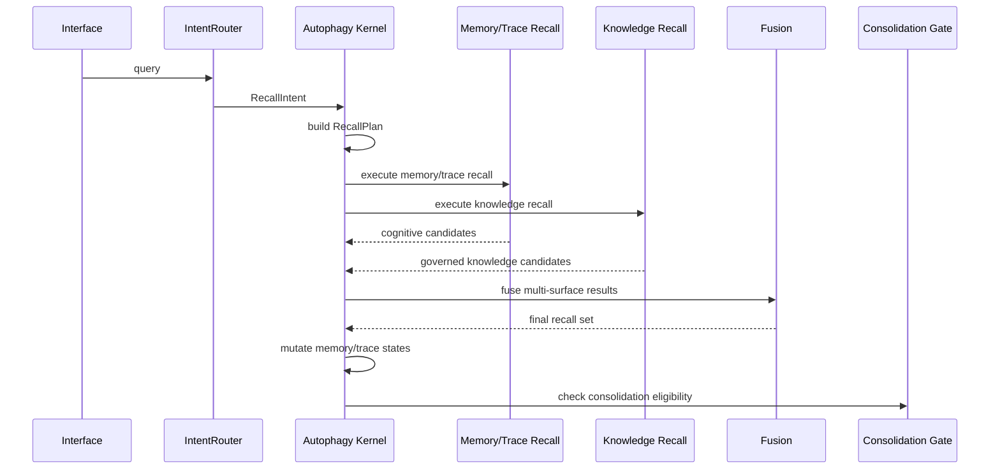

# OpenCortex Autophagy Cognitive Kernel Design

> Date: 2026-04-06
> Status: Draft v1
> Scope: North-star architecture
> Non-goal: This document does not define the Phase 1 implementation plan

## 1. Purpose

This spec defines the north-star architecture for OpenCortex after the current memory, trace, knowledge, cone retrieval, and skill systems are re-layered into a stable long-term design.

The core design decision is:

`Autophagy becomes the cognitive kernel for memory and trace, but does not absorb knowledge governance or skill evolution.`

This yields a three-layer long-term architecture:

- cognition layer: memory + trace
- knowledge layer: governed knowledge
- skill layer: independent execution assets

## 2. Background

OpenCortex already has substantial implemented capability:

- `CortexFS + Qdrant` layered persistence
- dense / sparse / rerank recall
- cone retrieval
- `IntentRouter`
- three ingest modes: `memory / document / conversation`
- conversation `immediate + merged` write path
- `Observer -> TraceSplitter -> TraceStore`
- `Archivist -> Sandbox -> KnowledgeStore`
- `SkillEngine`
- JWT tenant/user isolation
- MCP integration

However, lifecycle authority is still distributed across:

- `orchestrator.py`
- `context/manager.py`
- `retrieve/*`
- `alpha/*`
- `skill_engine/*`

The result is that OpenCortex already behaves like a long-term system, but it does not yet have a single stable architecture that clearly separates:

- cognitive state
- knowledge governance
- skill evolution

This spec resolves that separation.

## 3. Design Goals

The north-star design must satisfy the following:

1. Establish a single cognitive authority for `memory + trace`
2. Keep `knowledge` independent from the cognitive state machine
3. Keep `skill` independent from both the cognitive and knowledge state machines
4. Redefine recall as a cognitive operation rather than a direct retrieval call
5. Preserve the current strengths of OpenCortex:
   - CortexFS
   - cone retrieval
   - trace continuity
   - knowledge extraction
   - skill evolution
6. Make the system explainable at every major transition

## 4. Non-Goals

This spec does not:

- define the Phase 1 implementation sequence
- rewrite all current code into a single object model
- collapse all objects into one graph-node abstraction
- move skill evolution back into the cognition layer
- let knowledge recall participate in the memory/trace cognitive state machine

## 5. Architectural Thesis

OpenCortex should converge to the following model:

- `Autophagy` is the cognitive kernel
- `Knowledge Layer` is the governed conclusion layer
- `SkillEngine` is the external execution-evolution layer

The final system is not a single giant warehouse. It is a layered long-term system in which:

- cognition metabolizes experience
- knowledge governs stable conclusions
- skills evolve executable behavior

## 6. System Layers

### 6.1 Interface Layer

Responsibilities:

- MCP / HTTP / SDK entrypoints
- JWT identity extraction
- session lifecycle integration
- `memory_context` protocol adaptation
- request-to-event conversion

Representative current modules:

- `src/opencortex/http/server.py`
- `src/opencortex/context/manager.py`
- MCP plugin layer

This layer does not own cognition.

### 6.2 Cognition Layer

Responsibilities:

- own the cognitive state of `memory + trace`
- plan recall
- mutate cognitive objects after recall
- determine consolidation eligibility
- dispatch knowledge candidates downstream

Core component:

- `Autophagy Kernel`

### 6.3 Knowledge Layer

Responsibilities:

- receive governed candidates from cognition
- validate, version, publish, supersede, deprecate, archive, or invalidate knowledge
- provide stable knowledge recall surfaces
- supply governed knowledge to SkillEngine

Core components:

- `Knowledge Intake`
- `Knowledge Validation`
- `Knowledge Governance`
- `Knowledge Recall Service`

### 6.4 Skill Layer

Responsibilities:

- consume governed operational knowledge
- evolve executable skill assets
- manage independent skill lineage and exposure
- inject execution guidance when needed

Core component:

- `SkillEngine`

This layer is not part of the cognition loop.

### 6.5 Persistence Layer

Responsibilities:

- store layered memory and trace content
- store vector and metadata indexes
- store governed knowledge
- store skills

Representative current modules:

- `CortexFS`
- Qdrant adapters
- trace store
- knowledge store
- skill storage adapters

## 7. Native Object Model

### 7.1 Cognitive Native Objects

Only two native object classes belong to the cognition layer:

- `Memory`
- `Trace`

These objects are:

- time-sensitive
- competitively retrievable
- reinforceable
- suppressible
- compressible
- archivable
- forgettable

### 7.2 Knowledge Objects

`Knowledge` is not a cognitive native object.

It is a stabilized downstream conclusion object that:

- has provenance
- has governance states
- can be published or suppressed
- can be canonical or superseded
- can be deprecated or invalid

It does not participate in memory/trace activation competition.

### 7.3 Skill Objects

`Skill` is not a cognitive native object and not a knowledge-governance object.

It is an execution asset that:

- is derived from governed knowledge
- has independent lifecycle and lineage
- can be injected into execution contexts

It does not re-enter the cognition state machine.

## 8. Autophagy Kernel

### 8.1 Definition

Autophagy is the sole cognitive authority for `memory + trace`.

It is not a storage layer, not a retrieval backend, and not a knowledge governance system.

It is the cognitive kernel.

### 8.2 Responsibilities

Autophagy directly owns:

- ingest-time cognitive state initialization
- recall planning
- recall-result mutation
- reinforcement / contestation / quarantine decisions
- compression / archive / forget decisions for cognitive objects
- consolidation candidate dispatch to the knowledge layer
- cognitive homeostasis

### 8.2.1 Internal Subcomponents

To prevent `Autophagy` from collapsing into a God object, the kernel must be decomposed conceptually into first-class subcomponents:

- `Cognitive State Manager`
  - owns state transition rules for memory/trace

- `Recall Planner`
  - transforms `RecallIntent` into `RecallPlan`

- `Recall Mutation Engine`
  - applies reinforcement / suppression / contestation after recall

- `Consolidation Gate`
  - decides candidate admission into the knowledge pipeline

- `Cognitive Homeostasis Controller`
  - enforces activation ceilings, exposure balancing, long-tail suppression, and metabolic throttling

- `Cognitive Audit Log`
  - emits explainable event traces

These may be composed in one service at implementation time, but must exist explicitly in the architecture.

### 8.3 Boundaries

Autophagy does not directly own:

- knowledge validation
- knowledge publication
- knowledge supersession governance
- skill evolution
- skill exposure
- raw persistence implementation

### 8.4 Kernel Principle

No module outside Autophagy may unilaterally change the cognitive state of memory or trace objects.

All cognitive state mutation must route through the kernel.

## 9. Cognitive State System for Memory and Trace

The north-star cognitive state model is three-dimensional. A single enum is insufficient.

### 9.1 Lifecycle State

- `captured`
- `stabilized`
- `active`
- `reinforced`
- `contested`
- `compressed`
- `archived`
- `forgotten`

### 9.2 Cognitive Exposure State

- `foreground`
- `background`
- `suppressed`
- `quarantined`

### 9.3 Consolidation State

- `raw`
- `clusterable`
- `candidate`
- `consolidating`
- `absorbed`
- `residual`

### 9.4 Why This Split Exists

These dimensions answer different questions:

- lifecycle: is the object alive, compressed, archived, or gone?
- exposure: is the object visible to recall?
- consolidation: has the object entered or been absorbed by the knowledge pipeline?

Trying to encode all three into one state field would make the system opaque and unstable.

### 9.5 Required Cognitive Fields

Each memory or trace object should expose at least:

- `lifecycle_state`
- `exposure_state`
- `consolidation_state`
- `activation_score`
- `stability_score`
- `recall_value_score`
- `contestation_score`
- `compression_level`
- `quarantine_reason`
- `archive_reason`
- `superseded_by`
- `absorbed_into_knowledge_id`
- `evidence_residual_score`

Where:

- `evidence_residual_score`
  measures how much residual evidentiary value remains in an object after its core conclusion has been absorbed into the knowledge layer.
  For example, a trace may already be abstracted into an SOP while its detailed failure scene and repair path still retain value for audit or debugging.

### 9.6 Reinforcement Damping

The cognition layer must include anti-runaway mechanisms to avoid a pure “rich get richer” loop.

Reinforcement therefore cannot be an unbounded additive process. It must satisfy:

- `activation ceiling`
  - activation_score must have an upper bound

- `diminishing returns`
  - repeated hits on the same object within a short window should yield lower marginal reinforcement

- `recency rebalance`
  - newer but high-evidence objects must retain a chance to challenge incumbent popular objects

- `suppression recovery`
  - suppressed objects must be able to recover when new evidence or new query patterns appear

- `homeostatic decay`
  - historically popular but no-longer-cited objects should drift back toward a stable baseline

These mechanisms are governed by the `Cognitive Homeostasis Controller`.

## 10. Knowledge Layer

### 10.1 Definition

Knowledge is the stable conclusion layer between cognition and skill evolution.

It is not an extension of memory storage and not a passive table of extracted summaries.

It is an independently governed system.

### 10.2 Internal Modules

#### Knowledge Intake

Accepts `ConsolidationCandidate` objects from Autophagy and performs:

- schema validation
- duplicate checks
- canonical group hints
- entry-path selection

#### Knowledge Validation

Performs:

- evidence review
- consistency checks
- sandbox validation
- optional human approval workflows

#### Knowledge Governance

Owns:

- validity states
- publication states
- lineage states
- supersession
- merge
- split
- deprecation
- invalidation

#### Knowledge Recall Service

Provides stable recall over governed knowledge with filters such as:

- canonical preference
- validity
- publication visibility
- scope
- lineage awareness

### 10.2.1 Module Interaction Order

The standard flow inside the Knowledge Layer must be:

`Intake -> Validation -> Governance -> Recall Service`

Where:

- `Knowledge Intake`
  decides whether the object enters the layer and which candidate canonical group it belongs to

- `Knowledge Validation`
  decides whether evidence is sufficient for governance

- `Knowledge Governance`
  decides the final governance state and lineage position

- `Knowledge Recall Service`
  only exposes already-governed knowledge and does not participate in governance decisions

### 10.3 Knowledge Governance State Model

Knowledge should use a governance-oriented three-dimensional model:

#### Validity State

- `candidate`
- `validated`
- `canonical`
- `contested`
- `deprecated`
- `invalid`

#### Publication State

- `hidden`
- `internal`
- `published`
- `suppressed`
- `archived`

#### Lineage State

- `origin`
- `revision`
- `superseding`
- `superseded`
- `merged`
- `split`

### 10.3.1 Explicit Intake-to-Governance Flow

To avoid ad-hoc transitions across Intake/Validation/Governance, the standard state flow into the knowledge layer should be:

`intake_received -> validating -> governed`

Where `governed` branches into:

- `accepted`
- `rejected`
- `contested`

And then maps into formal governance states:

- `accepted`
  -> `validated` or `canonical`

- `rejected`
  -> no formal knowledge record is published; intake audit remains

- `contested`
  -> enters `contested + suppressed/internal` until further evidence or governance resolution

### 10.3.2 contested Knowledge Resolution

When knowledge enters `contested`, the governance layer must choose an explicit path rather than leaving it unresolved indefinitely:

- `human resolution`
  - route to human review

- `evidence resolution`
  - wait for additional evidence and re-validate

- `supersession resolution`
  - if a stronger successor exists, transition toward `superseded`

- `timeout archival`
  - if unresolved for too long, archive it

This is a knowledge-governance concern, not an Autophagy concern.

### 10.4 Required Knowledge Fields

Each knowledge object should expose at least:

- `knowledge_id`
- `knowledge_type`
- `canonical_group_id`
- `scope`
- `tenant_id`
- `project_id`
- `uri`
- `validity_state`
- `publication_state`
- `lineage_state`
- `confidence_score`
- `evidence_strength`
- `parent_knowledge_ids`
- `supersedes_ids`
- `superseded_by_id`
- `merged_from_ids`
- `split_from_id`
- `source_memory_ids`
- `source_trace_ids`
- `candidate_id`
- `validated_by`
- `validated_at`
- `abstract`
- `overview`
- `content`
- `tags`
- `applicability`
- `constraints`
- `deprecation_note`

Note:

- `abstract / overview / content`
  are intentionally retained for knowledge objects as well, meaning knowledge keeps the same layered content representation used elsewhere in OpenCortex.
  This does not place knowledge back into the cognitive state machine; it only preserves a unified layered content substrate and recall granularity.

## 11. Skill Layer

### 11.1 Definition

SkillEngine is an independent execution-evolution layer downstream of governed knowledge.

It is not part of the cognitive loop.

### 11.2 Input Contract

SkillEngine should only consume knowledge that satisfies a governed input contract.

Required conditions:

- `validity_state in {validated, canonical}`
- `publication_state in {internal, published}`
- operationally useful `knowledge_type`
- sufficient `evidence_strength`
- not `contested`, `deprecated`, or `invalid`

### 11.3 Skill Lifecycle

Skill should have an independent lifecycle, for example:

- `candidate`
- `approved`
- `active`
- `deprecated`
- `retired`

And an independent lineage:

- `origin`
- `revision`
- `derived`
- `fixed`
- `superseded`

### 11.4 Boundary Rule

SkillEngine must not:

- directly consume raw memory or trace
- directly govern knowledge validity
- directly mutate cognitive states

Its feedback may influence knowledge governance metrics, but not the cognitive state machine directly.

## 12. Recall as a Cognitive Operation

### 12.1 Redefinition

In the north-star architecture, recall is not a direct retrieval call. It is a cognitive operation governed by Autophagy.

The full recall flow is:

`intent -> plan -> execution -> fusion -> mutation`

### 12.2 IntentRouter Role

`IntentRouter` becomes a `Recall Intent Analyzer`.

It still performs:

- keyword extraction
- semantic classification
- trigger generation

But it no longer owns recall behavior. It emits `RecallIntent`.

### 12.3 RecallPlan

Autophagy transforms `RecallIntent` into `RecallPlan`.

`RecallPlan` decides:

- whether to query memory
- whether to query trace
- whether to query knowledge
- whether cone retrieval is enabled
- what detail policy to use
- how to fuse surfaces

### 12.4 Recall Surfaces

Recall should operate over three separate surfaces:

#### Memory Recall

For:

- facts
- preferences
- constraints
- events

#### Trace Recall

For:

- episodes
- process fragments
- failure/fix chains
- temporal evidence

#### Knowledge Recall

For:

- validated conclusions
- canonical rules
- governed SOPs
- stable summaries

These surfaces must be executed separately and fused intentionally.

### 12.5 Cone Retrieval Role

Cone retrieval is a cognitive recall enhancer for memory and trace recall.

It is not:

- a full graph reasoning engine
- the primary knowledge recall mechanism

Its role is:

`start from a narrow set of anchors, expand through entity co-occurrence neighborhoods, and improve recall through propagated path-cost signals`

### 12.5.1 Entity Graph Ownership

In the north-star architecture, the entity index and co-occurrence graph required by cone retrieval should not be privately owned by Autophagy.

They should be defined as:

`shared cognitive retrieval infrastructure`

That means:

- maintained by write/update paths
- read by memory/trace recall executors
- enabled or disabled by Autophagy at recall-planning time

This prevents:

- conflating the entity graph with cognitive state itself
- coupling cone retrieval too tightly to Autophagy internals

Autophagy decides when to use the graph, not how the entire graph is owned as state.

### 12.6 Recall Mutation

After recall, Autophagy must mutate cognitive objects:

- reinforce successful hits
- suppress repeated near-miss competitors
- update activation and exposure
- elevate consolidation eligibility when appropriate
- mark superseded candidates when stronger objects consistently win

Knowledge objects do not undergo the same mutation cycle. They receive governance-level usage and citation updates instead.

### 12.7 Recall Sequence Diagram

## 13. Consolidation Pipeline

### 13.1 Principle

Knowledge cannot be created from arbitrary modules.

All knowledge candidates must pass through Autophagy.

### 13.2 Consolidation Sources

Autophagy may form candidates from:

- memory-driven stability patterns
- trace-driven process clusters

### 13.3 Consolidation Gate

Autophagy must evaluate at least:

- stability
- redundancy
- evidence strength
- knowledge value

before creating a `ConsolidationCandidate`.

### 13.4 Candidate Contract

Autophagy outputs candidates, not final governed knowledge.

Each `ConsolidationCandidate` should include at least:

- `candidate_id`
- `candidate_type`
- `source_memory_ids`
- `source_trace_ids`
- `proposed_knowledge_type`
- `candidate_summary`
- `candidate_body`
- `evidence_strength`
- `stability_score`
- `redundancy_score`
- `proposed_scope`
- `conflict_refs`
- `canonical_group_hint`

### 13.5 Feedback Loop

Knowledge Layer must return governance outcomes to Autophagy, such as:

- `accepted`
- `rejected`
- `merged`
- `contested`

Autophagy then updates source memory/trace objects accordingly.

This prevents infinite candidate re-emission and keeps cognition aware of what has already been absorbed downstream.

At minimum:

- `accepted`
  - source objects move toward `absorbed` or `residual`
  - record `absorbed_into_knowledge_id`

- `rejected`
  - source objects return to `raw` or `clusterable`
  - record `candidate_rejection_reason`
  - apply a cooldown window before the same cluster can be re-candidated

- `merged`
  - source objects record `merged_into_knowledge_id`
  - increase compression or archival tendency

- `contested`
  - source objects increase `contestation_score`
  - may enter `quarantined` candidacy where appropriate
  - wait for more evidence rather than being forgotten immediately

## 14. Full Event Loop

The north-star system loop is:

1. ingest creates cognitive objects
2. Autophagy initializes and stabilizes them
3. recall is planned and executed across memory / trace / knowledge surfaces
4. Autophagy mutates memory and trace after recall
5. stable or redundant cognitive objects become knowledge candidates
6. Knowledge Layer validates and governs the resulting knowledge
7. governed knowledge is exposed for stable recall
8. selected governed knowledge feeds SkillEngine
9. skill outcomes feed governance metrics back to the knowledge layer

This is a layered cognition-to-knowledge-to-skill system, not a monolithic store.

## 14.1 Observability and Explainability

“Explainable” must be made concrete in the architecture. The system should provide at least:

- `Cognitive Event Log`
  - for ingest, recall, mutation, and consolidation-dispatch events

- `Knowledge Governance Audit Log`
  - for validation, canonicalization, supersession, deprecation, and invalidation decisions

- `Recall Explain Trace`
  - for RecallIntent, RecallPlan, per-surface results, fusion decisions, and mutation outputs

- `Debug / Audit Endpoint`
  - to inspect the lineage, states, and recent events of memory, trace, knowledge, or skill objects

In short:

- state changes must be traceable
- recall plans must be replayable
- governance decisions must be auditable

## 15. Current-Code Remapping

### 15.1 Modules to Keep and Reinterpret

- `orchestrator.py`
  - becomes an application façade
  - no longer acts as the cognitive brain

- `context/manager.py`
  - becomes a session lifecycle adapter

- `retrieve/*`
  - become recall executors and enhancers

- `ingest/resolver.py`
  - remains the ingest classification service

- `trace_splitter.py`
  - remains a trace preparation service

- `trace_store.py`
  - remains a persistence backend

- `skill_engine/*`
  - remains independent and downstream

- `storage/*`
  - remains infrastructure

### 15.2 Modules to Re-scope or Split

- `archivist.py`
  - split between cognition-side candidate formation and knowledge intake

- `sandbox.py`
  - re-scoped into `Knowledge Validation`

### 15.3 New Conceptual Modules Required

- `Autophagy Kernel`
- `Recall Planner`
- `Consolidation Gate`
- `Knowledge Intake`
- `Knowledge Governance`

These do not necessarily need one-file-per-concept implementation, but they must exist as explicit architectural units.

## 15.4 Recommended Decomposition Order (Non-Binding)

Although this document does not define a Phase 1 plan, it should still signal an architectural seam-cutting order to avoid becoming shelfware:

1. first extract recall authority from `orchestrator + retrieve` into explicit `RecallIntent / RecallPlan`
2. then unify memory/trace cognitive mutation paths
3. then split `Archivist / Sandbox / KnowledgeStore` into intake / validation / governance
4. only after those seams exist should the full `Autophagy Kernel` shell be formalized

This is not an implementation plan, only a recommended decomposition signal.

## 16. Design Risks

### 16.1 Overloading Autophagy

Autophagy must not absorb:

- knowledge governance
- skill governance

Otherwise it becomes an unbounded God object.

### 16.2 Mixing Cognitive and Knowledge States

Knowledge must not re-enter:

- activation competition
- quarantine
- recall-surface suppression logic

Otherwise the knowledge layer collapses back into cognition.

### 16.3 Recall Overcomplexity

Recall can be architecturally rich, but module responsibilities must remain strict:

- router analyzes
- kernel plans and mutates
- executors execute
- fusion fuses

### 16.4 Skill Boundary Collapse

SkillEngine must never directly consume raw cognition objects, or the layer separation fails.

## 17. Governing Principles

1. The cognition layer manages only experiential objects: memory and trace.
2. Knowledge is a downstream governed conclusion layer, not a cognitive object.
3. Skill is an execution asset, not a cognitive or knowledge-governance object.
4. Recall is a cognitive operation, not a search call.
5. State authority must be unique:
   - Autophagy governs cognition
   - Knowledge Governance governs knowledge
   - Skill governance governs skills
6. Candidate objects are the only legal bridge from cognition to knowledge.
7. Governed knowledge is the only legal bridge from knowledge to skill.
8. CortexFS is substrate, not semantic authority.
9. The system must remain explainable at every major transition.

## 18. Final Definition

OpenCortex should converge to a layered long-term architecture in which Autophagy is the cognitive kernel for memory and trace, Knowledge Layer is the independent governance system for stable conclusions, and SkillEngine is the downstream execution-evolution system for governed operational assets. Recall becomes a cognitive operation planned by Autophagy, executed across memory, trace, and knowledge surfaces, and followed by mutation on cognitive objects and governance feedback on knowledge objects. This preserves OpenCortex as a unified long-term system without collapsing cognition, knowledge, and skill into the same state machine.
